# 《自己动手写 AI Agent》

**从 Claude Code 开源架构到你的第一个编程助手**

> 配套代码仓库 · 全书 11 章 + 终章 + 4 附录

## Ling（灵）是什么

一个从零构建的 AI 编程助手，全书贯穿项目。读完本书，你将拥有一个能理解项目、能改代码、能接外部工具、能跑在 CI 里的 Agent。

| 项目 | 规格 |
|------|------|
| 语言 | TypeScript (Node.js) |
| LLM 支持 | 火山引擎（豆包）/ Claude / OpenAI |
| 内置工具 | 8 个（Bash、ReadFile、WriteFile、EditFile、Glob、Grep、ListFiles、AskUser） |
| 核心代码 | ~1800 行（不含依赖） |
| 协议 | MCP (Model Context Protocol) |
| 运行模式 | 交互式 CLI / 非交互（CI/CD） / Print 模式 |

## 快速开始

```bash
# 1. 克隆仓库
git clone https://github.com/anthropics/ling-agent.git
cd ling-agent

# 2. 配置环境变量（火山引擎免费额度够跑完全书）
export ARK_API_KEY="your-api-key"

# 3. 运行第一章的 50 行 Agent
cd code/ch01
npm install
npx tsx ling.ts "分析一下当前目录的文件结构"
```

跑完这三步你就有了一个能对话、能调用工具的 Agent。接下来跟着书一章一章加功能。

## 目录结构

```
ling-agent/
├── book/                          # 书稿（Markdown）
│   ├── 00-preface/                # 前言 · 先看最终效果
│   ├── 01-first-agent/            # 第 1 章
│   ├── 02-multi-provider/         # 第 2 章
│   ├── 03-tool-system/            # 第 3 章
│   ├── 04-context-engineering/    # 第 4 章
│   ├── 05-permission-security/    # 第 5 章
│   ├── 06-streaming/              # 第 6 章
│   ├── 07-session-memory/         # 第 7 章
│   ├── 08-hooks/                  # 第 8 章
│   ├── 09-mcp/                    # 第 9 章
│   ├── 09-multi-agent/            # 第 10 章
│   ├── 10-production/             # 第 11 章
│   ├── 11-finale/                 # 终章
│   └── appendix/                  # 4 篇附录
├── code/                          # 配套代码（递进式，每章包含前章 + 新增）
│   ├── ch01/                      # 50 行最小 Agent
│   ├── ch02/                      # + 多模型适配
│   ├── ch03/                      # + 工具系统
│   ├── ch04/                      # + 上下文工程
│   ├── ch05/                      # + 权限与安全
│   ├── ch06/                      # + 流式交互
│   ├── ch07/                      # + 会话与记忆
│   ├── ch08/                      # + Hook 系统
│   ├── ch09/                      # + MCP 协议
│   └── ch10/                      # 完整版 Ling
└── TODO.md
```

## 章节导航

| 章节 | 标题 | 书稿 | 代码 | 核心概念 |
|:----:|------|:----:|:----:|----------|
| 前言 | 先看最终效果 | [book/00-preface](book/00-preface/) | — | 8 个场景演示 |
| 第 1 章 | 50 行代码，你的第一个 Agent | [book/01-first-agent](book/01-first-agent/) | [code/ch01](code/ch01/) | Agentic Loop、Tool Use |
| 第 2 章 | 多模型适配 | [book/02-multi-provider](book/02-multi-provider/) | [code/ch02](code/ch02/) | Provider 抽象、OpenAI 兼容协议 |
| 第 3 章 | 工具系统 | [book/03-tool-system](book/03-tool-system/) | [code/ch03](code/ch03/) | Tool 注册、JSON Schema、Bash/File 工具 |
| 第 4 章 | 上下文工程 | [book/04-context-engineering](book/04-context-engineering/) | [code/ch04](code/ch04/) | System Prompt、项目感知、Token 预算 |
| 第 5 章 | 权限与安全 | [book/05-permission-security](book/05-permission-security/) | [code/ch05](code/ch05/) | 权限模型、沙箱、Prompt Injection 防御 |
| 第 6 章 | 流式交互 | [book/06-streaming](book/06-streaming/) | [code/ch06](code/ch06/) | SSE、流式 Tool Call、实时渲染 |
| 第 7 章 | 会话与记忆 | [book/07-session-memory](book/07-session-memory/) | [code/ch07](code/ch07/) | 多轮会话、持久化、上下文压缩 |
| 第 8 章 | Hook 系统 | [book/08-hooks](book/08-hooks/) | [code/ch08](code/ch08/) | 生命周期钩子、事件驱动扩展 |
| 第 9 章 | MCP 协议 | [book/09-mcp](book/09-mcp/) | [code/ch09](code/ch09/) | Model Context Protocol、外部工具接入 |
| 第 10 章 | 多 Agent 协作 | [book/09-multi-agent](book/09-multi-agent/) | [code/ch10](code/ch10/) | Agent 编排、任务分发、SubAgent |
| 第 11 章 | 从 CLI 到生产 | [book/10-production](book/10-production/) | [code/ch10](code/ch10/) | 非交互模式、CI/CD、Print 模式 |
| 终章 | 从 Ling 到真实世界 | [book/11-finale](book/11-finale/) | — | 回顾与展望 |

**附录：**
[A. 三家 API 对比](book/appendix/a-api-comparison.md) ·
[B. 代码索引](book/appendix/b-code-index.md) ·
[C. MCP 参考](book/appendix/c-mcp-reference.md) ·
[D. Claude Code 源码地图](book/appendix/d-claude-code-map.md)

## 章节递进关系

```mermaid
graph LR
    CH1[1 第一个 Agent<br/>Agentic Loop] --> CH2[2 多模型适配<br/>Provider 抽象]
    CH2 --> CH3[3 工具系统<br/>8 个内置工具]
    CH3 --> CH4[4 上下文工程<br/>System Prompt]
    CH4 --> CH5[5 权限与安全<br/>沙箱 & 防御]
    CH5 --> CH6[6 流式交互<br/>SSE & 渲染]
    CH6 --> CH7[7 会话与记忆<br/>持久化]
    CH7 --> CH8[8 Hook 系统<br/>生命周期扩展]
    CH8 --> CH9[9 MCP<br/>协议连接一切]
    CH9 --> CH10[10 多 Agent<br/>协作编排]
    CH10 --> CH11[11 生产部署<br/>CI/CD]

    style CH1 fill:#e1f5fe
    style CH11 fill:#e8f5e9
```



## 环境要求

- **Node.js** >= 18
- **操作系统**：macOS / Linux（Windows 请使用 WSL 2）
- **LLM API Key**（任选其一）：
  - 火山引擎（豆包）— 免费额度够跑完全书
  - Anthropic（Claude）
  - OpenAI

## 如何使用本仓库

**跟书读**：按 ch01 → ch10 顺序，每章在前一章基础上递进。先读书稿理解原理，再看代码动手跑。

**直接用**：`code/ch10` 是完整版 Ling，可以直接当编程助手使用。

**贡献**：Issue 和 PR 都欢迎。发现错误、有改进建议，请直接提。

## License

MIT
