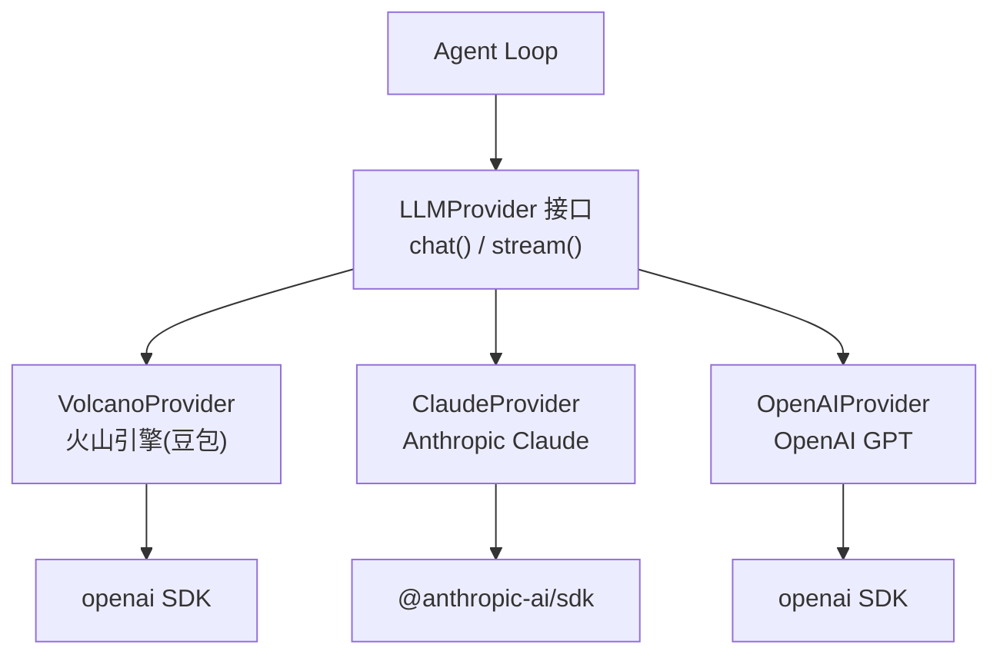

# 第2章 多模型适配——一套代码跑通三家 LLM

上一章我们用火山引擎的豆包 API 写了一个能跑的 Agent。但你很快会遇到一个现实问题：老板说"试试 Claude 效果怎么样"，或者你自己想对比一下 GPT-4o 和豆包的工具调用能力。

如果每换一个模型就重写一遍 Agent Loop，那代码很快就变成一坨意大利面。这章我们来解决这个问题：**用 Adapter 模式，让 Agent 代码完全不关心底层用的是哪家 LLM**。

为什么是这三家？火山引擎（豆包）是国内最容易拿到 API 的大模型之一，注册即用、免费额度够你开发调试；Claude 是目前编程能力最强的模型之一，做 coding agent 绕不开；OpenAI 是行业标杆，很多开源项目和教程都默认用它。覆盖这三家，基本上能满足国内外开发者的主流需求。

而且做完这个适配层之后，再加新的 Provider（比如 Gemini、通义千问、Moonshot）就只是多写一个类的事，Agent 的核心逻辑一行不用改。

## 2.1 三家 API 到底差在哪

先看一张表，把三家 API 的关键差异摆出来：

| 特性 | 火山引擎（豆包） | Claude (Anthropic) | OpenAI |
|------|-------------------|-------------------|--------|
| 协议格式 | OpenAI 兼容 | 自有格式 | OpenAI 原版 |
| SDK | `openai` npm 包 | `@anthropic-ai/sdk` | `openai` npm 包 |
| system 消息 | 放在 messages 数组 | **单独的 system 参数** | 放在 messages 数组 |
| 工具调用请求 | `tool_calls` 字段 | **content 数组里嵌 tool_use block** | `tool_calls` 字段 |
| 工具结果返回 | `role: "tool"` 消息 | **user 消息里嵌 tool_result block** | `role: "tool"` 消息 |
| 模型名格式 | `doubao-1.5-pro-32k-250115` | `claude-sonnet-4-20250514` | `gpt-4o` |
| 必填参数 | model, messages | model, messages, **max_tokens** | model, messages |

这张表里加粗的地方就是坑。火山引擎虽然号称 OpenAI 兼容，但 model 名字格式完全不同，有些高级参数也不支持。Claude 就更特殊了——它不是"有点不同"，而是"设计哲学就不同"。

### Claude 的 tool_use 格式，到底特殊在哪？

OpenAI 和火山引擎的工具调用是这样的：模型返回的消息有个 `tool_calls` 字段，和 `content` 平级：

```json
{
  "role": "assistant",
  "content": null,
  "tool_calls": [
    {
      "id": "call_abc123",
      "type": "function",
      "function": {
        "name": "read_file",
        "arguments": "{\"file_path\": \"package.json\"}"
      }
    }
  ]
}
```

Claude 不一样。它把工具调用直接塞进 `content` 数组里，跟文字混在一起：

```json
{
  "role": "assistant",
  "content": [
    { "type": "text", "text": "Let me read that file for you." },
    {
      "type": "tool_use",
      "id": "toolu_abc123",
      "name": "read_file",
      "input": { "file_path": "package.json" }
    }
  ]
}
```

注意几个细节：
1. `content` 是数组，不是字符串
2. 文本和工具调用在同一个数组里
3. 参数字段叫 `input`，是对象，不是 `arguments` 的 JSON 字符串
4. 返回工具结果时，要放在 `user` 角色的 `tool_result` block 里

这意味着你没法简单地写个 `if/else` 做字段映射——你需要一个正经的适配层。

为什么 Claude 要这么设计？我猜测是因为 Claude 希望模型的回复是一个"连贯的内容流"——文字、工具调用、文字可以交替出现在同一条消息里。OpenAI 的设计是"文字归文字、工具归工具"，概念上更清晰，但不够灵活。实际使用中，Claude 确实可以在调用工具之前先说一句"我来帮你看看这个文件"，工具调用和文字混排，用户体验更自然。

不管你觉得哪种设计更好，作为 SDK 使用者我们的任务很明确：把这些差异藏起来，让上层代码不用操心。

## 2.2 设计统一接口



经典的 Adapter 模式：先定义你想要的接口，再让各家实现去适配。

### 统一消息类型

```typescript
// src/providers/types.ts

/** 工具定义 */
export interface Tool {
  name: string;
  description: string;
  parameters: Record<string, unknown>; // JSON Schema
}

/** 工具调用请求 */
export interface ToolCall {
  id: string;
  name: string;
  arguments: string; // JSON 字符串
}

/** 统一消息格式 */
export type Message =
  | { role: "system"; content: string }
  | { role: "user"; content: string }
  | { role: "assistant"; content: string; toolCalls?: ToolCall[] }
  | { role: "tool"; toolCallId: string; content: string };

/** 模型返回的统一响应 */
export interface LLMResponse {
  content: string | null;
  toolCalls: ToolCall[];
  finishReason: "stop" | "tool_calls" | "length" | "unknown";
}
```

设计这套类型时我做了几个取舍：

- **`ToolCall.arguments` 保持 JSON 字符串**。Claude 的 `input` 是对象，OpenAI 的 `arguments` 是字符串。我选了字符串，因为 Agent Loop 里反正要 `JSON.parse`，统一用字符串省得适配层还要帮你序列化。
- **`Message` 用联合类型而非单一类型**。`role: "tool"` 的消息有 `toolCallId`，`role: "assistant"` 的消息有 `toolCalls`，硬塞成一个类型只会到处写 `as any`。
- **`finishReason` 统一成三个值**。Claude 返回 `end_turn`、OpenAI 返回 `stop`，都归一成 `"stop"`。Agent Loop 只需要判断是不是 `"tool_calls"` 就行。

### Provider 接口

```typescript
export interface LLMProvider {
  readonly name: string;
  chat(messages: Message[], tools?: Tool[]): Promise<LLMResponse>;
  stream(messages: Message[], tools?: Tool[]): AsyncIterableIterator<StreamChunk>;
}
```

就两个方法。`chat` 是一次性返回，`stream` 是流式返回。够了。

你可能会想加一堆参数：temperature、top_p、max_tokens。别急。我们遵循 YAGNI 原则——用到了再加。现在 Agent 最需要的就是"发消息、收回复、调工具"，其他参数各家格式反正差不多，后面需要时加个 `options` 参数就行。

## 2.3 实现 VolcanoProvider

火山引擎用的是 OpenAI 兼容格式，所以直接用 `openai` 这个 npm 包，把 `baseURL` 指向火山引擎就行。

```typescript
// src/providers/volcano.ts
import OpenAI from "openai";
import type { LLMProvider, LLMResponse, Message, Tool, ToolCall } from "./types.js";

/** 把我们的统一 Tool 转成 OpenAI 格式 */
function toOpenAITools(tools: Tool[]): OpenAI.Chat.ChatCompletionTool[] {
  return tools.map((t) => ({
    type: "function" as const,
    function: {
      name: t.name,
      description: t.description,
      parameters: t.parameters,
    },
  }));
}

/** 把统一 Message 转成 OpenAI 格式 */
function toOpenAIMessages(messages: Message[]): OpenAI.Chat.ChatCompletionMessageParam[] {
  return messages.map((msg) => {
    switch (msg.role) {
      case "system":
        return { role: "system" as const, content: msg.content };
      case "user":
        return { role: "user" as const, content: msg.content };
      case "assistant":
        return {
          role: "assistant" as const,
          content: msg.content,
          tool_calls: msg.toolCalls?.map((tc) => ({
            id: tc.id,
            type: "function" as const,
            function: { name: tc.name, arguments: tc.arguments },
          })),
        };
      case "tool":
        return {
          role: "tool" as const,
          tool_call_id: msg.toolCallId,
          content: msg.content,
        };
    }
  });
}

/** 把 OpenAI 的 tool_calls 转成统一格式 */
function fromOpenAIToolCalls(
  toolCalls?: OpenAI.Chat.ChatCompletionMessageToolCall[],
): ToolCall[] {
  if (!toolCalls) return [];
  return toolCalls.map((tc) => ({
    id: tc.id,
    name: tc.function.name,
    arguments: tc.function.arguments,
  }));
}
```

这三个转换函数是核心。写 Adapter 说白了就是写"翻译函数"——从我们的格式翻译成 API 的格式，再把 API 的响应翻译回来。

Provider 类本身很薄：

```typescript
export class VolcanoProvider implements LLMProvider {
  readonly name = "volcano";
  private client: OpenAI;
  private model: string;

  constructor(apiKey: string, model: string, baseURL?: string) {
    this.model = model;
    this.client = new OpenAI({
      apiKey,
      baseURL: baseURL || "https://ark.cn-beijing.volces.com/api/v3",
    });
  }

  async chat(messages: Message[], tools?: Tool[]): Promise<LLMResponse> {
    const res = await this.client.chat.completions.create({
      model: this.model,
      messages: toOpenAIMessages(messages),
      tools: tools?.length ? toOpenAITools(tools) : undefined,
    });

    const choice = res.choices[0];
    return {
      content: choice.message.content,
      toolCalls: fromOpenAIToolCalls(choice.message.tool_calls),
      finishReason: choice.finish_reason === "tool_calls" ? "tool_calls"
        : choice.finish_reason === "stop" ? "stop"
        : choice.finish_reason === "length" ? "length"
        : "unknown",
    };
  }

  // stream 方法类似，省略
}
```

关键点：**`tools` 参数没有工具时传 `undefined`，不要传空数组**。有些 API 会把空数组当成"你注册了0个工具"，行为可能不一样。

写到这里你可能觉得：这不就是把 OpenAI 的类型包了一层吗？没错。火山引擎的适配成本很低，因为它本来就是 OpenAI 兼容协议。真正考验适配层设计的是下一个——Claude。

## 2.4 实现 ClaudeProvider

这是三家里代码量最大的，因为 Claude 的格式确实独特。

```typescript
// src/providers/claude.ts
import Anthropic from "@anthropic-ai/sdk";
import type { LLMProvider, LLMResponse, Message, Tool, ToolCall } from "./types.js";

/** 把统一 Tool 转成 Claude 格式 */
function toClaudeTools(tools: Tool[]): Anthropic.Tool[] {
  return tools.map((t) => ({
    name: t.name,
    description: t.description,
    input_schema: t.parameters as Anthropic.Tool.InputSchema,
  }));
}
```

第一个不同：工具的 `parameters` 在 Claude 那边叫 `input_schema`。

接下来是最复杂的部分——消息格式转换：

```typescript
function splitSystemAndMessages(messages: Message[]): {
  system: string | undefined;
  claudeMessages: Anthropic.MessageParam[];
} {
  let system: string | undefined;
  const claudeMessages: Anthropic.MessageParam[] = [];

  for (const msg of messages) {
    switch (msg.role) {
      case "system":
        system = system ? `${system}\n\n${msg.content}` : msg.content;
        break;

      case "user":
        claudeMessages.push({ role: "user", content: msg.content });
        break;

      case "assistant": {
        // Claude 的 assistant content 是数组，文本和工具调用混在一起
        const content: Anthropic.ContentBlockParam[] = [];
        if (msg.content) {
          content.push({ type: "text", text: msg.content });
        }
        if (msg.toolCalls) {
          for (const tc of msg.toolCalls) {
            content.push({
              type: "tool_use",
              id: tc.id,
              name: tc.name,
              input: JSON.parse(tc.arguments),  // 字符串 -> 对象
            });
          }
        }
        claudeMessages.push({ role: "assistant", content });
        break;
      }

      case "tool":
        // 工具结果放在 user 消息的 content 数组里
        claudeMessages.push({
          role: "user",
          content: [
            {
              type: "tool_result",
              tool_use_id: msg.toolCallId,
              content: msg.content,
            },
          ],
        });
        break;
    }
  }

  return { system, claudeMessages };
}
```

这个函数做了三件事：
1. **把 system 消息提出来**。Claude 的 system 不在 messages 数组里，是 `create` 方法的单独参数。
2. **assistant 消息的 content 转成数组**。文本变 `{type: "text"}`，工具调用变 `{type: "tool_use"}`。
3. **tool 消息变成 user 消息**。没错，在 Claude 的世界里，工具执行结果是以"用户"的身份提交的，而且要包在 `tool_result` block 里。

响应解析也要做反向翻译：

```typescript
function extractToolCalls(content: Anthropic.ContentBlock[]): ToolCall[] {
  return content
    .filter((block): block is Anthropic.ToolUseBlock => block.type === "tool_use")
    .map((block) => ({
      id: block.id,
      name: block.name,
      arguments: JSON.stringify(block.input),  // 对象 -> 字符串
    }));
}

function extractText(content: Anthropic.ContentBlock[]): string | null {
  const texts = content
    .filter((block): block is Anthropic.TextBlock => block.type === "text")
    .map((block) => block.text);
  return texts.length > 0 ? texts.join("") : null;
}
```

Provider 类：

```typescript
export class ClaudeProvider implements LLMProvider {
  readonly name = "claude";
  private client: Anthropic;
  private model: string;

  constructor(apiKey: string, model: string) {
    this.model = model;
    this.client = new Anthropic({ apiKey });
  }

  async chat(messages: Message[], tools?: Tool[]): Promise<LLMResponse> {
    const { system, claudeMessages } = splitSystemAndMessages(messages);

    const res = await this.client.messages.create({
      model: this.model,
      max_tokens: 4096,
      system,
      messages: claudeMessages,
      tools: tools?.length ? toClaudeTools(tools) : undefined,
    });

    return {
      content: extractText(res.content),
      toolCalls: extractToolCalls(res.content),
      finishReason: res.stop_reason === "tool_use" ? "tool_calls"
        : res.stop_reason === "end_turn" ? "stop"
        : res.stop_reason === "max_tokens" ? "length"
        : "unknown",
    };
  }
}
```

注意 `max_tokens` 是必填的。Claude 不像 OpenAI 有个默认值，你不传就报错。另一个坑：`stop_reason` 里工具调用返回的是 `"tool_use"`，不是 `"tool_calls"`。

回头看一下 ClaudeProvider 的代码量，大概是 VolcanoProvider 的 1.5 倍。多出来的部分全在"翻译"上——system 消息要提出来，assistant content 要从扁平格式转成数组格式，tool 消息的角色要从 `tool` 变成 `user`。这种翻译逻辑写一次就好，以后每次模型迭代只要 API 格式不变，这些代码就不用动。

流式处理（`stream` 方法）的适配同理。Claude 用的是 Server-Sent Events，通过 `content_block_start`、`content_block_delta`、`content_block_stop` 三种事件来推送内容。我们把它翻译成统一的 `StreamChunk` 格式，上层代码不用关心底层是 SSE 还是其他协议。完整实现见源码文件。

## 2.5 实现 OpenAIProvider

说实话，这个 Provider 的代码跟 VolcanoProvider 几乎一模一样。因为火山引擎本来就是 OpenAI 兼容格式嘛。

但我还是建议单独写一个类，不要复用。原因：

1. **默认 baseURL 不同**。火山引擎指向 `ark.cn-beijing.volces.com`，OpenAI 指向 `api.openai.com`。
2. **未来可能分叉**。OpenAI 可能加 structured outputs 之类的新功能，火山引擎不一定跟进。
3. **错误处理可能不同**。两家的错误码和限流策略完全不一样。

代码我就不重复贴了，核心区别就一行：

```typescript
this.client = new OpenAI({
  apiKey,
  baseURL: baseURL || "https://api.openai.com/v1",  // 唯一的区别
});
```

完整代码见 `src/providers/openai.ts`。

你可能会想：既然代码一样，为什么不搞个 `OpenAICompatibleProvider` 基类，让 Volcano 和 OpenAI 都继承它？可以，但我建议先别。继承带来的耦合比你想象的严重——改基类会影响所有子类，而两家 API 未来的演进方向很可能不同。等真的发现大量重复代码无法忍受时再抽基类不迟。在那之前，一点代码重复反而是更安全的选择。

## 2.6 Provider 工厂 + 配置化切换

三个 Provider 写好了，怎么让用户方便地切换？我设计了三层配置：

```
命令行参数 > 环境变量 > .ling.json > 默认值
```

这个优先级很常见。日常开发用 `.ling.json` 省得每次敲参数，CI 环境用环境变量不用提交配置文件，临时切换用命令行参数覆盖一切。

```typescript
// src/providers/factory.ts

export function resolveConfig(cliArgs?: Partial<ProviderConfig>): ProviderConfig {
  const fileConfig = loadConfigFile();  // 读 .ling.json

  const provider = cliArgs?.provider
    || (process.env.LING_PROVIDER as ProviderConfig["provider"])
    || fileConfig?.provider
    || "volcano";  // 默认用火山引擎

  const apiKey = cliArgs?.apiKey
    || process.env.LING_API_KEY
    || process.env.LLM_API_KEY  // 兼容 ch01 的环境变量
    || fileConfig?.apiKey
    || "";

  const defaultModels: Record<string, string> = {
    volcano: "doubao-1.5-pro-32k-250115",
    claude: "claude-sonnet-4-20250514",
    openai: "gpt-4o",
  };

  const model = cliArgs?.model
    || process.env.LING_MODEL
    || fileConfig?.model
    || defaultModels[provider];

  // ...
  return { provider, apiKey, model, baseURL };
}
```

工厂函数本身没啥花头：

```typescript
export function createProvider(config: ProviderConfig): LLMProvider {
  switch (config.provider) {
    case "volcano":
      return new VolcanoProvider(config.apiKey, config.model, config.baseURL);
    case "claude":
      return new ClaudeProvider(config.apiKey, config.model);
    case "openai":
      return new OpenAIProvider(config.apiKey, config.model, config.baseURL);
    default:
      throw new Error(`Unknown provider: ${config.provider}`);
  }
}
```

使用起来：

```bash
# 默认用火山引擎
npx tsx src/ling.ts "帮我看看这个项目"

# 切换到 Claude
npx tsx src/ling.ts --provider claude "帮我看看这个项目"

# 用环境变量
LING_PROVIDER=openai LING_API_KEY=sk-xxx npx tsx src/ling.ts "帮我看看这个项目"
```

或者创建 `.ling.json`：

```json
{
  "provider": "claude",
  "apiKey": "sk-ant-xxx",
  "model": "claude-sonnet-4-20250514"
}
```

## 2.7 更新 Agent Loop

上一章的 Agent Loop 直接用 OpenAI SDK，现在换成我们的 Provider 接口，改动非常小：

```typescript
// src/ling.ts

async function agent(query: string, config: Partial<ProviderConfig>) {
  const provider = initProvider(config);  // 一行搞定初始化

  const messages: Message[] = [
    { role: "system", content: "You are Ling, a helpful coding assistant." },
    { role: "user", content: query },
  ];

  const MAX_TURNS = 20;
  for (let turn = 0; turn < MAX_TURNS; turn++) {
    const res = await provider.chat(messages, tools);  // 统一接口调用

    messages.push({
      role: "assistant",
      content: res.content || "",
      toolCalls: res.toolCalls.length > 0 ? res.toolCalls : undefined,
    });

    if (res.finishReason !== "tool_calls" || res.toolCalls.length === 0) {
      console.log(res.content);
      return;
    }

    for (const tc of res.toolCalls) {
      const args = JSON.parse(tc.arguments);
      const result = executeTool(tc.name, args);
      console.log(`[tool] ${tc.name}(${JSON.stringify(args)}) -> ${result.slice(0, 100)}...`);
      messages.push({ role: "tool", toolCallId: tc.id, content: result });
    }
  }
}
```

对比一下上一章的代码，核心变化：
- `client.chat.completions.create(...)` 变成 `provider.chat(messages, tools)`
- `choice.message.content` 变成 `res.content`
- `choice.message.tool_calls` 变成 `res.toolCalls`
- `choice.finish_reason` 变成 `res.finishReason`

Agent Loop 完全不知道底层用的是豆包还是 Claude 还是 GPT。这就是适配层的价值——**上层逻辑稳定，下层实现可替换**。

## 2.8 踩坑记录

写适配层最烦的不是设计模式，而是各家 API 的细节差异。有些差异文档里写得清清楚楚但你就是没注意，有些差异文档里根本没写要你自己踩。下面这些坑我都亲自踩过，记下来给你避雷。

### 坑1：火山引擎的 model 名字

火山引擎的 model 名字格式是 `doubao-1.5-pro-32k-250115`，后面那串数字是版本号。你在控制台创建的推理接入点（endpoint）其实也可以当 model 名用，格式是 `ep-xxx-xxx`。两种格式都能用，但别混了。

### 坑2：Claude 的 system message

Claude 的 `messages.create()` 里，system 是单独的参数：

```typescript
await client.messages.create({
  model: "claude-sonnet-4-20250514",
  max_tokens: 4096,
  system: "You are a helpful assistant.",  // 这里！
  messages: [
    { role: "user", content: "Hello" }
  ],
});
```

如果你把 system message 放进 messages 数组，Claude 会直接报错。这跟 OpenAI 完全不同。

### 坑3：Claude 的 tool_result 是 user 角色

在 OpenAI 的世界里，工具结果用 `role: "tool"` 返回。在 Claude 的世界里，工具结果要放在 `role: "user"` 的消息里，用 `tool_result` block 包裹。如果你用 `role: "tool"` 发给 Claude，它不认。

### 坑4：空 tools 数组

有些 API 你传 `tools: []` 和不传 `tools` 行为不一样。安全起见，没有工具时传 `undefined`，不要传空数组。

### 坑5：Claude 的 max_tokens 必填

OpenAI 的 `max_tokens` 有默认值，不传也行。Claude 没有默认值，不传直接报错。而且不同模型支持的最大值不同（Claude Sonnet 是 8192，Opus 是 32768）。我们先硬编码 4096，后面可以做成可配置的。

### 坑6：finishReason 的值不统一

三家 API 表示"工具调用"的方式都不一样：

| Provider | 表示"有工具要调" | 表示"说完了" |
|----------|-----------------|-------------|
| 火山引擎 | `tool_calls` | `stop` |
| Claude | `tool_use` (在 stop_reason 里) | `end_turn` |
| OpenAI | `tool_calls` | `stop` |

这就是为什么我们需要适配层来统一。如果没有适配层，这个表格里的每一行差异都会变成 Agent Loop 里的一个 `if/else`。三家 API 六个差异，你的核心循环就会变得面目全非。

### 坑7：工具参数的 arguments 类型

OpenAI 返回的 `function.arguments` 是 JSON 字符串（`"{\"file_path\": \"x\"}"`），Claude 的 `input` 是已经解析好的对象（`{file_path: "x"}`）。如果你的统一类型用字符串，那 Claude 适配层里要 `JSON.stringify`；如果用对象，那 OpenAI 适配层里要 `JSON.parse`。我选了字符串，因为 Agent Loop 里执行工具时反正要 parse，而 stringify 几乎不会出错，parse 有可能遇到格式问题，把风险放在确定的环节更好控制。

## 2.9 对照 Claude Code 源码

我们自己写的 Ling 用的是最朴素的 Adapter 模式。来看看 Claude Code 是怎么做多后端支持的。

Claude Code 支持三个后端：直接调 Anthropic API、通过 AWS Bedrock、通过 Google Vertex。它的切换方式是**环境变量**：

```bash
# 用 Bedrock
CLAUDE_CODE_USE_BEDROCK=1

# 用 Vertex
CLAUDE_CODE_USE_VERTEX=1

# 不设这两个就直接调 Anthropic
```

这个设计很简洁——因为 Claude Code 的后端全是 Claude 模型，不需要适配不同的消息格式，只需要切换认证方式和 endpoint。跟我们的情况不同，我们是要适配三家格式完全不同的 API。

Claude Code 的模型抽象也很有意思：

```typescript
type ModelOption = "sonnet" | "opus" | "haiku"
```

它不暴露完整的模型名（比如 `claude-sonnet-4-20250514`），而是用"档位"来抽象。用户说"我要 opus"，底层自动映射到最新版本。这个思路我们后面也可以借鉴——用户说 `--provider claude --tier fast`，自动选 Haiku。

还有两个值得注意的设计：

**effort 参数**：Claude Code 支持 `'low' | 'medium' | 'high' | 'max'` 四档"努力程度"。low 的时候模型快速回答、少调工具，max 的时候深度思考、不惜代价。这不是简单的 temperature 调节，而是会影响到 system prompt 和工具选择策略。

**thinking 配置**：支持 `adaptive | enabled | disabled` 三种模式。`enabled` 时模型会先输出一段"思考过程"再给最终回答。这个功能不是所有模型都支持，所以 Claude Code 做了条件判断——只有在支持 thinking 的模型上才开启。

对比一下我们的设计和 Claude Code 的设计：

| 设计点 | Ling (我们的) | Claude Code |
|--------|-------------|-------------|
| 适配对象 | 三家不同格式的 API | 同一格式、三个不同 endpoint |
| 切换方式 | 配置文件 + 环境变量 + 命令行 | 纯环境变量 |
| 模型选择 | 完整模型名 | "档位" 抽象 |
| 核心复杂度 | 消息格式转换 | 认证方式切换 |

## 2.10 设计讨论：Adapter 模式什么时候该用

写了这么多代码，最后聊聊"什么时候该抽象、什么时候不该"。

**该用 Adapter 的场景：**

1. **你确实需要多个实现**。我们有三家 LLM 要适配，这是真实需求，不是臆想的。
2. **差异在"怎么做"而非"做什么"**。三家 API 都是"发消息、收回复、调工具"，只是格式不同。这正是 Adapter 擅长的。
3. **上层逻辑不应该感知差异**。Agent Loop 不应该写 `if (provider === 'claude')` 这种代码。

**不该用 Adapter 的场景：**

1. **只有一个实现，未来也不会有第二个**。别写 `interface DatabaseProvider` 然后只有一个 `PostgresProvider`。YAGNI。
2. **差异在"做什么"而非"怎么做"**。如果两个"Provider"的能力完全不同（一个能调工具、一个不能），强行统一接口只会到处写 `throw new Error("not supported")`。
3. **差异太大，接口变成最小公分母**。如果为了统一，你的接口精简到失去了各家独有的能力，那这个抽象就有问题。

我们的 `LLMProvider` 目前很精简，只有 `chat` 和 `stream` 两个方法。这是故意的。Claude 支持 `thinking`，OpenAI 支持 `structured outputs`，火山引擎有自己的特殊参数——这些能力差异暂时不需要统一。等后面真的需要了，我们可以用 `options` 参数做扩展，不影响现有接口。

实际开发中怎么判断"该不该抽象"？我有个简单的经验法则：**如果你能用一句话描述接口的职责，并且所有实现都能完整满足这句话，那就值得抽象**。我们的 `LLMProvider` 的职责就是"给一组消息和工具定义，返回模型的回复"。三家 API 都能完整满足这个描述。如果某天出了个"只能返回文本、不能调工具"的 API，那它就不应该实现 `LLMProvider`——你需要另一个接口。

代码量增加了不少，但 Agent Loop 本身反而变简单了。以后不管换什么模型，`provider.chat()` 一行搞定。

下一章给 Ling 装上完整的工具系统——8 个工具，覆盖文件操作、代码搜索、命令执行。
