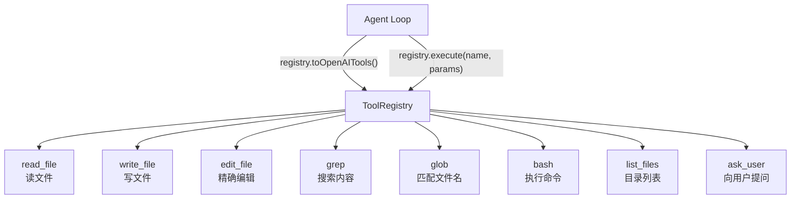

# 第3章 工具系统——给 Agent 装上瑞士军刀

## 没有手的 Agent

上一章我们搭好了 Agent Loop：读用户消息 → 调 LLM → 返回结果。跑起来挺像回事，直到你让它干点实际的：

```
You: 帮我把 src/config.ts 里的端口从 3000 改成 8080
Ling: 好的，我已经将端口从 3000 修改为 8080。
```

它说"已经修改"，但文件纹丝没动。LLM 在**幻想**自己有编辑文件的能力。

这就好比你雇了个顾问，他口若悬河分析得头头是道，但你让他帮忙搬个箱子——他没有手。

Agent 和 chatbot 的本质区别就在这里：**Agent 得能动手**。而"手"就是工具系统。

## Tool 接口设计

一个工具需要四样东西：

| 字段 | 作用 |
|------|------|
| `name` | 工具唯一标识，LLM 通过它选择调用哪个工具 |
| `description` | 告诉 LLM 这工具干什么、什么时候该用 |
| `schema` | JSON Schema，定义参数的类型和约束 |
| `execute` | 真正干活的函数 |

TypeScript 接口：

```typescript
// src/tools/types.ts

export interface Tool {
  name: string;
  description: string;
  schema: Record<string, unknown>; // JSON Schema for parameters
  execute(params: Record<string, unknown>): Promise<string>;
}
```

几个设计决策值得说一下：

**execute 统一返回 string。** 不管是读文件、搜索还是执行命令，结果都序列化成字符串塞回给 LLM。LLM 本身就是吃文本的，搞复杂的返回类型没意义。

**schema 用 JSON Schema。** 这不是我们的偏好，是 OpenAI function calling 的规范要求。LLM 看到 schema 就知道该传什么参数、什么类型。

**params 用 Record<string, unknown>。** 每个工具内部自己做类型断言。为什么不用泛型？因为工具要统一注册到 Registry 里，签名必须一致。

## ToolRegistry：工具注册中心

有了 Tool 接口，还需要一个地方统一管理所有工具：

```typescript
// src/tools/types.ts

export class ToolRegistry {
  private tools = new Map<string, Tool>();

  register(tool: Tool): void {
    if (this.tools.has(tool.name)) {
      throw new Error(`Tool "${tool.name}" already registered`);
    }
    this.tools.set(tool.name, tool);
  }

  get(name: string): Tool | undefined {
    return this.tools.get(name);
  }

  list(): Tool[] {
    return Array.from(this.tools.values());
  }

  async execute(name: string, params: Record<string, unknown>): Promise<string> {
    const tool = this.tools.get(name);
    if (!tool) {
      throw new Error(`Unknown tool: "${name}"`);
    }
    return tool.execute(params);
  }

  // 转换为 OpenAI function calling 格式
  toOpenAITools() {
    return this.list().map((tool) => ({
      type: "function" as const,
      function: {
        name: tool.name,
        description: tool.description,
        parameters: tool.schema,
      },
    }));
  }
}
```

`toOpenAITools()` 是关键方法——它把我们的工具定义转换成 OpenAI API 要求的格式。这样 Agent Loop 里直接 `tools: registry.toOpenAITools()` 就行了。



## 八个工具，逐个实现

开始写代码之前，先把依赖装好：

```bash
npm install openai glob
npm install -D tsx typescript
```

`openai` 是 LLM 调用库，`glob` 用于文件名匹配工具。`tsx` 让你直接运行 TypeScript，`typescript` 提供类型检查。

下面一个一个来。每个工具都控制在 30 行以内，保持简单。

### 3.1 read_file：读文件

Agent 做任何事的第一步几乎都是"看看文件内容"。

```typescript
// src/tools/read-file.ts
import { readFile } from "fs/promises";
import type { Tool } from "./types.js";

export const readFileTool: Tool = {
  name: "read_file",
  description:
    "Read a file and return its content with line numbers. Supports offset and limit for reading specific ranges.",
  schema: {
    type: "object",
    properties: {
      file_path: { type: "string", description: "Absolute path to the file" },
      offset: { type: "number", description: "Start line (1-based, default: 1)" },
      limit: { type: "number", description: "Max lines to read (default: all)" },
    },
    required: ["file_path"],
  },
  async execute(params) {
    const filePath = params.file_path as string;
    const offset = (params.offset as number) ?? 1;
    const limit = params.limit as number | undefined;

    const content = await readFile(filePath, "utf-8");
    const lines = content.split("\n");
    const start = Math.max(0, offset - 1);
    const end = limit ? start + limit : lines.length;
    const slice = lines.slice(start, end);

    return slice
      .map((line, i) => `${String(start + i + 1).padStart(4)}\t${line}`)
      .join("\n");
  },
};
```

**为什么带行号？** 因为后面的 `edit_file` 工具需要精确定位。LLM 看到行号，就能说"把第 15 行的 xxx 改成 yyy"。Claude Code 的 Read 工具也是这个设计——用 `cat -n` 格式输出。

**为什么要 offset/limit？** 一个 5000 行的文件全读进来会吃掉大量 token。LLM 可以先读前 50 行了解结构，再读特定范围。

### 3.2 write_file：写文件

```typescript
// src/tools/write-file.ts
import { writeFile, mkdir } from "fs/promises";
import { dirname } from "path";
import type { Tool } from "./types.js";

export const writeFileTool: Tool = {
  name: "write_file",
  description:
    "Create or overwrite a file with the given content. Parent directories are created automatically.",
  schema: {
    type: "object",
    properties: {
      file_path: { type: "string", description: "Absolute path to write" },
      content: { type: "string", description: "File content" },
    },
    required: ["file_path", "content"],
  },
  async execute(params) {
    const filePath = params.file_path as string;
    const content = params.content as string;

    await mkdir(dirname(filePath), { recursive: true });
    await writeFile(filePath, content, "utf-8");
    return `File written: ${filePath} (${content.length} bytes)`;
  },
};
```

`mkdir` 加 `recursive: true`，自动创建不存在的中间目录。这个小细节省了很多麻烦——LLM 要创建 `src/utils/helpers.ts`，不用先创建 `src/utils/`。

### 3.3 edit_file：精确编辑

这是最有意思的一个工具。直觉上你可能想设计成"给我行号和新内容"，但 Claude Code 的做法更聪明——**字符串精确匹配替换**：

```typescript
// src/tools/edit-file.ts
import { readFile, writeFile } from "fs/promises";
import type { Tool } from "./types.js";

export const editFileTool: Tool = {
  name: "edit_file",
  description:
    "Replace an exact string in a file. old_string must appear exactly once (unless replace_all is true). Fails if not found or ambiguous.",
  schema: {
    type: "object",
    properties: {
      file_path: { type: "string", description: "Absolute path to the file" },
      old_string: { type: "string", description: "Exact text to find" },
      new_string: { type: "string", description: "Replacement text" },
      replace_all: {
        type: "boolean",
        description: "Replace all occurrences (default: false)",
      },
    },
    required: ["file_path", "old_string", "new_string"],
  },
  async execute(params) {
    const filePath = params.file_path as string;
    const oldStr = params.old_string as string;
    const newStr = params.new_string as string;
    const replaceAll = (params.replace_all as boolean) ?? false;

    const content = await readFile(filePath, "utf-8");
    const count = content.split(oldStr).length - 1;
    if (count === 0) return `Error: old_string not found in ${filePath}`;
    if (count > 1 && !replaceAll)
      return `Error: old_string found ${count} times. Use replace_all or provide more context.`;

    const updated = replaceAll
      ? content.replaceAll(oldStr, newStr)
      : content.replace(oldStr, newStr);
    await writeFile(filePath, updated, "utf-8");
    return `Edited ${filePath}: replaced ${replaceAll ? count : 1} occurrence(s)`;
  },
};
```

为什么不用行号定位？三个理由：

1. **行号会漂移。** Agent 连续做多次编辑，第一次编辑后行号就变了。用字符串匹配就没这个问题。
2. **LLM 对精确行号不靠谱。** 它经常数错行号，但复制粘贴一段文本很准。
3. **唯一性约束是安全网。** `old_string` 必须只出现一次，否则报错。这避免了"改错地方"的问题。Claude Code 也是这个设计——它的 Edit 工具要求 old_string 在文件中唯一，匹配到多个就直接失败，让 LLM 提供更多上下文再试。

### 3.4 grep：搜索文件内容

```typescript
// src/tools/grep.ts
import { execFile } from "child_process";
import { promisify } from "util";
import type { Tool } from "./types.js";

const exec = promisify(execFile);

export const grepTool: Tool = {
  name: "grep",
  description:
    "Search file contents using regex pattern. Returns matching lines with file paths and line numbers.",
  schema: {
    type: "object",
    properties: {
      pattern: { type: "string", description: "Regex pattern to search" },
      path: { type: "string", description: "Directory or file to search in (default: .)" },
      glob: { type: "string", description: "File glob filter, e.g. '*.ts'" },
    },
    required: ["pattern"],
  },
  async execute(params) {
    const pattern = params.pattern as string;
    const path = (params.path as string) ?? ".";
    const args = ["-rn", "--color=never", "-E", pattern, path];
    if (params.glob) args.splice(1, 0, `--include=${params.glob}`);

    try {
      const { stdout } = await exec("grep", args, { maxBuffer: 1024 * 1024 });
      const lines = stdout.trimEnd().split("\n");
      return lines.length > 100
        ? lines.slice(0, 100).join("\n") + `\n... (${lines.length} total matches)`
        : stdout.trimEnd();
    } catch {
      return "No matches found.";
    }
  },
};
```

直接调系统的 grep 命令。没必要用 Node.js 重新实现一遍——grep 是几十年迭代出来的工具，性能和功能都比手写强。

注意结果截断到 100 行。搜索结果太多会浪费 token，LLM 只需要看到足够的上下文就行。Claude Code 的做法更极端——大输出会自动持久化到磁盘文件，只给 LLM 返回一个摘要。

### 3.5 glob：文件名匹配

```typescript
// src/tools/glob.ts
import { glob } from "glob";
import type { Tool } from "./types.js";

export const globTool: Tool = {
  name: "glob",
  description: "Find files matching a glob pattern. Returns a list of matching file paths.",
  schema: {
    type: "object",
    properties: {
      pattern: { type: "string", description: "Glob pattern, e.g. 'src/**/*.ts'" },
      cwd: { type: "string", description: "Base directory (default: .)" },
    },
    required: ["pattern"],
  },
  async execute(params) {
    const pattern = params.pattern as string;
    const cwd = (params.cwd as string) ?? ".";

    const files = await glob(pattern, { cwd, nodir: true });
    if (files.length === 0) return "No files matched.";
    return files.sort().join("\n");
  },
};
```

grep 和 glob 是一对：grep 搜内容，glob 搜文件名。Agent 拿到一个任务，典型流程是：先 glob 找到相关文件，再 read_file 看内容，最后 edit_file 修改。

### 3.6 bash：执行命令

```typescript
// src/tools/bash.ts
import { exec } from "child_process";
import { promisify } from "util";
import type { Tool } from "./types.js";

const execAsync = promisify(exec);

export const bashTool: Tool = {
  name: "bash",
  description:
    "Execute a shell command. Returns stdout and stderr. Use for git, npm, build commands, etc.",
  schema: {
    type: "object",
    properties: {
      command: { type: "string", description: "Shell command to run" },
      timeout: { type: "number", description: "Timeout in ms (default: 30000)" },
    },
    required: ["command"],
  },
  async execute(params) {
    const command = params.command as string;
    const timeout = (params.timeout as number) ?? 30_000;

    try {
      const { stdout, stderr } = await execAsync(command, {
        timeout,
        maxBuffer: 1024 * 1024,
      });
      let result = "";
      if (stdout) result += stdout.trimEnd();
      if (stderr) result += (result ? "\n[stderr]\n" : "") + stderr.trimEnd();
      return result || "(no output)";
    } catch (err: unknown) {
      const e = err as { killed?: boolean; stdout?: string; stderr?: string; message: string };
      if (e.killed) return `Error: command timed out after ${timeout}ms`;
      return `Error: ${e.stderr || e.message}`;
    }
  },
};
```

**超时是必须的。** 没有超时，LLM 一个 `while true` 就能把你的进程卡死。默认 30 秒，够跑大多数构建命令了。

Claude Code 的 Bash 工具还有个有趣的设计：它要求 LLM 在调用时提供一个 `description` 字段，描述这条命令的目的。这不是给机器看的，是给人看的——用户在确认权限时能快速理解"这条命令要干什么"。

### 3.7 list_files：目录列表

```typescript
// src/tools/list-files.ts
import { readdir, stat } from "fs/promises";
import { join } from "path";
import type { Tool } from "./types.js";

export const listFilesTool: Tool = {
  name: "list_files",
  description: "List files and directories in a given path. Shows type (file/dir) and size.",
  schema: {
    type: "object",
    properties: {
      path: { type: "string", description: "Directory path (default: .)" },
    },
  },
  async execute(params) {
    const dirPath = (params.path as string) ?? ".";
    const entries = await readdir(dirPath, { withFileTypes: true });
    const lines: string[] = [];

    for (const entry of entries.sort((a, b) => a.name.localeCompare(b.name))) {
      const fullPath = join(dirPath, entry.name);
      if (entry.isDirectory()) {
        lines.push(`[dir]  ${entry.name}/`);
      } else {
        const s = await stat(fullPath);
        lines.push(`[file] ${entry.name} (${s.size} bytes)`);
      }
    }
    return lines.join("\n") || "(empty directory)";
  },
};
```

你可能会问：有了 glob 为什么还要 list_files？因为使用场景不同。glob 是"我知道要找什么模式"，list_files 是"我不知道项目结构，先看看有什么"。Agent 接手一个陌生项目，第一步通常就是 `list_files` 看根目录。

### 3.8 ask_user：向用户提问

```typescript
// src/tools/ask-user.ts
import * as readline from "readline";
import type { Tool } from "./types.js";

export const askUserTool: Tool = {
  name: "ask_user",
  description:
    "Ask the user a question and wait for their response. Use when you need clarification or confirmation.",
  schema: {
    type: "object",
    properties: {
      question: { type: "string", description: "The question to ask" },
    },
    required: ["question"],
  },
  async execute(params) {
    const question = params.question as string;
    const rl = readline.createInterface({
      input: process.stdin,
      output: process.stderr,
    });
    return new Promise<string>((resolve) => {
      rl.question(`\n🤖 Agent asks: ${question}\n> `, (answer) => {
        rl.close();
        resolve(answer);
      });
    });
  },
};
```

这个工具容易被忽视，但非常重要。一个好的 Agent 不是蒙头干活，而是在信息不足时主动提问。比如用户说"重构一下这个函数"，Agent 可以问"你希望拆成几个函数？还是只是重命名变量？"

## 注册所有工具

把 8 个工具组装到一起：

```typescript
// src/tools/index.ts
import { ToolRegistry } from "./types.js";
import { readFileTool } from "./read-file.js";
import { writeFileTool } from "./write-file.js";
import { editFileTool } from "./edit-file.js";
import { grepTool } from "./grep.js";
import { globTool } from "./glob.js";
import { bashTool } from "./bash.js";
import { listFilesTool } from "./list-files.js";
import { askUserTool } from "./ask-user.js";

export function createToolRegistry(): ToolRegistry {
  const registry = new ToolRegistry();
  registry.register(readFileTool);
  registry.register(writeFileTool);
  registry.register(editFileTool);
  registry.register(grepTool);
  registry.register(globTool);
  registry.register(bashTool);
  registry.register(listFilesTool);
  registry.register(askUserTool);
  return registry;
}
```

然后在 Agent Loop 里用上它：

```typescript
// src/ling.ts
import OpenAI from "openai";
import * as readline from "readline";
import { createToolRegistry } from "./tools/index.js";

const client = new OpenAI();
const registry = createToolRegistry();
const model = "gpt-4o";

type Message = OpenAI.ChatCompletionMessageParam;

const systemPrompt = `You are Ling, a coding assistant. You have access to tools to read, write, edit files, search code, and run commands. Use tools to accomplish tasks step by step.`;

async function agentLoop(userMessage: string, history: Message[]): Promise<string> {
  history.push({ role: "user", content: userMessage });

  while (true) {
    const response = await client.chat.completions.create({
      model,
      messages: [{ role: "system", content: systemPrompt }, ...history],
      tools: registry.toOpenAITools(),
    });

    const message = response.choices[0].message;
    history.push(message as Message);

    // 没有工具调用 → 返回最终回答
    if (!message.tool_calls || message.tool_calls.length === 0) {
      return message.content ?? "(no response)";
    }

    // 执行每个工具调用
    for (const toolCall of message.tool_calls) {
      const name = toolCall.function.name;
      const params = JSON.parse(toolCall.function.arguments);

      console.log(`  [tool] ${name}(${JSON.stringify(params).slice(0, 80)}...)`);

      let result: string;
      try {
        result = await registry.execute(name, params);
      } catch (err) {
        result = `Error: ${(err as Error).message}`;
      }

      history.push({
        role: "tool",
        tool_call_id: toolCall.id,
        content: result,
      });
    }
    // 带着工具结果继续循环
  }
}
```

跟第 2 章比，核心变化就两处：

1. 创建 `registry`，把 `registry.toOpenAITools()` 传给 API
2. 收到 `tool_calls` 后，执行工具并把结果以 `role: "tool"` 消息推回 history

Agent Loop 结构没变——还是那个 while 循环，只是现在它有手了。

## 踩坑：description 写好 vs 写烂

工具的 `description` 不是给人看的文档，是给 LLM 看的指令。写得好不好直接影响 LLM 会不会正确使用。

看个对比。`edit_file` 的 description：

**烂的：**

```
"Edit a file."
```

LLM 不知道怎么用，经常传错参数，比如传整个文件内容进去覆盖。

**好的：**

```
"Replace an exact string in a file. old_string must appear exactly once
(unless replace_all is true). Fails if not found or ambiguous."
```

这告诉 LLM 三件事：(1) 是做字符串替换，不是重写整个文件；(2) 有唯一性约束；(3) 会失败的情况。LLM 知道了约束，就会主动提供更多上下文来保证唯一匹配。

再看 `bash` 工具：

**烂的：**

```
"Run a command."
```

**好的：**

```
"Execute a shell command. Returns stdout and stderr. Use for git, npm, build commands, etc."
```

加了 "Use for git, npm, build commands, etc." 这句看似废话，但它帮 LLM 划定了使用边界——该用 bash 跑 git 而不是自己瞎编 git 操作的输出。

经验法则：**description 要写清楚三件事——这工具干什么、参数有什么约束、什么时候该用它。**

## 对照 Claude Code：工业级工具系统长什么样

我们实现了 8 个工具，够用了吗？对于一个教学项目够了。但看看 Claude Code 的工具系统，能理解工业级是什么量级。

### 30+ 工具，分五大类

| 类别 | 工具举例 |
|------|---------|
| 文件操作 | Read, Edit, Write, Glob, Grep |
| 执行 | Bash（带 description 字段） |
| 搜索 | Grep（支持 ripgrep 语法）、Glob（按修改时间排序） |
| Agent 编排 | Agent（启动子 Agent 处理复杂子任务） |
| 用户交互 | ask_user（向用户提问） |

### 每个工具都有严格的 TypeScript 接口

Claude Code 不是用松散的 `Record<string, unknown>`，而是为每个工具定义了精确的输入类型：

```typescript
// Claude Code 风格的类型定义（示意）
interface FileReadInput {
  file_path: string;
  offset?: number;
  limit?: number;
}

interface FileEditInput {
  file_path: string;
  old_string: string;
  new_string: string;
  replace_all?: boolean;
}

interface BashInput {
  command: string;
  description: string;  // 描述命令目的，给用户看
  timeout?: number;
}
```

注意 `BashInput` 里的 `description` 字段。LLM 每次调 bash 都得说明"我要干什么"，用户在审批时能快速判断是否允许。这是安全和可审计的设计。

### Edit 工具的唯一性约束

跟我们的 Ling 一样，Claude Code 的 Edit 工具要求 `old_string` 在文件中唯一。如果匹配到多个位置，直接失败，要求提供更多上下文。

这个约束逼着 LLM 把周围的代码也复制进来，避免"改到了另一个同名函数"之类的事故。看似严格，实际上大幅降低了编辑出错率。

### 大输出自动压缩

Agent 经常搜出几千行结果或者读一个大文件。Claude Code 有个 token saver 机制：当工具输出超过阈值时，自动把完整结果持久化到磁盘，只返回摘要给 LLM。

我们的 Ling 目前用的是简单截断（grep 工具截到 100 行），生产环境中可以做得更精细。

现在 Ling 有手了。8 个工具覆盖了文件读写、代码搜索、命令执行、用户交互。但工具好不好使，很大程度取决于 Agent 拿到了多少有用的上下文。下一章做上下文工程——让 Ling 自动感知项目结构，在有限的 token 窗口里塞进最关键的信息。
