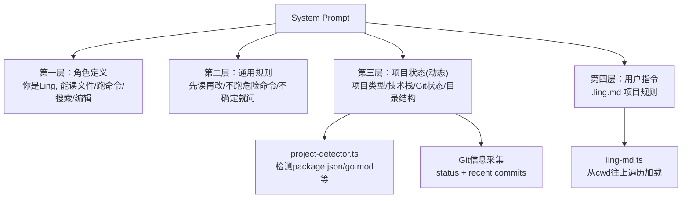

# 上下文工程——比 Prompt Engineering 更重要的事

同一个问题，上下文不同，Agent 的表现天壤之别。

比如你问 Ling："帮我加一个用户注册功能。" 如果 Ling 什么都不知道——不知道你用的是 Express 还是 Koa，不知道数据库是 MySQL 还是 MongoDB，不知道项目里已经有了 `src/routes/auth.ts`——它只能给你一坨通用的示例代码，大概率跑不起来。

但如果 Ling 启动时就知道：这是个 TypeScript + Express 项目，用的 Prisma ORM，已经有 `src/routes/` 目录和统一的错误处理中间件，git status 显示你刚改了 `schema.prisma`——它给出的代码会直接匹配你的项目结构、导入路径和代码风格。能直接跑。

这就是**上下文工程**（Context Engineering）。不是在 prompt 里多写几句"你是一个资深工程师"就行的。核心问题是：怎么在有限的 token 窗口里，塞进最相关的信息，让 LLM 做出最好的决策。

## System Prompt 分层设计

第一章我们的 system prompt 就一行：

```typescript
{ role: "system", content: "You are Ling, a helpful coding assistant. Use tools to answer questions." }
```

能用，但太粗了。真实的 Agent 需要分层组织上下文。

```typescript
// src/context/system-prompt.ts

// 第一层：角色定义
const LAYER_ROLE = `You are Ling, a coding assistant built for real projects.
You can read files, run commands, search code, and edit files.
You think step by step, use tools to gather information before answering, and verify your work.`;

// 第二层：通用规则
const LAYER_RULES = `## Rules
- Always read the relevant file before editing it.
- Never run destructive commands (rm -rf /, git push --force) without explicit user confirmation.
- When you make an error, acknowledge it and try a different approach.
- Keep responses concise — code speaks louder than paragraphs.
- If a task is ambiguous, ask the user to clarify instead of guessing.`;
```

第一层告诉 LLM "你是谁"。第二层告诉它"什么能做、什么不能做"。这两层是静态的，写死在代码里。

关键在第三层——**项目状态**。这层是动态的，每次启动时从工作目录现场采集。

## 项目感知：启动时自动扫描

Agent 启动时，先看看当前目录是什么项目。

```typescript
// src/context/project-detector.ts

export interface ProjectInfo {
  type: string;           // "nodejs" | "go" | "python" | "unknown"
  name: string;           // 项目名
  description: string;    // 一句话描述
  techStack: string[];    // 技术栈关键词
  gitStatus: string;      // git status 摘要
  recentCommits: string;  // 最近 5 条 commit
  directoryTree: string;  // 目录结构
}
```

检测逻辑很直接：看标志性文件。

```typescript
const DETECTION_RULES: { file: string; type: string; parser: (cwd: string) => Partial<ProjectInfo> }[] = [
  {
    file: "package.json",
    type: "nodejs",
    parser: (cwd) => {
      const pkg = JSON.parse(readFileSync(join(cwd, "package.json"), "utf-8"));
      const deps = Object.keys({ ...pkg.dependencies, ...pkg.devDependencies });
      const techStack: string[] = ["Node.js"];
      if (deps.includes("react")) techStack.push("React");
      if (deps.includes("vue")) techStack.push("Vue");
      if (deps.includes("next")) techStack.push("Next.js");
      if (deps.includes("express")) techStack.push("Express");
      if (deps.includes("typescript")) techStack.push("TypeScript");
      return { name: pkg.name || basename(cwd), description: pkg.description || "", techStack };
    },
  },
  {
    file: "go.mod",
    type: "go",
    parser: (cwd) => {
      const content = readFileSync(join(cwd, "go.mod"), "utf-8");
      const moduleLine = content.split("\n").find((l) => l.startsWith("module "));
      const name = moduleLine?.replace("module ", "").trim() || basename(cwd);
      return { name, techStack: ["Go"] };
    },
  },
  {
    file: "requirements.txt",
    type: "python",
    parser: (cwd) => {
      const deps = readFileSync(join(cwd, "requirements.txt"), "utf-8").split("\n").filter(Boolean);
      const techStack: string[] = ["Python"];
      if (deps.some((d) => d.startsWith("django"))) techStack.push("Django");
      if (deps.some((d) => d.startsWith("flask"))) techStack.push("Flask");
      if (deps.some((d) => d.startsWith("fastapi"))) techStack.push("FastAPI");
      return { name: basename(cwd), techStack };
    },
  },
];
```

有 `package.json` → Node.js 项目，有 `go.mod` → Go 项目，有 `requirements.txt` → Python 项目。命中第一条就停。

然后采集 git 信息和目录结构：

```typescript
function getGitInfo(cwd: string): { gitStatus: string; recentCommits: string } {
  try {
    const gitStatus = execSync("git status --short", { cwd, encoding: "utf-8", timeout: 5000 });
    const recentCommits = execSync("git log --oneline -5", { cwd, encoding: "utf-8", timeout: 5000 });
    return { gitStatus: gitStatus.trim() || "(clean)", recentCommits: recentCommits.trim() };
  } catch {
    return { gitStatus: "(not a git repo)", recentCommits: "" };
  }
}
```

为什么要 `timeout: 5000`？因为 git 命令在大仓库上可能很慢（几万个文件的 monorepo），你不想 Agent 启动时卡在这。5 秒拿不到就算了。

最后把采集到的信息塞进 system prompt 的第三层：

```typescript
function buildProjectLayer(project: ProjectInfo): string {
  const parts: string[] = ["## Project Context"];
  parts.push(`Working directory: ${project.name}`);
  parts.push(`Type: ${project.type} (${project.techStack.join(", ")})`);
  if (project.description) {
    parts.push(`Description: ${project.description}`);
  }
  parts.push("");
  parts.push("### Git Status");
  parts.push("```");
  parts.push(project.gitStatus);
  parts.push("```");
  if (project.recentCommits) {
    parts.push("");
    parts.push("### Recent Commits");
    parts.push("```");
    parts.push(project.recentCommits);
    parts.push("```");
  }
  parts.push("");
  parts.push("### Directory Structure");
  parts.push("```");
  parts.push(project.directoryTree);
  parts.push("```");
  return parts.join("\n");
}
```

现在 LLM 每次回答问题，都能看到项目的技术栈、git 状态、目录结构。它知道你的项目里有什么文件、最近改了什么，做决策时就有据可依。

## .ling.md：项目指令文件

项目感知解决了"自动检测"的问题。但很多事是自动检测不出来的——比如"我们项目统一用 Tailwind CSS，不要写内联样式"，或者"测试用 Vitest 不用 Jest"。

这种项目特定的规则，需要用户自己写。我们定义一个约定文件：`.ling.md`。放在项目根目录，Agent 启动时自动加载。

一个 React 项目的 `.ling.md` 可能长这样：

```markdown
# Project Rules

- This is a React 18 + TypeScript project with Vite
- Use functional components only, no class components
- CSS: Tailwind CSS, never write inline styles or CSS files
- State management: Zustand, not Redux
- Testing: Vitest + React Testing Library
- All API calls go through `src/api/client.ts`

# Code Style
- Use named exports, not default exports
- File naming: kebab-case (e.g. `user-profile.tsx`)
```

一个 Go 项目的：

```markdown
# Project Rules

- Go 1.22, standard library preferred over third-party packages
- Error handling: always wrap errors with fmt.Errorf("context: %w", err)
- Logging: use slog, not log or fmt.Println
- Database: sqlc for queries, goose for migrations
- Never use init() functions
```

加载逻辑：

```typescript
// src/context/ling-md.ts

const LING_MD = ".ling.md";
const MAX_SIZE = 25 * 1024; // 25KB 上限
const MAX_LINES = 200;

export interface LingMdResult {
  path: string;
  content: string;
}

// 从 cwd 往上找，直到根目录，收集所有 .ling.md
export function loadLingMd(cwd: string): LingMdResult[] {
  const results: LingMdResult[] = [];
  const seen = new Set<string>();
  let dir = resolve(cwd);

  while (true) {
    const filePath = join(dir, LING_MD);
    if (!seen.has(filePath) && existsSync(filePath)) {
      seen.add(filePath);
      const raw = readFileSync(filePath, "utf-8");
      const content = truncate(raw);
      results.push({ path: filePath, content });
    }
    const parent = dirname(dir);
    if (parent === dir) break;
    dir = parent;
  }

  return results.reverse(); // 根目录的在前，项目目录的在后
}
```

为什么要往上遍历？想象一个 monorepo：

```
my-company/
  .ling.md          ← 公司级规则："所有项目用 pnpm，commit message 用 conventional commits"
  packages/
    web-app/
      .ling.md      ← 项目级规则："React + Tailwind"
    api-server/
      .ling.md      ← 项目级规则："Express + Prisma"
```

在 `packages/web-app/` 目录启动 Ling，它会加载两个 `.ling.md`：先加公司级的，再加项目级的。项目级的优先级更高（后面覆盖前面）。

两个限制：200 行、25KB。用户不该在 `.ling.md` 里贴整本代码规范——那是浪费 token。精炼的规则才有用。



## 组装完整的 System Prompt

四层合在一起：

```typescript
export function buildSystemPrompt(options: SystemPromptOptions): string {
  const project = detectProject(options.cwd);
  const lingMds = loadLingMd(options.cwd);

  const sections = [
    LAYER_ROLE,        // 第一层：你是谁
    LAYER_RULES,       // 第二层：通用规则
    buildProjectLayer(project),  // 第三层：项目状态
    buildLingMdLayer(lingMds),   // 第四层：用户指令
  ];

  return sections.filter(Boolean).join("\n\n");
}
```

最终发给 LLM 的 system prompt 大概长这样：

```
You are Ling, a coding assistant built for real projects.
You can read files, run commands, search code, and edit files.
...

## Rules
- Always read the relevant file before editing it.
- Never run destructive commands without explicit user confirmation.
...

## Project Context
Working directory: my-web-app
Type: nodejs (Node.js, React, TypeScript)
Description: A dashboard for managing user accounts

### Git Status
 M src/components/UserTable.tsx
 M src/api/users.ts
?? src/components/UserForm.tsx

### Recent Commits
a1b2c3d feat: add user list page
d4e5f6a chore: setup project with Vite
...

### Directory Structure
src/
  api/
    client.ts
    users.ts
  components/
    UserTable.tsx
    UserForm.tsx
...

## Project Instructions (from .ling.md)
- Use functional components only, no class components
- CSS: Tailwind CSS, never write inline styles
...
```

LLM 看到这些信息，回答"帮我加一个用户注册功能"时，就能：在 `src/api/` 下加接口、在 `src/components/` 下加组件、用 Tailwind 写样式、用 Zustand 管状态、知道 `UserForm.tsx` 是你刚建的空文件。

## Token 预算管理

200K 上下文窗口听起来很大，但你不能全用。

一次对话涉及这些内容：

- System prompt（角色 + 规则 + 项目状态 + .ling.md）
- 工具定义（JSON Schema）
- 历史消息（所有 user/assistant/tool 消息）
- 工具返回结果（可能很长——比如读一个 2000 行的文件）
- LLM 生成的回复

如果你把 200K 全填满了历史消息，工具返回一个大文件的内容就放不下了。

简单的 token 估算：

```typescript
export function estimateTokens(text: string): number {
  return Math.ceil(text.length / 4);
}
```

1 token 约等于 4 个英文字符。中文大概 1.5 字符一个 token，但用 `字符数 / 4` 做保守估计够用了。精确计算要用 tokenizer（比如 `tiktoken`），但那东西很慢，在每次请求前跑一遍不值得。

预算分配：

```typescript
export function calculateBudget(
  contextWindow: number,
  systemPrompt: string,
  toolDefs: string,
  history: string,
): TokenBudget {
  const systemPromptTokens = estimateTokens(systemPrompt);
  const toolTokens = estimateTokens(toolDefs);
  const historyTokens = estimateTokens(history);
  const reserved = Math.floor(contextWindow * 0.3); // 留 30% 给工具返回结果
  const available = contextWindow - systemPromptTokens - toolTokens - historyTokens - reserved;

  return {
    total: contextWindow,
    systemPrompt: systemPromptTokens,
    tools: toolTokens,
    history: historyTokens,
    reserved,
    available: Math.max(0, available),
  };
}
```

30% 留给工具返回结果，这是关键。你让 LLM 读一个文件，文件内容可能是 5000 token；你让它搜索代码，结果可能是 3000 token。如果不预留空间，工具结果一来就溢出了。

## 长对话压缩

聊着聊着，消息历史越来越长。第 50 轮对话的时候，前面 40 轮的细节早就不重要了——但它们还在 `messages` 数组里占着 token。

解决办法：压缩。把旧消息摘要成一段总结，保留最近几轮的原始内容。

```typescript
// src/context/compactor.ts

export class Compactor {
  private options: CompactOptions;
  private client: OpenAI;
  private model: string;

  constructor(client: OpenAI, model: string, options?: Partial<CompactOptions>) {
    this.client = client;
    this.model = model;
    this.options = { ...DEFAULT_OPTIONS, ...options };
  }

  shouldCompact(messages: Message[]): boolean {
    const history = messages.filter((m) => m.role !== "system");
    return messagesToTokens(history) > this.options.maxHistoryTokens;
  }

  async compact(messages: Message[]): Promise<Message[]> {
    if (messages.length === 0) return messages;

    const systemMsg = messages.find((m) => m.role === "system");
    const history = messages.filter((m) => m.role !== "system");

    // 按轮次拆分：user → assistant (+ tool) 算一轮
    const turns = splitIntoTurns(history);
    const keepCount = this.options.keepRecentTurns;

    if (turns.length <= keepCount) return messages;

    const oldTurns = turns.slice(0, turns.length - keepCount);
    const recentTurns = turns.slice(turns.length - keepCount);

    // 让 LLM 自己做摘要
    const summary = await this.summarize(oldTurns.flat());

    // 重新组装消息数组
    const result: Message[] = [];
    if (systemMsg) result.push(systemMsg);
    result.push({ role: "user", content: `[Previous conversation summary]\n${summary}` });
    result.push({ role: "assistant", content: "Understood. I have the context from our previous conversation." });
    result.push(...recentTurns.flat());

    return result;
  }
}
```

核心思路：

1. 把消息列表按"轮"拆开（一轮 = 用户消息 + Agent 回复 + 可能的工具调用）
2. 保留最近 N 轮原始内容
3. 把旧的轮次交给 LLM 做摘要
4. 用摘要替代原始内容，重新组装

压缩触发有两种方式：自动和手动。

```typescript
// 自动：每次对话前检查
if (compactor.shouldCompact(messages)) {
  console.log("[ling] Context getting large, auto-compacting...");
  messages = await compactor.compact(messages);
}

// 手动：用户输入 /compact
if (userMessage.trim() === "/compact") {
  messages = await compactor.compact(messages);
  console.log("[ling] Conversation compacted.");
  return;
}
```

自动压缩在历史消息超过 50000 token 时触发。手动压缩让用户在任何时候都能主动清理上下文——比如话题换了，旧的对话内容只会干扰。

压缩后的消息数组像这样：

```
[system] You are Ling...                                 ← 永远保留
[user] [Previous conversation summary] 用户之前讨论了...    ← 摘要
[assistant] Understood. I have the context...             ← 衔接
[user] 现在帮我加个用户注册功能                              ← 最近几轮原始内容
[assistant] 好的，让我先看看...
...
```

## 集成到 Agent Loop

把上下文引擎接入主循环：

```typescript
// src/ling.ts

import { buildSystemPrompt, calculateBudget, estimateTokens, Compactor } from "./context/index.js";

const cwd = process.cwd();
const systemPrompt = buildSystemPrompt({ cwd });
const compactor = new Compactor(client, MODEL, { keepRecentTurns: 4, maxHistoryTokens: 50000 });

// 启动时打印预算
const budget = calculateBudget(CONTEXT_WINDOW, systemPrompt, JSON.stringify(tools), "");
console.log(`[ling] Project detected. System prompt: ${budget.systemPrompt} tokens`);
console.log(`[ling] Budget: ${budget.available} tokens available (${budget.reserved} reserved)`);

// 消息数组初始化：带上完整的 system prompt
let messages: Message[] = [{ role: "system", content: systemPrompt }];

async function handleTurn(userMessage: string) {
  if (userMessage.trim() === "/compact") {
    messages = await compactor.compact(messages);
    return;
  }

  messages.push({ role: "user", content: userMessage });

  if (compactor.shouldCompact(messages)) {
    messages = await compactor.compact(messages);
  }

  for (let turn = 0; turn < 20; turn++) {
    const res = await client.chat.completions.create({ model: MODEL, messages, tools });
    const choice = res.choices[0];
    messages.push(choice.message);

    if (choice.finish_reason !== "tool_calls" || !choice.message.tool_calls) {
      console.log(`\n${choice.message.content}\n`);
      return;
    }

    for (const tc of choice.message.tool_calls) {
      const args = JSON.parse(tc.function.arguments);
      const result = executeTool(tc.function.name, args);
      messages.push({ role: "tool", tool_call_id: tc.id, content: result });
    }
  }
}
```

注意和前几章的区别：`messages` 从函数局部变量变成了模块级变量。因为现在 Ling 是个持续交互的 REPL，不是跑一次就退出了。对话状态需要跨轮次保持。

## 对照 Claude Code

看看真实产品怎么做上下文工程的。

**CLAUDE.md**——等价于我们的 `.ling.md`。Claude Code 从项目根目录和所有父目录自动加载 `CLAUDE.md`。层级越深优先级越高，跟我们一样。限制也类似：前 200 行、25KB。

**Auto Memory**——Claude Code 有一个记忆系统，路径在 `~/.claude/projects/<project-hash>/memory/MEMORY.md`。用户可以让 Claude "记住"某些偏好（比如"我喜欢用 arrow function"），它会自动写入这个文件，下次启动自动加载。我们的 Ling 目前没做这个，但实现起来不难——就是一个持久化的 key-value 文件。

**Rules 目录**——`<project>/.claude/rules/` 下可以放多个规则文件。每个文件可以通过 frontmatter 指定路径匹配规则，比如 `globs: "*.test.ts"` 表示只在处理测试文件时加载这条规则。这比一个大文件更灵活，但我们这个阶段用 `.ling.md` 就够了。

**System Prompt 结构**——Claude Code 的 system prompt 包含：

- 角色定义和行为规则（几千字的详细指令）
- `gitStatus`：启动时的 git 状态快照
- 环境信息：操作系统、shell 类型、工作目录
- 所有工具的完整 JSON Schema 描述
- CLAUDE.md 和 rules 的内容

本质上和我们的四层结构一样，只是内容更丰富。Claude Code 的 system prompt 大概有 1 万多 token——这不算少，但对于 200K 的上下文窗口来说，占比不到 10%，值得。

**上下文压缩**——Claude Code 也有 compact 机制。当对话太长时，它会把旧消息压缩成摘要。用户也可以手动触发 `/compact` 命令，和我们的实现思路一致。

## 上下文工程 vs Prompt Engineering

很多人花大量时间调 prompt 的措辞——"请你扮演一个资深工程师"换成"你是一个有 10 年经验的全栈开发者"，反复对比效果。这是 **Prompt Engineering**。

**Context Engineering** 不一样。它关注的不是怎么措辞，而是**怎么选择和组织信息**。

- Prompt Engineering：怎么问问题才能让 LLM 回答得更好
- Context Engineering：给 LLM 看什么信息才能让它做出更好的决策

对 Agent 来说，Context Engineering 的影响远大于 Prompt Engineering。LLM 的推理能力是固定的，你把"请"换成"你必须"不会让它变聪明。但你给不给它项目的 git status、给不给它相关文件的内容、给不给它前几轮对话的摘要——这决定了它能不能做对事情。

一个具体的例子：用户说"把 Button 组件的颜色改成蓝色"。

- 没有上下文：LLM 瞎猜一个 `Button.tsx` 的实现，用内联 style 写 `color: blue`
- 有项目感知：LLM 知道项目用 Tailwind，会先读 `src/components/Button.tsx` 看现有实现，然后把 `className="bg-red-500"` 改成 `className="bg-blue-500"`

差别不在 prompt 写得好不好，在于 LLM 看到了什么。

写好 system prompt 的**结构和内容来源**，比反复调措辞有用得多。

核心代码在 `src/context/` 目录下，四个文件各管一件事：

```
src/context/
  system-prompt.ts   ← 分层组装 system prompt
  project-detector.ts ← 检测项目类型和技术栈
  ling-md.ts          ← 加载 .ling.md 用户指令
  compactor.ts        ← 长对话压缩
  index.ts            ← 统一导出
```

跑一下试试：

```bash
cd your-project-directory
npx tsx ../ling-agent/code/ch04/src/ling.ts
```

启动后你会看到类似这样的输出：

```
[ling] Project detected. System prompt: 850 tokens
[ling] Budget: 18350 tokens available (9600 reserved for tool results)
[ling] Ready. Type /compact to compress history, /quit to exit.
```

现在你的 Agent 认识你的项目了。
