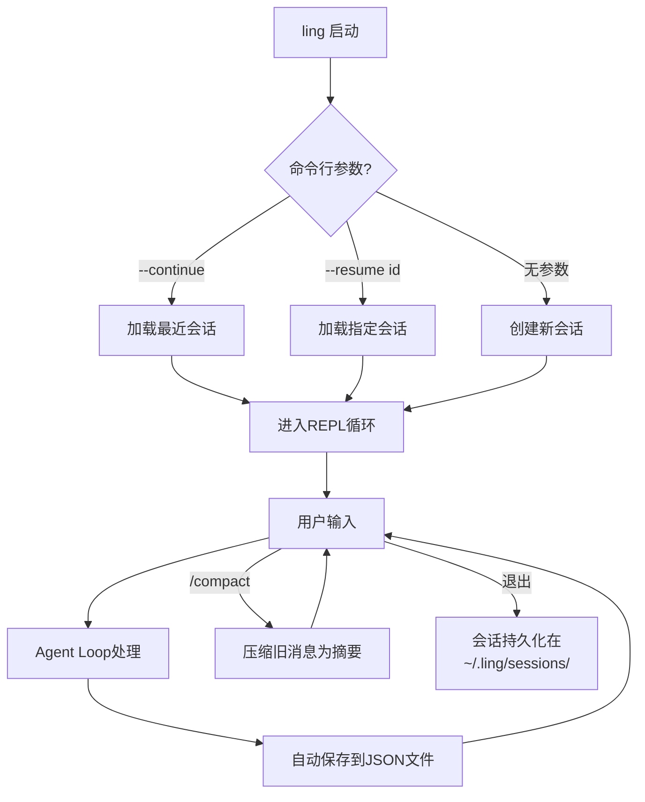

# 会话与记忆——记住上次聊到哪了

昨天让 Agent 花了半小时分析项目架构、理清了模块依赖、还帮你重构了三个文件。今天打开——全忘了。你得从头再说一遍"这是个 Express 项目，用了 Prisma，目录结构是这样的……"

这就是没有会话持久化的代价。LLM 本身是无状态的，每次请求都是一张白纸。前面六章我们一直把 `messages` 数组放在内存里，进程一退出就没了。这章来解决这个问题。

要做两件事：
1. **Session**——把对话历史存到磁盘，下次能接着聊
2. **Memory**——跨会话的长期记忆，让 Agent 记住你的偏好和项目约定



## 7.1 Session 数据结构

先想清楚一个 Session 需要哪些信息。

```typescript
// src/session/types.ts

import type OpenAI from "openai";

/** 对话消息——直接复用 OpenAI 的类型 */
export type Message = OpenAI.ChatCompletionMessageParam;

/** 一次完整的对话会话 */
export interface Session {
  id: string;
  name?: string;
  messages: Message[];
  metadata: SessionMetadata;
  createdAt: number;  // Unix 时间戳
  updatedAt: number;
}

/** 会话的元信息——记录"在哪个环境下"发生的对话 */
export interface SessionMetadata {
  cwd: string;          // 工作目录
  provider: string;     // LLM 提供商
  model: string;        // 模型名
  gitBranch?: string;   // 当前 git 分支
}
```

几个设计决策说一下：

**为什么要存 metadata？** 因为"在哪聊的"很重要。你在 `project-a` 目录下的对话，恢复时如果 cwd 变了，Agent 的工具调用全会指错路径。存下 metadata 可以在恢复时做检查和提示。

**为什么 messages 直接用 OpenAI 的类型？** 因为这就是我们实际传给 API 的数据结构。如果做一层抽象转换，会话恢复时还得转回去，多此一举。如果你要支持多个 LLM 提供商，可以定义一个通用的 Message 类型然后做适配——但在我们当前这个阶段，YAGNI。

**为什么用时间戳而不是 Date 对象？** JSON 序列化。`Date` 转 JSON 变字符串，反序列化回来还是字符串，得手动 `new Date()`。直接用 `number` 时间戳，序列化和反序列化都是零成本。

还需要一个列表展示用的摘要类型——不用加载完整消息数组就能展示会话列表：

```typescript
/** 会话列表项——不包含完整消息，用于 list 展示 */
export interface SessionSummary {
  id: string;
  name?: string;
  messageCount: number;
  createdAt: number;
  updatedAt: number;
  metadata: SessionMetadata;
  /** 最后一条用户消息的前 80 个字符，方便识别 */
  lastUserMessage?: string;
}
```

`lastUserMessage` 是个小细节但很实用。当你有 20 个历史会话时，光看 ID 和时间根本分不清哪个是哪个。显示最后一条用户消息的前 80 个字符，一眼就能认出来。

## 7.2 SessionStore：文件系统实现

存储方案：每个 session 一个 JSON 文件，放在 `~/.ling/sessions/` 目录下。

为什么选文件不选 SQLite？三个理由：

1. **简单**。不需要额外依赖，Node.js 自带 `fs` 模块就行。SQLite 要装 `better-sqlite3`，这个包的 native binding 在不同平台上经常出编译问题。
2. **可读**。用户可以直接用编辑器打开 JSON 文件查看甚至手动编辑。调试时能直接 `cat` 看内容。SQLite 是二进制格式，得用专门工具。
3. **够用**。一个 Agent 能有多少会话？几百个顶天了。几百个 JSON 文件的读写性能完全不是问题。等真的遇到性能瓶颈再迁移不迟。

```typescript
// src/session/store.ts

import * as fs from "fs/promises";
import * as path from "path";
import { randomUUID } from "crypto";
import type { Session, SessionSummary, SessionMetadata, Message } from "./types.js";

const SESSIONS_DIR = path.join(
  process.env.HOME ?? "~",
  ".ling",
  "sessions"
);

export class SessionStore {
  private dir: string;

  constructor(dir: string = SESSIONS_DIR) {
    this.dir = dir;
  }

  /** 确保目录存在 */
  private async ensureDir(): Promise<void> {
    await fs.mkdir(this.dir, { recursive: true });
  }

  private filePath(id: string): string {
    return path.join(this.dir, `${id}.json`);
  }

  /** 创建新会话 */
  async create(metadata: SessionMetadata, name?: string): Promise<Session> {
    await this.ensureDir();

    const session: Session = {
      id: randomUUID(),
      name,
      messages: [],
      metadata,
      createdAt: Date.now(),
      updatedAt: Date.now(),
    };

    await this.save(session);
    return session;
  }

  /** 保存会话（整体覆盖写入） */
  async save(session: Session): Promise<void> {
    await this.ensureDir();
    session.updatedAt = Date.now();

    const data = JSON.stringify(session, null, 2);
    // 先写临时文件再 rename——防止写到一半断电出现损坏文件
    const tmpPath = this.filePath(session.id) + ".tmp";
    await fs.writeFile(tmpPath, data, "utf-8");
    await fs.rename(tmpPath, this.filePath(session.id));
  }
```

注意 `save` 方法里的 write-then-rename 模式。这是文件存储的标准做法：先写到 `.tmp` 文件，完成后再原子性地 rename。如果直接写目标文件，写到一半进程挂了，文件就成了半成品——既不是旧数据也不是新数据，直接损坏。rename 在大多数文件系统上是原子操作，要么成功要么失败，不会出现中间状态。

继续实现 load 和 list：

```typescript
  /** 加载指定会话 */
  async load(id: string): Promise<Session | null> {
    try {
      const data = await fs.readFile(this.filePath(id), "utf-8");
      return JSON.parse(data) as Session;
    } catch {
      return null;
    }
  }

  /** 列出所有会话摘要，按更新时间倒序 */
  async list(): Promise<SessionSummary[]> {
    await this.ensureDir();

    const files = await fs.readdir(this.dir);
    const jsonFiles = files.filter((f) => f.endsWith(".json"));

    const summaries: SessionSummary[] = [];

    for (const file of jsonFiles) {
      try {
        const data = await fs.readFile(path.join(this.dir, file), "utf-8");
        const session = JSON.parse(data) as Session;

        // 找最后一条用户消息
        const lastUserMsg = [...session.messages]
          .reverse()
          .find((m) => m.role === "user");
        const lastContent =
          lastUserMsg && "content" in lastUserMsg
            ? String(lastUserMsg.content).slice(0, 80)
            : undefined;

        summaries.push({
          id: session.id,
          name: session.name,
          messageCount: session.messages.length,
          createdAt: session.createdAt,
          updatedAt: session.updatedAt,
          metadata: session.metadata,
          lastUserMessage: lastContent,
        });
      } catch {
        // 跳过损坏的文件
      }
    }

    return summaries.sort((a, b) => b.updatedAt - a.updatedAt);
  }
```

`list` 方法有一个性能问题：它需要读取每个文件来提取摘要信息。当会话数量增长到几百个时，这会变慢。解决方案是维护一个索引文件，或者在文件名里编码时间戳和名称。但现在几百个文件的顺序读取大概耗时几百毫秒，用户无感，所以先不优化。

```typescript
  /** 删除会话 */
  async delete(id: string): Promise<boolean> {
    try {
      await fs.unlink(this.filePath(id));
      return true;
    } catch {
      return false;
    }
  }

  /** 获取最近的会话 ID */
  async getLatestId(): Promise<string | null> {
    const summaries = await this.list();
    return summaries.length > 0 ? summaries[0].id : null;
  }

  /** 重命名会话 */
  async rename(id: string, name: string): Promise<boolean> {
    const session = await this.load(id);
    if (!session) return false;
    session.name = name;
    await this.save(session);
    return true;
  }
}
```

整个 SessionStore 不到 120 行。API 就五个操作：create / save / load / list / delete，加两个便捷方法 getLatestId 和 rename。够了。

## 7.3 CLI 集成

现在把 SessionStore 接入 Agent 的主循环，需要支持四个命令行参数：

| 参数 | 短写 | 作用 |
|------|------|------|
| `--continue` | `-c` | 恢复最近一次会话 |
| `--resume <id>` | `-r` | 恢复指定会话 |
| `--name "xxx"` | `-n` | 给当前会话命名 |
| `--list-sessions` | `-l` | 列出所有历史会话 |

参数解析不需要引入 commander 或 yargs，手写 20 行就够：

```typescript
// src/ling.ts（节选）

interface CliArgs {
  continue: boolean;
  resume?: string;
  name?: string;
  listSessions: boolean;
}

function parseArgs(argv: string[]): CliArgs {
  const args: CliArgs = { continue: false, listSessions: false };

  for (let i = 2; i < argv.length; i++) {
    switch (argv[i]) {
      case "--continue":
      case "-c":
        args.continue = true;
        break;
      case "--resume":
      case "-r":
        args.resume = argv[++i];
        break;
      case "--name":
      case "-n":
        args.name = argv[++i];
        break;
      case "--list-sessions":
      case "-l":
        args.listSessions = true;
        break;
    }
  }
  return args;
}
```

为什么从 `argv[2]` 开始？因为 `argv[0]` 是 node 可执行文件路径，`argv[1]` 是脚本路径，从 `argv[2]` 开始才是用户传的参数。

主函数里的会话初始化逻辑：

```typescript
async function main() {
  const args = parseArgs(process.argv);
  const store = new SessionStore();

  // --list-sessions：打印后退出
  if (args.listSessions) {
    const sessions = await store.list();
    if (sessions.length === 0) {
      console.log("No sessions found.");
      return;
    }
    console.log("Sessions:\n");
    for (const s of sessions) {
      const date = new Date(s.updatedAt).toLocaleString();
      const label = s.name ? `"${s.name}"` : s.id.slice(0, 8);
      const preview = s.lastUserMessage ?? "(empty)";
      console.log(`  ${label}  ${s.messageCount} msgs  ${date}`);
      console.log(`    ${preview}\n`);
    }
    return;
  }

  // 决定是新建还是恢复会话
  let session: Session;

  if (args.continue) {
    const latestId = await store.getLatestId();
    if (!latestId) {
      console.log("No previous session found. Starting new session.");
      session = await store.create(detectMetadata(), args.name);
    } else {
      session = (await store.load(latestId))!;
      console.log(`Resuming session ${session.id.slice(0, 8)}...`
        + ` (${session.messages.length} messages)`);
    }
  } else if (args.resume) {
    const loaded = await store.load(args.resume);
    if (!loaded) {
      console.error(`Session not found: ${args.resume}`);
      process.exit(1);
    }
    session = loaded;
    console.log(`Resuming session ${session.id.slice(0, 8)}...`
      + ` (${session.messages.length} messages)`);
  } else {
    session = await store.create(detectMetadata(), args.name);
    console.log(`New session: ${session.id.slice(0, 8)}`);
  }

  // ... REPL 循环（见下文）
}
```

`detectMetadata` 采集当前环境信息：

```typescript
import { execSync } from "child_process";

function detectMetadata(): SessionMetadata {
  let gitBranch: string | undefined;
  try {
    gitBranch = execSync("git branch --show-current",
      { encoding: "utf-8" }).trim();
  } catch {
    // 不在 git 仓库内，忽略
  }

  return {
    cwd: process.cwd(),
    provider: "openai",
    model,
    gitBranch,
  };
}
```

REPL 循环的关键改动是每轮对话后自动保存：

```typescript
  const prompt = () => {
    rl.question("You: ", async (input) => {
      if (!input.trim()) return prompt();

      try {
        const reply = await agentLoop(input, session.messages);
        console.log(`\nLing: ${reply}\n`);

        // 每轮对话后自动保存
        await store.save(session);
      } catch (err) {
        console.error(`Error: ${(err as Error).message}\n`);
      }
      prompt();
    });
  };
```

为什么每轮都保存而不是退出时保存？因为用户可能 Ctrl+C 强制退出，或者进程崩溃。每轮保存虽然多了 I/O，但一个 JSON 文件的写入耗时是微秒级的，用户完全无感。

实际使用效果：

```bash
# 新建会话
$ ling --name "migration"
New session: a3f2b1c8
You: 帮我把数据库从 MySQL 迁移到 PostgreSQL
Ling: ...

# 第二天继续
$ ling --continue
Resuming session a3f2b1c8... (12 messages)
You: 昨天迁移到哪一步了？
Ling: 我们昨天完成了 schema 转换和数据导出，接下来需要...

# 查看历史
$ ling --list-sessions
Sessions:

  "migration"  12 msgs  2024/12/15 14:30:00
    帮我把数据库从 MySQL 迁移到 PostgreSQL

  e7d9a4b2  6 msgs  2024/12/14 09:15:00
    这个项目的测试覆盖率怎么样
```

## 7.4 跨会话记忆：Memory

Session 解决了"接着上次聊"的问题。但有些信息的生命周期比一次会话更长——用户偏好、项目约定、Agent 犯过的错。这些东西应该永久存储，每次新会话都自动加载。

### 什么该记，什么不该记

该记的：
- **用户偏好**：代码风格、语言习惯（"回复用中文"、"变量名用 camelCase"）
- **项目约定**：架构规范、技术栈限制（"不要用 class，项目统一用函数式"）
- **反馈纠正**：Agent 犯了错，用户纠正后的正确做法（"部署时要先跑 migrate，不能直接 push"）

不该记的：
- 临时调试信息（"这个 bug 的堆栈是这样的"）
- 一次性任务细节（"帮我写封邮件给张三"的邮件内容）
- 过于具体的代码片段（这些应该在代码库里，不在记忆里）

判断标准很简单：**如果下次新会话时，这个信息还有用，就值得记住。**

### Memory 数据结构

```typescript
// src/session/types.ts（续）

/** 记忆类型 */
export type MemoryType = "user" | "project" | "feedback";

/** 一条记忆 */
export interface MemoryEntry {
  name: string;           // 记忆标题
  description: string;    // 一句话说明
  type: MemoryType;
  content: string;        // 正文内容（Markdown）
  createdAt: number;
  updatedAt: number;
}

/** 记忆索引文件中的条目 */
export interface MemoryIndexEntry {
  file: string;           // 文件名
  name: string;
  description: string;
  type: MemoryType;
}
```

三种类型对应三种场景：`user` 是个人偏好，跟项目无关；`project` 是项目级别的约定；`feedback` 是用户对 Agent 行为的纠正。分类的意义在于后续可以按类型过滤——比如切换到新项目时，`user` 类型的记忆依然有效，`project` 类型的就不应该加载了。

### MemoryStore 实现

存储路径：`~/.ling/memory/<project-slug>/`。每个项目一个目录，每条记忆一个 `.md` 文件，外加一个 `MEMORY.md` 索引文件。

```typescript
// src/session/memory.ts

import * as fs from "fs/promises";
import * as path from "path";
import type { MemoryEntry, MemoryIndexEntry, MemoryType } from "./types.js";

const MEMORY_BASE = path.join(process.env.HOME ?? "~", ".ling", "memory");

/** 把项目路径变成安全的目录名 */
function slugify(projectPath: string): string {
  return projectPath
    .replace(/^\//, "")
    .replace(/\//g, "-")
    .replace(/[^a-zA-Z0-9-]/g, "")
    .toLowerCase();
}

export class MemoryStore {
  private dir: string;

  constructor(projectPath: string) {
    this.dir = path.join(MEMORY_BASE, slugify(projectPath));
  }

  private async ensureDir(): Promise<void> {
    await fs.mkdir(this.dir, { recursive: true });
  }

  private indexPath(): string {
    return path.join(this.dir, "MEMORY.md");
  }
```

`slugify` 把 `/home/ubuntu/my-project` 变成 `home-ubuntu-my-project`，作为目录名。粗暴但有效。

写入记忆——生成带 frontmatter 的 Markdown 文件：

```typescript
  /**
   * 写入一条记忆
   * 生成独立的 .md 文件 + 更新 MEMORY.md 索引
   */
  async write(entry: MemoryEntry): Promise<string> {
    await this.ensureDir();

    const fileName = entry.name
      .toLowerCase()
      .replace(/[^a-z0-9]+/g, "-")
      .replace(/^-|-$/g, "")
      + ".md";

    // 生成带 frontmatter 的内容
    const fileContent = [
      "---",
      `name: ${entry.name}`,
      `description: ${entry.description}`,
      `type: ${entry.type}`,
      `createdAt: ${entry.createdAt}`,
      `updatedAt: ${entry.updatedAt}`,
      "---",
      "",
      entry.content,
      "",
    ].join("\n");

    await fs.writeFile(
      path.join(this.dir, fileName), fileContent, "utf-8"
    );

    // 更新索引
    await this.updateIndex({
      file: fileName,
      name: entry.name,
      description: entry.description,
      type: entry.type,
    });

    return fileName;
  }
```

为什么用 frontmatter 格式？因为这样每个 `.md` 文件既是机器可读的（解析 frontmatter 提取元数据），又是人类可读的（直接在编辑器里打开就是一篇格式清晰的文档）。这是 Markdown 生态的事实标准，Hugo、Jekyll、Obsidian 都用这个格式。

加载记忆到上下文——只读前 200 行：

```typescript
  /** 读取所有记忆条目（前 200 行） */
  async loadForContext(): Promise<string> {
    try {
      const indexContent = await fs.readFile(this.indexPath(), "utf-8");
      const lines = indexContent.split("\n");
      return lines.slice(0, 200).join("\n");
    } catch {
      return "";
    }
  }
```

为什么限制 200 行？因为记忆要注入到系统提示里，占的是上下文窗口。如果记忆文件膨胀到几千行，光记忆就吃掉了大量 token，真正的对话反而放不下了。200 行大概是 3000-4000 个 token，对于记忆索引来说绰绰有余。

解析和索引维护：

```typescript
  /** 读取指定记忆文件的完整内容 */
  async read(fileName: string): Promise<MemoryEntry | null> {
    try {
      const raw = await fs.readFile(
        path.join(this.dir, fileName), "utf-8"
      );
      return parseFrontmatter(raw);
    } catch {
      return null;
    }
  }

  /** 更新 MEMORY.md 索引文件 */
  private async updateIndex(entry: MemoryIndexEntry): Promise<void> {
    const entries = await this.list();

    // 去重：同名的覆盖
    const filtered = entries.filter((e) => e.file !== entry.file);
    filtered.push(entry);

    const lines = ["# Memory Index", ""];
    for (const e of filtered) {
      lines.push(
        `- [${e.name}](${e.file}) — ${e.description} (${e.type})`
      );
    }
    lines.push("");

    await fs.writeFile(this.indexPath(), lines.join("\n"), "utf-8");
  }
}
```

`MEMORY.md` 索引文件长这样：

```markdown
# Memory Index

- [代码风格偏好](code-style.md) — 使用 camelCase，不用分号 (user)
- [部署流程](deploy-flow.md) — 必须先跑 migrate 再部署 (project)
- [不要用 rm -rf](no-rm-rf.md) — 用 trash-cli 替代 (feedback)
```

每条记忆是一个带 frontmatter 的 Markdown 文件，比如 `code-style.md`：

```markdown
---
name: 代码风格偏好
description: 使用 camelCase，不用分号
type: user
createdAt: 1734567890000
updatedAt: 1734567890000
---

- 变量和函数名使用 camelCase
- 不使用分号（依赖 ASI）
- 字符串优先使用双引号
- 缩进用 2 个空格
```

### 自动写入：让 Agent 自己决定什么该记

手动管理记忆太麻烦，没人会用。正确的做法是给 Agent 一个 `save_memory` 工具，让它自己判断什么时候该记：

```typescript
// src/ling.ts（节选）

const memoryTool: OpenAI.ChatCompletionTool = {
  type: "function",
  function: {
    name: "save_memory",
    description:
      "Save a piece of information that should be remembered " +
      "across sessions. Use this for user preferences, project " +
      "conventions, and feedback corrections.",
    parameters: {
      type: "object",
      properties: {
        name: { type: "string", description: "Short title" },
        description: { type: "string", description: "One-line summary" },
        type: {
          type: "string",
          enum: ["user", "project", "feedback"],
          description: "user=preference, project=convention, feedback=correction",
        },
        content: { type: "string", description: "Full content in Markdown" },
      },
      required: ["name", "description", "type", "content"],
    },
  },
};
```

然后在 system prompt 里告诉 Agent：

```typescript
const systemPrompt = `You are Ling, a coding assistant.
When the user tells you something worth remembering
(preferences, project conventions, corrections),
call the save_memory tool to persist it across sessions.`;
```

Agent 收到 "以后回复都用中文" 这种消息时，就会自动调用 `save_memory`：

```json
{
  "name": "save_memory",
  "arguments": {
    "name": "语言偏好",
    "description": "回复使用中文",
    "type": "user",
    "content": "用户要求所有回复使用中文。"
  }
}
```

不需要用户显式说"记住这个"。LLM 足够聪明，能从对话语境中判断哪些信息具有跨会话的价值。

## 7.5 对照 Claude Code

我们的实现是简化版。来看看 Claude Code 在会话和记忆这块做了哪些更复杂的事。

### 会话存储格式

Claude Code 用 JSONL（每行一个 JSON 对象）而不是 JSON 来存储会话。差别在哪？

```
// JSON（我们的方案）——整个文件是一个 JSON 对象
{ "id": "xxx", "messages": [...], ... }

// JSONL（Claude Code 的方案）——每行一条消息
{"type":"summary","sessionId":"xxx","metadata":{...}}
{"type":"message","role":"user","content":"..."}
{"type":"message","role":"assistant","content":"..."}
```

JSONL 的优势是**追加写入**。新消息直接 append 一行，不用读取-修改-写回整个文件。当会话有几百轮对话时，JSON 方案每次保存都要序列化整个数组，JSONL 只写一行。

但 JSONL 的代价是读取时需要逐行解析，而且没法直接 `JSON.parse` 整个文件。对我们来说，几十轮对话的 JSON 文件通常也就几十 KB，整体读写的性能完全可接受。

### 会话管理 API

Claude Code 提供了比我们更丰富的会话操作：

- `listSessions`——列出会话，支持按目录过滤
- `getSessionInfo`——获取会话元信息
- `getSessionMessages`——获取消息（支持分页）
- `renameSession`——重命名
- `tagSession`——给会话打标签
- `forkSession`——**分叉会话**

`forkSession` 值得说一下。它的作用是从某个会话的某个时间点"分叉"出一个新会话——复制到那个时间点为止的所有消息，然后从这个分叉点开始走不同的方向。

使用场景：你让 Agent 做了一个方案，觉得不太满意，想试另一个方向。如果没有 fork，你得新建会话然后重新描述背景。有了 fork，直接从"提出方案"之前的那个点分叉，所有上下文都保留。

我们的简化版里没有实现 fork，但如果要加，核心逻辑就是深拷贝 messages 数组的前 N 条，创建一个新 Session。

### Memory 系统

Claude Code 的记忆比我们复杂。它有几种记忆类型：

| 类型 | 说明 | 存储位置 |
|------|------|----------|
| user | 用户全局偏好 | `~/.claude/memory/` |
| project | 项目级约定 | 项目目录下 `.claude/` |
| feedback | 纠正记录 | 跟 user 存一起 |
| reference | 参考文档 | 项目目录下 |

和我们一样，Claude Code 也用 `MEMORY.md` 作为索引文件，每条记忆存独立的 topic 文件。它的 frontmatter 格式：

```yaml
---
name: 代码风格
description: 项目的代码风格约定
type: project
---
```

一个关键设计：**自动加载到上下文时只读前 200 行**。这和我们的 `loadForContext` 一样——记忆是压缩过的知识，不应该占太多上下文窗口。

Claude Code 的记忆写入也是通过工具调用，LLM 自行判断什么值得记住。但它多了一层：会在对话结束时做一次"记忆回顾"——检查这次对话中有没有产生应该持久化但还没保存的信息。这个机制比我们的纯依赖 LLM 实时判断要更可靠。

### 可以学到什么

1. **JSONL 格式**——如果你的会话经常超过 100 轮，换成 JSONL 会有明显的性能收益
2. **forkSession**——低成本探索不同方案的利器
3. **记忆回顾**——对话结束时再检查一遍，比纯依赖 LLM 实时判断更可靠
4. **多级记忆**——用户级和项目级分开，切换项目时不会带入无关记忆

## 7.6 设计讨论：文件存储 vs 数据库

这章通篇用的是文件存储。有人会问：为什么不用 SQLite？或者 Redis？

回答这个问题要看场景。

**文件存储的优势：**
- 零依赖。Node.js 标准库就够。
- 可调试。`cat ~/.ling/sessions/xxx.json` 直接看内容，`ls -lt` 看时间排序。
- 可版本控制。理论上你可以把 `.ling/` 目录加入 git（虽然一般不会这么干）。
- 容错。一个文件坏了不影响其他文件。SQLite 数据库坏了可能全部丢失。

**文件存储的劣势：**
- 没有查询能力。想按关键词搜索历史会话？得逐个文件读取和遍历。
- 没有事务。并发写入同一个文件会出问题（虽然 CLI 工具基本不会并发）。
- 列表性能随文件数量线性增长。

**什么时候该换 SQLite？**
- 会话数量超过 1000
- 需要全文搜索历史对话
- 需要复杂查询（比如"找出所有在 project-a 目录下、包含 database 关键词的会话"）
- 多进程并发访问

对于一个 CLI Agent 来说，这些场景大多不存在。一个人一天能开多少个会话？10 个算多了。一年下来也就几千个文件。几千个 JSON 文件的全量扫描大概耗时 1-2 秒，完全可以接受。

所以结论是：**先用文件，遇到瓶颈再迁移。** 迁移也很简单——SessionStore 是一个接口，换个实现类就行，调用方完全不用改。这就是为什么我们要把存储抽成独立模块而不是内联在主循环里。

## 小结

这章实现了 Agent 的"记忆系统"：

- **Session** 解决了"接着上次聊"的问题。每个会话存成一个 JSON 文件，CLI 参数 `--continue` / `--resume` 控制恢复
- **Memory** 解决了"跨会话记住偏好"的问题。索引文件 + 独立 topic 文件的结构，前 200 行自动加载到上下文
- **自动写入** 靠 `save_memory` 工具让 Agent 自己判断什么该记，不需要用户手动管理
- **文件存储** 在当前规模下是最务实的选择。零依赖、可读、可调试

对照 Claude Code 的实现，我们能看到几个进阶方向：JSONL 追加写入、会话分叉、对话结束后的记忆回顾、多级记忆作用域。这些都不难加，但在需要之前不急着加。

下一章进入 Hook 和 MCP——怎么让 Agent 对接外部系统和工具链。
