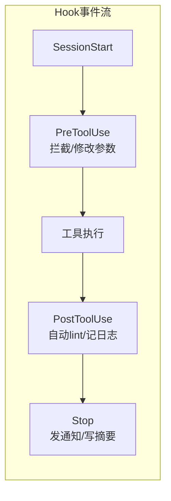

# 第 8 章 · Hook 系统：Agent 生命周期的扩展点

你不可能预见所有需求。

用户 A 想每次编辑文件后自动跑 ESLint。用户 B 想把 Agent 的操作日志发到 Slack。用户 C 想在危险操作前加一道额外检查。

你不可能把这些都硬编码进去。今天加个 ESLint，明天加个 Prettier，后天还要加个 Slack 通知——这条路走不通，Agent 会变成一个什么都做、什么都做不好的臃肿怪物。

正确的做法是提供**扩展机制**，让用户自己接入需要的功能。Hook 系统就是这样一套机制：在 Agent 的关键节点插入用户自定义的逻辑（编辑后跑 lint、结束时发通知、危险操作前拦截）。

Hook 管的是"Agent 做事的时候顺便做点别的"——它是切面，不是插件。下一章我们会讲 MCP，那才是给 Agent 加新能力的插件系统。



---

## 8.1 Hook 的设计思路

Hook 的概念很简单：在 Agent 执行流程的关键点，允许用户挂载自己的处理逻辑。

Git 有 pre-commit hook，Webpack 有 plugin hook，CI/CD 有 pipeline hook——思路都一样。Agent 的 hook 也不例外：在工具调用前后、会话开始和结束时，触发用户注册的 handler。

定义 4 种事件：

| 事件 | 触发时机 | 典型用途 |
|------|---------|---------|
| `PreToolUse` | 工具执行前 | 拦截危险操作、修改参数 |
| `PostToolUse` | 工具执行后 | 自动 lint、记录日志 |
| `SessionStart` | 会话开始 | 初始化环境、加载配置 |
| `Stop` | Agent 停止响应 | 发通知、写摘要 |

其中 `PreToolUse` 最强大——它可以**拦截**工具调用（返回 `blocked: true`），也可以**修改参数**（返回 `modifiedParams`）。相当于一个请求级的中间件。

Handler 支持两种类型：

- **command**：执行 shell 命令，把 Hook 上下文以 JSON 格式写入 stdin
- **http**：POST JSON 到一个 URL

为什么只要这两种？因为这两种覆盖了绝大多数场景。command 能跑任何本地脚本，http 能对接任何远程服务。想发 Slack？curl 一个 webhook。想跑 Python 脚本？command 里写 `python3 my_hook.py`。

## 8.2 类型定义

先把类型写清楚：

```typescript
// src/hooks/types.ts

/** Hook 事件类型 */
export type HookEvent =
  | "PreToolUse"
  | "PostToolUse"
  | "SessionStart"
  | "Stop";

/** 工具调用的上下文，传给 Hook handler */
export interface ToolCallContext {
  tool: string;
  params: Record<string, unknown>;
  result?: unknown; // PostToolUse 时才有
}

/** Hook 触发时传给 handler 的完整上下文 */
export interface HookContext {
  event: HookEvent;
  sessionId: string;
  timestamp: number;
  toolCall?: ToolCallContext;
}

/** Handler 执行结果 */
export interface HookResult {
  ok: boolean;
  output?: string;
  error?: string;
  /** PreToolUse：handler 可以修改工具参数 */
  modifiedParams?: Record<string, unknown>;
  /** PreToolUse：handler 可以拦截工具执行 */
  blocked?: boolean;
  blockReason?: string;
}
```

`HookContext` 是传给 handler 的完整上下文——事件类型、会话 ID、时间戳，以及工具调用的详情（如果是 `PreToolUse` / `PostToolUse` 的话）。

`HookResult` 是 handler 执行后的返回。关键是 `modifiedParams` 和 `blocked` 两个字段，它们让 `PreToolUse` 有了拦截和修改的能力。

Handler 的类型定义：

```typescript
/** command handler：执行 shell 命令 */
export interface CommandHandler {
  type: "command";
  command: string;
  timeout?: number; // 毫秒，默认 10000
}

/** http handler：POST JSON 到 URL */
export interface HttpHandler {
  type: "http";
  url: string;
  headers?: Record<string, string>;
  timeout?: number; // 毫秒，默认 5000
}

export type HookHandler = CommandHandler | HttpHandler;

/** 单条 Hook 规则 */
export interface HookRule {
  event: HookEvent;
  /** 正则匹配工具名（仅对 PreToolUse / PostToolUse 有效） */
  matcher?: string;
  handler: HookHandler;
  /** 是否异步执行（不阻塞 Agent），默认 false */
  async?: boolean;
}
```

`matcher` 用正则匹配工具名。比如 `"edit_file"` 只匹配编辑文件，`".*"` 匹配所有工具。没有 `matcher` 就匹配该事件的所有触发。

`async` 字段控制是否阻塞。发 Slack 通知不需要等结果，设成 `true` 就是 fire-and-forget。但 PreToolUse 的拦截逻辑必须是同步的——你总不能"先执行了再说要不要拦截"。

## 8.3 HookEngine 实现

HookEngine 是核心——注册规则、匹配事件、执行 handler：

```typescript
// src/hooks/engine.ts

import { spawn } from "node:child_process";
import type {
  HookEvent, HookContext, HookResult,
  HookRule, HooksConfig, CommandHandler, HttpHandler,
} from "./types.js";

export class HookEngine {
  private rules: HookRule[] = [];

  load(config: HooksConfig): void {
    this.rules = config.hooks;
    console.log(`[hooks] Loaded ${this.rules.length} hook(s)`);
  }

  register(rule: HookRule): void {
    this.rules.push(rule);
  }

  async trigger(ctx: HookContext): Promise<HookResult[]> {
    const matched = this.match(ctx);
    if (matched.length === 0) return [];

    const results: HookResult[] = [];

    for (const rule of matched) {
      if (rule.async) {
        // fire-and-forget
        this.execute(rule, ctx).catch((err) =>
          console.error(`[hooks] Async handler error:`, err.message)
        );
        results.push({ ok: true, output: "(async, no wait)" });
      } else {
        const result = await this.execute(rule, ctx);
        results.push(result);
        // PreToolUse 时，如果被拦截就不再执行后续 handler
        if (ctx.event === "PreToolUse" && result.blocked) {
          break;
        }
      }
    }

    return results;
  }

  private match(ctx: HookContext): HookRule[] {
    return this.rules.filter((rule) => {
      if (rule.event !== ctx.event) return false;
      if (rule.matcher && ctx.toolCall) {
        return new RegExp(rule.matcher).test(ctx.toolCall.tool);
      }
      return true;
    });
  }

  private async execute(rule: HookRule, ctx: HookContext): Promise<HookResult> {
    try {
      switch (rule.handler.type) {
        case "command":
          return await this.executeCommand(rule.handler, ctx);
        case "http":
          return await this.executeHttp(rule.handler, ctx);
        default:
          return { ok: false, error: "Unknown handler type" };
      }
    } catch (err: any) {
      return { ok: false, error: err.message };
    }
  }

  // ...
}
```

`trigger` 方法的逻辑：

1. 用 `match` 找到所有匹配的规则
2. 逐个执行 handler
3. 异步 handler 直接 fire-and-forget
4. 同步 handler 等结果，如果 `blocked` 就提前退出

注意 `match` 方法里的正则匹配——`rule.matcher` 是个正则字符串，用 `new RegExp` 构造后匹配工具名。

## 8.4 Command Handler

command handler 最有意思。它把 `HookContext` 以 JSON 格式写入子进程的 stdin，handler 脚本从 stdin 读取上下文，做处理，然后把结果写到 stdout：

```typescript
private executeCommand(
  handler: CommandHandler,
  ctx: HookContext
): Promise<HookResult> {
  return new Promise((resolve) => {
    const timeout = handler.timeout ?? 10_000;
    const child = spawn("sh", ["-c", handler.command], {
      stdio: ["pipe", "pipe", "pipe"],
    });

    let stdout = "";
    let stderr = "";

    child.stdout.on("data", (chunk: Buffer) => {
      stdout += chunk.toString();
    });
    child.stderr.on("data", (chunk: Buffer) => {
      stderr += chunk.toString();
    });

    // 把上下文 JSON 写入 stdin
    child.stdin.write(JSON.stringify(ctx));
    child.stdin.end();

    const timer = setTimeout(() => {
      child.kill("SIGTERM");
      resolve({ ok: false, error: `Timed out after ${timeout}ms` });
    }, timeout);

    child.on("close", (code) => {
      clearTimeout(timer);
      if (code === 0) {
        const result: HookResult = { ok: true, output: stdout.trim() };
        try {
          const parsed = JSON.parse(stdout);
          if (parsed.modifiedParams) result.modifiedParams = parsed.modifiedParams;
          if (parsed.blocked) {
            result.blocked = true;
            result.blockReason = parsed.blockReason ?? "Blocked by hook";
          }
        } catch {
          // stdout 不是 JSON，没关系
        }
        resolve(result);
      } else {
        resolve({ ok: false, error: stderr.trim() || `Exit code ${code}` });
      }
    });
  });
}
```

关键设计决策：

- **stdin 传入上下文**：handler 脚本可以用任何语言写——Node、Python、bash 都行，只要能读 stdin 就行
- **stdout 返回结果**：如果 stdout 是合法 JSON 且包含 `modifiedParams` 或 `blocked`，就提取出来。不是 JSON 也没关系，当作普通输出
- **超时兜底**：handler 挂了不能拖死 Agent

## 8.5 HTTP Handler

HTTP handler 更简单——POST JSON 到 URL：

```typescript
private async executeHttp(
  handler: HttpHandler,
  ctx: HookContext
): Promise<HookResult> {
  const timeout = handler.timeout ?? 5_000;
  const controller = new AbortController();
  const timer = setTimeout(() => controller.abort(), timeout);

  try {
    const resp = await fetch(handler.url, {
      method: "POST",
      headers: { "Content-Type": "application/json", ...handler.headers },
      body: JSON.stringify(ctx),
      signal: controller.signal,
    });
    clearTimeout(timer);
    const body = await resp.text();
    return resp.ok
      ? { ok: true, output: body }
      : { ok: false, error: `HTTP ${resp.status}: ${body}` };
  } catch (err: any) {
    clearTimeout(timer);
    return { ok: false, error: err.message };
  }
}
```

用 `AbortController` 做超时控制。Node.js 18+ 原生支持 `fetch`，不需要额外依赖。

## 8.6 配置加载

Hook 规则写在 `.ling/hooks.json` 里：

```json
{
  "hooks": [
    {
      "event": "PostToolUse",
      "matcher": "edit_file",
      "handler": {
        "type": "command",
        "command": "npx eslint --fix $(cat | jq -r '.toolCall.params.file_path')"
      }
    },
    {
      "event": "Stop",
      "handler": {
        "type": "http",
        "url": "https://hooks.slack.com/services/xxx/yyy/zzz"
      },
      "async": true
    }
  ]
}
```

加载逻辑很直白——读文件、解析 JSON、校验结构：

```typescript
// src/hooks/config.ts

import { readFile } from "node:fs/promises";
import { join } from "node:path";
import type { HooksConfig, HookRule } from "./types.js";

export async function loadHooksConfig(
  projectRoot: string
): Promise<HooksConfig> {
  const configPath = join(projectRoot, ".ling", "hooks.json");

  try {
    const raw = await readFile(configPath, "utf-8");
    const parsed = JSON.parse(raw);
    return validateConfig(parsed);
  } catch (err: any) {
    if (err.code === "ENOENT") {
      return { hooks: [] }; // 没有配置文件就用空配置
    }
    console.error(`[hooks] Failed to load ${configPath}:`, err.message);
    return { hooks: [] };
  }
}
```

配置文件不存在不报错，返回空配置。这是"零配置可用"的原则——不配 hook，Agent 照常工作。

## 8.7 实战案例

**案例 1：自动 lint**

每次 `edit_file` 后自动跑 `eslint --fix`。配置：

```json
{
  "hooks": [
    {
      "event": "PostToolUse",
      "matcher": "edit_file",
      "handler": {
        "type": "command",
        "command": "npx eslint --fix $(cat | jq -r '.toolCall.params.file_path')"
      }
    }
  ]
}
```

`cat | jq -r '.toolCall.params.file_path'` 从 stdin 读 JSON 上下文，提取被编辑的文件路径，传给 `eslint --fix`。Agent 每次编辑完文件，lint 自动跑一遍，格式问题当场修复。

**案例 2：Slack 通知**

Agent 完成任务后发 Slack 消息。配置：

```json
{
  "hooks": [
    {
      "event": "Stop",
      "handler": {
        "type": "http",
        "url": "https://hooks.slack.com/services/T00/B00/xxxx",
        "headers": { "Content-Type": "application/json" }
      },
      "async": true
    }
  ]
}
```

`async: true` 因为发通知不需要等结果，别拖慢 Agent 的响应。Slack Incoming Webhook 直接接受 JSON POST，会把收到的内容显示在频道里。

**案例 3：PreToolUse 拦截**

假设你想禁止 Agent 在 `node_modules` 目录下写文件。写个 shell 脚本 `block-node-modules.sh`：

```bash
#!/bin/bash
# 从 stdin 读 JSON，检查文件路径是否在 node_modules 下
INPUT=$(cat)
FILE_PATH=$(echo "$INPUT" | jq -r '.toolCall.params.file_path // empty')

if [[ "$FILE_PATH" == *node_modules* ]]; then
  echo '{"blocked": true, "blockReason": "Cannot write to node_modules"}'
else
  echo '{"blocked": false}'
fi
```

配置：

```json
{
  "event": "PreToolUse",
  "matcher": "edit_file|write_file",
  "handler": {
    "type": "command",
    "command": "bash .ling/hooks/block-node-modules.sh"
  }
}
```

`matcher` 用正则 `"edit_file|write_file"` 同时匹配两个工具。脚本返回 `blocked: true` 时，`HookEngine` 会阻止工具调用并把 `blockReason` 反馈给 LLM。

## 8.8 对照 Claude Code

我们实现了一个最小但可用的 Hook 系统。来看看 Claude Code 做到了什么程度：

- **24 种事件类型**：我们只有 4 种，Claude Code 有 PreToolUse、PostToolUse、Notification、Stop 等等，粒度更细
- **4 种 handler 类型**：除了 command 和 http，还有 prompt（修改 system prompt）和 agent（启动子 Agent 来处理）
- **优先级系统**：managed settings > local > shared > plugin，不同来源的 Hook 有不同优先级。公司统一配置的 Hook 优先于个人配置，防止个人绕过安全规则

这些都是我们这个版本可以逐步演进的方向。先把核心跑通，再加功能。

## 8.9 小结

这章做了一件事：

**Hook 系统** 让用户在 Agent 的执行流程中插入自定义逻辑。4 种事件（PreToolUse、PostToolUse、SessionStart、Stop），2 种 handler（command、http），通过 `.ling/hooks.json` 配置。PreToolUse 最强大——能拦截和修改工具调用。

核心设计原则是 **Agent 核心保持简单，扩展能力外置**。Hook 是切面（AOP），在已有动作上加逻辑，但不改变 Agent 本身的能力边界。

但如果你想给 Agent **全新的能力**呢？比如查数据库、搜 Jira、调公司内部 API——这些不是 Hook 能搞定的，你需要给 Agent 加新工具。下一章我们来讲 MCP（Model Context Protocol），一个标准协议，让任何人都能给 Agent 写新工具。