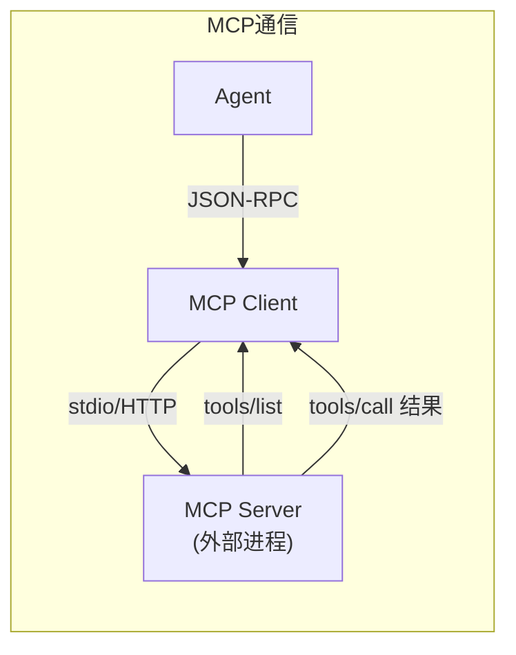

# 第 9 章 · MCP：一个协议连接所有工具

上一章我们搞定了 Hook 系统——在 Agent 已有动作上加逻辑。但如果你想给 Agent **全新的能力**呢？比如查数据库、搜 Jira、调公司内部 API——这些不是 Hook 能搞定的，你需要给 Agent 加新工具。

最粗暴的做法：直接在代码里加一个工具函数。但这意味着每加一个工具都要改 Agent 代码、重新部署。用户想接自己的服务？不好意思，先提 PR。

MCP（Model Context Protocol）的思路是：**定义一个标准协议，让工具以独立进程运行，Agent 通过协议和它通信**。就像 USB——你不需要知道 U 盘的内部实现，插上就能用。



MCP 的架构很简单：

```
Agent (MCP Client) ←→ stdio/HTTP ←→ MCP Server (工具提供者)
```

Agent 是 Client，工具提供者是 Server。它们之间用 JSON-RPC 2.0 通信。最常见的传输方式是 stdio——Agent 把 MCP Server 当子进程启动，通过 stdin/stdout 交换 JSON 消息。

---

## 9.1 协议核心

别被"协议"这个词吓到。MCP 的核心就四步：

**第一步：握手。** Client 发 `initialize`，告诉 Server 自己支持的协议版本和能力。Server 回复自己的版本和能力。然后 Client 发一个 `notifications/initialized` 通知，握手完成。

```
Client → Server: {"method": "initialize", "params": {"protocolVersion": "2025-03-26", ...}}
Server → Client: {"result": {"protocolVersion": "2025-03-26", "capabilities": {"tools": {}}, ...}}
Client → Server: {"method": "notifications/initialized"}
```

**第二步：发现工具。** Client 发 `tools/list`，Server 返回它提供的所有工具列表，包括名称、描述、参数 schema。

```
Client → Server: {"method": "tools/list"}
Server → Client: {"result": {"tools": [{"name": "query", "description": "...", "inputSchema": {...}}]}}
```

**第三步：调用工具。** LLM 决定要用某个工具时，Client 发 `tools/call`，Server 执行并返回结果。

```
Client → Server: {"method": "tools/call", "params": {"name": "query", "arguments": {"sql": "SELECT ..."}}}
Server → Client: {"result": {"content": [{"type": "text", "text": "[{...}]"}]}}
```

**第四步：收工。** 用完了就关掉子进程，或者保持连接等下次用。

所有消息都是 JSON-RPC 2.0 格式——有 `jsonrpc: "2.0"`、有 `id`（请求）或没有 `id`（通知）、有 `method`、有 `params`/`result`。就是普通的 RPC，没什么魔法。

## 9.2 MCP Server 的三种能力

一个 MCP Server 可以提供三种东西：

- **Tools**：可执行的操作（查数据库、发邮件、搜索）
- **Resources**：可读取的数据源（文件、API 返回的数据）
- **Prompts**：预定义的 prompt 模板

这章只实现 Tools——这是最核心、用得最多的。Resources 和 Prompts 原理类似，后面可以自己扩展。

## 9.3 MCP 消息类型

协议层的类型定义：

```typescript
// src/mcp/types.ts

/** JSON-RPC 请求 */
export interface JsonRpcRequest {
  jsonrpc: "2.0";
  id: number;
  method: string;
  params?: Record<string, unknown>;
}

/** JSON-RPC 响应 */
export interface JsonRpcResponse {
  jsonrpc: "2.0";
  id: number;
  result?: unknown;
  error?: JsonRpcError;
}

export interface JsonRpcError {
  code: number;
  message: string;
  data?: unknown;
}

/** MCP 工具定义（从 tools/list 返回） */
export interface McpToolDefinition {
  name: string;
  description: string;
  inputSchema: {
    type: "object";
    properties: Record<string, unknown>;
    required?: string[];
  };
}

/** tools/call 的响应 */
export interface ToolCallResult {
  content: Array<{
    type: "text" | "image" | "resource";
    text?: string;
    data?: string;
    mimeType?: string;
  }>;
  isError?: boolean;
}

/** mcp.json 中单个 server 的配置 */
export interface McpServerConfig {
  command: string;
  args?: string[];
  env?: Record<string, string>;
}
```

`McpToolDefinition` 和 OpenAI function calling 的 tool schema 很像——都是名称 + 描述 + JSON Schema 参数。这不是巧合，MCP 就是在这一层上做了标准化。

`ToolCallResult` 的 `content` 是个数组，支持多种类型。文本是最常用的，图片和资源用于更复杂的场景。

## 9.4 实现 MCP Client

MCP Client 的职责：启动子进程、完成握手、发现工具、调用工具。

```typescript
// src/mcp/client.ts

import { spawn, type ChildProcess } from "node:child_process";
import type {
  JsonRpcRequest, JsonRpcResponse, InitializeResult,
  McpToolDefinition, ToolsListResult, ToolCallResult, McpServerConfig,
} from "./types.js";

export class McpClient {
  private process: ChildProcess | null = null;
  private requestId = 0;
  private pending = new Map<
    number,
    { resolve: (v: any) => void; reject: (e: Error) => void }
  >();
  private buffer = "";
  private serverName: string;
  private config: McpServerConfig;
  private _tools: McpToolDefinition[] = [];

  constructor(serverName: string, config: McpServerConfig) {
    this.serverName = serverName;
    this.config = config;
  }

  get tools(): McpToolDefinition[] {
    return this._tools;
  }
```

构造函数接收 server 名称和配置。`pending` 是一个 Map，用 request ID 追踪正在等待响应的请求——经典的异步 RPC 模式。

**启动和握手：**

```typescript
async connect(): Promise<InitializeResult> {
  this.process = spawn(this.config.command, this.config.args ?? [], {
    stdio: ["pipe", "pipe", "pipe"],
    env: { ...process.env, ...this.config.env },
  });

  // 监听 stdout，按行解析 JSON-RPC 响应
  this.process.stdout!.on("data", (chunk: Buffer) => {
    this.buffer += chunk.toString();
    this.processBuffer();
  });

  this.process.on("exit", (code) => {
    // 拒绝所有等待中的请求
    for (const [, { reject }] of this.pending) {
      reject(new Error(`MCP server exited with code ${code}`));
    }
    this.pending.clear();
  });

  // 握手
  const initResult = await this.request<InitializeResult>("initialize", {
    protocolVersion: "2025-03-26",
    capabilities: {},
    clientInfo: { name: "ling", version: "0.8.0" },
  });

  this.notify("notifications/initialized", {});

  // 发现工具
  const toolsResult = await this.request<ToolsListResult>("tools/list", {});
  this._tools = toolsResult.tools;

  console.log(
    `[mcp:${this.serverName}] Connected, ${this._tools.length} tool(s)`
  );
  return initResult;
}
```

`spawn` 启动子进程，`stdio: ["pipe", "pipe", "pipe"]` 使得 Client 能读写它的 stdin/stdout/stderr。`connect` 做三件事：启动进程、完成握手、发现工具。

**发送和接收消息：**

```typescript
private request<T>(method: string, params: Record<string, unknown>): Promise<T> {
  return new Promise((resolve, reject) => {
    const id = ++this.requestId;
    this.pending.set(id, { resolve, reject });

    this.send({ jsonrpc: "2.0", id, method, params });

    setTimeout(() => {
      if (this.pending.has(id)) {
        this.pending.delete(id);
        reject(new Error(`Request ${method} timed out`));
      }
    }, 30_000);
  });
}

private send(msg: object): void {
  const json = JSON.stringify(msg);
  this.process!.stdin!.write(json + "\n");
}

private processBuffer(): void {
  const lines = this.buffer.split("\n");
  this.buffer = lines.pop() ?? ""; // 最后一个可能不完整

  for (const line of lines) {
    const trimmed = line.trim();
    if (!trimmed) continue;
    try {
      const msg = JSON.parse(trimmed) as JsonRpcResponse;
      if (msg.id != null && this.pending.has(msg.id)) {
        const { resolve, reject } = this.pending.get(msg.id)!;
        this.pending.delete(msg.id);
        msg.error
          ? reject(new Error(`MCP error ${msg.error.code}: ${msg.error.message}`))
          : resolve(msg.result);
      }
    } catch { /* 非 JSON 行，忽略 */ }
  }
}
```

通信协议是"一行一个 JSON"——发送时追加 `\n`，接收时按 `\n` 分割。`processBuffer` 处理 TCP 粘包问题（stdout 可能一次吐出多行，也可能半行）。

`request` 方法返回 Promise，把 resolve/reject 存到 `pending` Map 里。当 `processBuffer` 解析到对应 ID 的响应时，resolve 或 reject 这个 Promise。30 秒超时兜底。

**调用工具：**

```typescript
async callTool(
  toolName: string,
  args: Record<string, unknown>
): Promise<ToolCallResult> {
  return this.request<ToolCallResult>("tools/call", {
    name: toolName,
    arguments: args,
  });
}
```

调用工具就是发个 `tools/call` 请求，没什么花头。

## 9.5 从配置加载 MCP Server

MCP Server 配置写在 `.ling/mcp.json` 里：

```json
{
  "mcpServers": {
    "sqlite": {
      "command": "npx",
      "args": ["tsx", "src/mcp-servers/sqlite-server.ts", "./data/mydb.sqlite"]
    },
    "github": {
      "command": "npx",
      "args": ["-y", "@modelcontextprotocol/server-github"],
      "env": {
        "GITHUB_TOKEN": "ghp_xxxx"
      }
    }
  }
}
```

每个 server 有个名字（`sqlite`、`github`），配置里指定启动命令和参数。loader 遍历配置，逐个启动 server：

```typescript
// src/mcp/loader.ts

import { McpClient } from "./client.js";
import type { McpToolDefinition } from "./types.js";

export interface McpRegisteredTool {
  /** 格式：mcp__<server>__<tool> */
  name: string;
  description: string;
  inputSchema: McpToolDefinition["inputSchema"];
  client: McpClient;
  remoteName: string;
}

export async function loadMcpServers(projectRoot: string): Promise<{
  clients: McpClient[];
  tools: McpRegisteredTool[];
}> {
  const configPath = join(projectRoot, ".ling", "mcp.json");
  let config: McpConfig;

  try {
    const raw = await readFile(configPath, "utf-8");
    config = JSON.parse(raw);
  } catch (err: any) {
    if (err.code === "ENOENT") return { clients: [], tools: [] };
    console.error(`[mcp] Failed to load config:`, err.message);
    return { clients: [], tools: [] };
  }

  const clients: McpClient[] = [];
  const tools: McpRegisteredTool[] = [];

  for (const [serverName, serverConfig] of Object.entries(config.mcpServers)) {
    const client = new McpClient(serverName, serverConfig);
    try {
      await client.connect();
      clients.push(client);

      for (const tool of client.tools) {
        tools.push({
          name: `mcp__${serverName}__${tool.name}`,
          description: `[MCP:${serverName}] ${tool.description}`,
          inputSchema: tool.inputSchema,
          client,
          remoteName: tool.name,
        });
      }
    } catch (err: any) {
      console.error(`[mcp] Failed to connect ${serverName}:`, err.message);
    }
  }

  return { clients, tools };
}
```

**命名规则 `mcp__<server>__<tool>`** 很重要。两个 MCP Server 可能都暴露了叫 `query` 的工具，加上 server 名前缀就不会冲突。LLM 看到 `mcp__sqlite__query`，也能理解这是 SQLite server 的查询工具。

注意错误处理——某个 server 连接失败不影响其他 server。这是可选扩展，不能因为一个插件挂了就整个 Agent 起不来。

## 9.6 实战：写一个 SQLite MCP Server

现在来写个真的 MCP Server——让 Ling 能查 SQLite 数据库。

一个 MCP Server 就是一个普通的 Node.js 脚本，从 stdin 读 JSON-RPC 请求，往 stdout 写响应：

```typescript
// src/mcp-servers/sqlite-server.ts

import Database from "better-sqlite3";
import { createInterface } from "node:readline";

let db: Database.Database;

const TOOLS = [
  {
    name: "list_tables",
    description: "List all tables in the SQLite database",
    inputSchema: { type: "object" as const, properties: {} },
  },
  {
    name: "query",
    description: "Execute a read-only SQL query",
    inputSchema: {
      type: "object" as const,
      properties: {
        sql: { type: "string", description: "SQL query (SELECT only)" },
      },
      required: ["sql"],
    },
  },
];
```

两个工具：`list_tables` 列出所有表，`query` 执行只读查询。

**请求分发：**

```typescript
function handleRequest(msg: { id?: number; method: string; params?: any }): object | null {
  if (msg.id == null) return null; // 通知不需要响应

  switch (msg.method) {
    case "initialize":
      return {
        jsonrpc: "2.0", id: msg.id,
        result: {
          protocolVersion: "2025-03-26",
          capabilities: { tools: {} },
          serverInfo: { name: "sqlite-server", version: "0.1.0" },
        },
      };
    case "tools/list":
      return { jsonrpc: "2.0", id: msg.id, result: { tools: TOOLS } };
    case "tools/call":
      return handleToolCall(msg.id, msg.params);
    default:
      return {
        jsonrpc: "2.0", id: msg.id,
        error: { code: -32601, message: `Unknown method: ${msg.method}` },
      };
  }
}
```

就是个 switch-case。`initialize` 返回握手信息，`tools/list` 返回工具列表，`tools/call` 分发到具体工具。

**工具实现：**

```typescript
function handleToolCall(
  id: number,
  params: { name: string; arguments: Record<string, unknown> }
): object {
  const { name, arguments: args } = params;

  try {
    switch (name) {
      case "list_tables": {
        const rows = db
          .prepare("SELECT name FROM sqlite_master WHERE type='table' ORDER BY name")
          .all() as { name: string }[];
        return {
          jsonrpc: "2.0", id,
          result: {
            content: [{ type: "text", text: JSON.stringify(rows.map(r => r.name), null, 2) }],
          },
        };
      }
      case "query": {
        const sql = args.sql as string;
        if (!/^\s*SELECT\b/i.test(sql)) {
          return {
            jsonrpc: "2.0", id,
            result: {
              content: [{ type: "text", text: "Error: Only SELECT queries allowed" }],
              isError: true,
            },
          };
        }
        const rows = db.prepare(sql).all();
        return {
          jsonrpc: "2.0", id,
          result: {
            content: [{ type: "text", text: JSON.stringify(rows, null, 2) }],
          },
        };
      }
      default:
        return { jsonrpc: "2.0", id, error: { code: -32601, message: `Unknown tool: ${name}` } };
    }
  } catch (err: any) {
    return {
      jsonrpc: "2.0", id,
      result: { content: [{ type: "text", text: `Error: ${err.message}` }], isError: true },
    };
  }
}
```

`query` 工具有个安全检查——正则匹配 `SELECT`，拒绝其他语句。这是最基本的防护，生产环境应该用数据库的只读模式（`better-sqlite3` 支持 `readonly: true`）。

**启动主循环：**

```typescript
const dbPath = process.argv[2];
if (!dbPath) {
  console.error("Usage: sqlite-server <database-path>");
  process.exit(1);
}

db = new Database(dbPath, { readonly: true });

const rl = createInterface({ input: process.stdin });
rl.on("line", (line) => {
  try {
    const msg = JSON.parse(line.trim());
    const response = handleRequest(msg);
    if (response) {
      process.stdout.write(JSON.stringify(response) + "\n");
    }
  } catch { /* 忽略 */ }
});
```

就这么多。一个完整的 MCP Server 不到 100 行。数据库路径从命令行参数传入，用 `readline` 逐行读 stdin，解析 JSON-RPC，处理请求，写回 stdout。

配置 `.ling/mcp.json`：

```json
{
  "mcpServers": {
    "sqlite": {
      "command": "npx",
      "args": ["tsx", "src/mcp-servers/sqlite-server.ts", "./data/mydb.sqlite"]
    }
  }
}
```

Ling 启动后会自动连接这个 server，发现 `list_tables` 和 `query` 两个工具，注册为 `mcp__sqlite__list_tables` 和 `mcp__sqlite__query`。现在你跟 Ling 说"列出数据库里所有表"，它会自动调用 MCP 工具。

## 9.7 集成到 Agent Loop

最后把 Hook（上一章）和 MCP 都集成到主循环里：

```typescript
// src/ling.ts

async function main() {
  const projectRoot = process.cwd();
  const sessionId = randomUUID();

  // 1. 加载 Hook
  const hookEngine = new HookEngine();
  const hooksConfig = await loadHooksConfig(projectRoot);
  hookEngine.load(hooksConfig);

  // 2. 加载 MCP
  const { clients: mcpClients, tools: mcpTools } = await loadMcpServers(projectRoot);

  // 合并内置工具和 MCP 工具
  const mcpToolMap = new Map(mcpTools.map((t) => [t.name, t]));
  const allTools = [...BUILTIN_TOOLS, ...mcpTools.map(mcpToolToOpenAI)];

  // 3. 触发 SessionStart hook
  await hookEngine.trigger({
    event: "SessionStart", sessionId, timestamp: Date.now(),
  });

  // ... Agent loop ...

  // 处理每个工具调用
  for (const call of msg.tool_calls) {
    const toolName = call.function.name;
    let toolParams = JSON.parse(call.function.arguments);

    // ---- PreToolUse Hook ----
    const preResults = await hookEngine.trigger({
      event: "PreToolUse", sessionId, timestamp: Date.now(),
      toolCall: { tool: toolName, params: toolParams },
    });

    const blocked = preResults.find((r) => r.blocked);
    if (blocked) {
      messages.push({
        role: "tool", tool_call_id: call.id,
        content: `Tool call blocked: ${blocked.blockReason}`,
      });
      continue; // 跳过执行
    }

    // 参数可能被 Hook 修改
    const modified = preResults.find((r) => r.modifiedParams);
    if (modified?.modifiedParams) {
      toolParams = { ...toolParams, ...modified.modifiedParams };
    }

    // ---- 执行工具 ----
    let result: string;
    const mcpTool = mcpToolMap.get(toolName);
    if (mcpTool) {
      result = await executeMcpTool(mcpTool, toolParams);
    } else {
      result = await executeBuiltinTool(toolName, toolParams);
    }

    // ---- PostToolUse Hook ----
    await hookEngine.trigger({
      event: "PostToolUse", sessionId, timestamp: Date.now(),
      toolCall: { tool: toolName, params: toolParams, result },
    });

    messages.push({ role: "tool", tool_call_id: call.id, content: result });
  }

  // 关闭 MCP 连接
  await shutdownMcpServers(mcpClients);
}
```

工具调用的完整流程：

1. LLM 决定调用工具
2. **PreToolUse Hook** → 可以拦截或修改参数
3. 判断是 MCP 工具还是内置工具，分别执行
4. **PostToolUse Hook** → 可以触发后续动作（lint、日志等）
5. 结果返回给 LLM

MCP 工具的执行委托给 `McpClient.callTool()`，从 LLM 的视角看，它和内置工具没有区别——都是有名称、有描述、有参数的 function。

## 9.8 对照 Claude Code

我们实现了一个最小但可用的 MCP 系统。来看看 Claude Code 做到了什么程度：

- **三种传输**：我们只实现了 stdio，Claude Code 还支持 HTTP 和 SSE（Server-Sent Events）。HTTP 适合远程 server，SSE 适合需要长连接的场景
- **动态工具发现**：Claude Code 有 `ToolSearch`——不是启动时一次性加载所有工具，而是按需搜索。如果有 200 个 MCP 工具，不会全塞进 system prompt（那太浪费 token），而是 LLM 需要时用 `ToolSearch` 查找
- **运行时重配置**：`setMcpServers()` 可以在不重启 Agent 的情况下添加、删除、重新连接 MCP Server
- **连接状态**：`mcpServerStatus()` 查看哪些 server 在线、哪些挂了

这些都是我们这个版本可以逐步演进的方向。先把核心跑通，再加功能。

## 9.9 Hook vs MCP：什么时候用哪个

读完了 Hook（第 8 章）和 MCP（本章），来做个对比：

| | Hook | MCP |
|---|---|---|
| **是什么** | 事件回调 | 工具插件 |
| **解决什么问题** | 在已有流程中插入自定义逻辑 | 给 Agent 添加全新能力 |
| **谁触发** | Agent 在特定节点自动触发 | LLM 主动决定调用 |
| **执行方式** | 同步阻塞或异步 fire-and-forget | 同步（等结果返回给 LLM） |
| **能否影响流程** | 能（拦截、修改参数） | 不能（只提供结果） |
| **典型场景** | 自动 lint、发通知、安全拦截 | 查数据库、调 API、搜文档 |
| **配置文件** | .ling/hooks.json | .ling/mcp.json |
| **协议** | 无（直接执行命令或 HTTP） | JSON-RPC 2.0 |

一句话总结：**Hook 是 AOP（面向切面），MCP 是 Plugin（插件系统）**。Hook 关注的是"Agent 做某件事的前后"，MCP 关注的是"Agent 能做什么事"。

实际项目中两者经常配合：MCP 提供数据库查询能力，Hook 在每次查询后记录审计日志。MCP 给了 Agent 能力，Hook 对这些能力做监控和管控。

## 9.10 小结

这章做了一件事：

**MCP** 让任何人都能给 Agent 写工具，无需修改 Agent 代码。标准的 JSON-RPC 协议，stdio 传输，启动即用。一个 SQLite MCP Server 不到 100 行代码。

Hook（第 8 章）和 MCP（本章）共享同一个设计原则——**Agent 核心保持简单，扩展能力外置**。Hook 是切面（在已有动作上加逻辑），MCP 是插件（加新能力）。

到这里，Ling 已经有了工具系统、权限控制、上下文管理、流式输出、会话记忆、Hook 和 MCP。作为单 Agent 架构，它已经相当完整了。

下一章打破"单 Agent"的限制——让多个 Agent 协作。