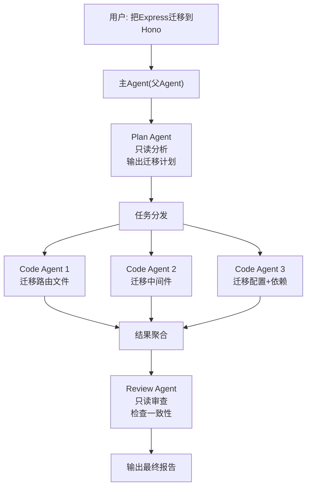

# 多 Agent 协作——一个不够就来一群

你不会一个人又写代码又做 Code Review。

想想真实的开发流程：你写完代码，提 PR，另一个人 review，CI 自动跑测试，三件事是三个"角色"在做。你不会期望同一个人同时干这三件事——质量和效率都扛不住。

Agent 也一样。

来个具体场景：把一个 Express 项目迁移到 Hono。这个项目有 8 个路由文件、3 个中间件、2 个配置文件。一个 Agent 干这事会怎样？

它得先看所有路由文件，分析 Express API 的用法。然后看中间件怎么写的。然后看配置。然后开始改。改到第五个文件的时候，上下文窗口已经塞了几千行代码，前面分析的结论可能已经被挤出去了。它忘了第一个路由文件用了 `req.query` 的哪种写法，于是又得重新读一遍。

一个 Agent 顺序干 13 个文件？光是来回读文件就能把 token 预算烧完。

正确的做法：分工。



---

## 9.1 为什么需要子 Agent

三个理由，每个都很实际。

**上下文隔离**

每个子 Agent 有独立的消息历史。Plan Agent 分析项目结构时积累的几千行代码内容，不会挤占 Code Agent 的上下文空间。Code Agent 在改 routes/ 目录时，不需要"记住" middleware/ 里的内容——那是另一个 Code Agent 的事。

这不是性能优化，是正确性保障。上下文窗口不是无限的，一个对话塞太多东西，模型的注意力会分散，输出质量下降。隔离上下文，每个 Agent 只看自己需要的东西，反而更准确。

**并行加速**

三个 Code Agent 同时改三组文件，耗时约等于最慢的那个。串行的话，改完 routes/ 再改 middleware/ 再改 config/，总时间是三份的累加。LLM API 调用是 I/O 密集的，天然适合并行。

**专业分工**

Plan Agent 只分析不动手——它的工具列表里只有 `read_file`、`grep`、`glob`，根本没有 `edit_file` 和 `bash`。不是不信任它，是从机制上消除风险。同样，Review Agent 只能读不能写，它的工作就是挑毛病。

分工不只是效率问题，还是安全问题。你不会给 Code Review 的人 production 数据库的写权限。Agent 也一样。

---

## 9.2 SubAgent 接口设计

先定义子 Agent 长什么样：

```typescript
// src/agents/types.ts

/** 子 Agent 配置 */
interface SubAgentConfig {
  /** 子 Agent 名称，用于日志和结果追踪 */
  name: string
  /** System prompt，定义角色和行为边界 */
  role: string
  /** 允许使用的工具子集（工具名列表） */
  tools: string[]
  /** 可以用不同模型（便宜的任务用便宜的模型） */
  model?: string
  /** 最大对话轮次，防止子 Agent 跑飞 */
  maxTurns?: number
}
```

五个字段，每个都有存在的理由：

- `name`：子 Agent 并行跑的时候，日志里得分清谁是谁
- `role`：system prompt，这是控制 Agent 行为最直接的手段
- `tools`：**工具子集**，Plan Agent 只给只读工具，Code Agent 给全量工具——权限隔离就靠这个
- `model`：不是所有子任务都需要最贵的模型。Plan Agent 做代码分析，用 gpt-4o-mini 够了；Code Agent 做复杂重构，可能需要 gpt-4o
- `maxTurns`：安全阀。子 Agent 陷入循环时自动停止，不然一个子 Agent 能烧掉你一天的 API 额度

子 Agent 执行完要返回结果：

```typescript
/** 子 Agent 执行结果 */
interface SubAgentResult {
  name: string
  success: boolean
  output: string        // 最终输出文本
  turns: number         // 消耗的对话轮次
  durationMs: number    // 执行耗时
  error?: string        // 失败时的错误信息
}
```

还需要一个工具注册表，这样子 Agent 才能从全局工具集中"取"自己需要的工具：

```typescript
/** 工具条目：定义 + 执行函数 */
interface ToolEntry {
  definition: OpenAI.ChatCompletionTool
  execute: (params: Record<string, unknown>) => Promise<string>
}

/** 全局工具注册表 */
type ToolRegistry = Map<string, ToolEntry>
```

把工具的"描述"（给 LLM 看的 JSON Schema）和"实现"（真正执行的函数）打包在一起。这样根据工具名就能同时拿到两样东西。

---

## 9.3 AgentSpawner：创建子 Agent

核心类。职责单一：接收一个 `SubAgentConfig`，创建一个独立的 Agent 实例，运行到完成。

```typescript
// src/agents/spawner.ts

import OpenAI from "openai"
import type { SubAgentConfig, SubAgentResult, ToolRegistry } from "./types.js"

const DEFAULT_MODEL = "gpt-4o-mini"
const DEFAULT_MAX_TURNS = 15

export class AgentSpawner {
  private openai: OpenAI
  private toolRegistry: ToolRegistry

  constructor(openai: OpenAI, toolRegistry: ToolRegistry) {
    this.openai = openai
    this.toolRegistry = toolRegistry
  }

  async spawn(config: SubAgentConfig, task: string): Promise<SubAgentResult> {
    const startTime = Date.now()
    const model = config.model ?? DEFAULT_MODEL
    const maxTurns = config.maxTurns ?? DEFAULT_MAX_TURNS

    // 1. 从全局工具表中过滤出子 Agent 允许用的工具
    const allowedTools: OpenAI.ChatCompletionTool[] = []
    const executors = new Map<
      string,
      (params: Record<string, unknown>) => Promise<string>
    >()

    for (const toolName of config.tools) {
      const entry = this.toolRegistry.get(toolName)
      if (entry) {
        allowedTools.push(entry.definition)
        executors.set(toolName, entry.execute)
      }
    }

    // 2. 独立的消息历史 —— 上下文隔离的关键
    const messages: OpenAI.ChatCompletionMessageParam[] = [
      { role: "system", content: config.role },
      { role: "user", content: task },
    ]

    console.log(
      `\n[${config.name}] Started (model=${model}, tools=${config.tools.join(",")})`
    )

    // 3. 独立的 agent loop
    let turns = 0
    try {
      while (turns < maxTurns) {
        turns++

        const response = await this.openai.chat.completions.create({
          model,
          messages,
          tools: allowedTools.length > 0 ? allowedTools : undefined,
        })

        const msg = response.choices[0].message
        messages.push(msg)

        // 没有工具调用 → 子 Agent 完成
        if (!msg.tool_calls || msg.tool_calls.length === 0) {
          console.log(`[${config.name}] Completed in ${turns} turns`)
          return {
            name: config.name,
            success: true,
            output: msg.content ?? "",
            turns,
            durationMs: Date.now() - startTime,
          }
        }

        // 执行工具调用
        for (const call of msg.tool_calls) {
          const toolName = call.function.name
          const params = JSON.parse(call.function.arguments)

          // 安全检查：只执行允许的工具
          const executor = executors.get(toolName)
          if (!executor) {
            messages.push({
              role: "tool",
              tool_call_id: call.id,
              content: `Error: tool "${toolName}" is not allowed for this agent.`,
            })
            continue
          }

          const result = await executor(params)
          messages.push({
            role: "tool",
            tool_call_id: call.id,
            content: result,
          })
        }
      }

      // 超过最大轮次
      return {
        name: config.name,
        success: false,
        output: "Reached maximum turns without completing.",
        turns,
        durationMs: Date.now() - startTime,
        error: `Exceeded ${maxTurns} turns`,
      }
    } catch (err) {
      return {
        name: config.name,
        success: false,
        output: "",
        turns,
        durationMs: Date.now() - startTime,
        error: err instanceof Error ? err.message : String(err),
      }
    }
  }
}
```

看关键的几个点：

**独立的消息列表**（第 2 步）。每次 `spawn()` 调用都创建全新的 `messages` 数组。这就是上下文隔离——子 Agent A 的对话历史不会泄露给子 Agent B。

**工具过滤**（第 1 步）。`config.tools` 是个白名单，只有名字匹配的工具才会传给 LLM。Plan Agent 配置里写了 `["read_file", "grep", "glob", "list_files"]`，那它在 API 调用中就只能看到这四个工具。就算 LLM 尝试调 `edit_file`（有时候它真的会），`executors.get()` 也找不到，直接返回错误。

**maxTurns 安全阀**。子 Agent 跑超了就强制停止。返回 `success: false`，调用方自己决定怎么处理。

---

## 9.4 预设角色

每次手写 `SubAgentConfig` 太啰嗦。封装三个工厂函数：

```typescript
// src/agents/roles.ts

import type { SubAgentConfig } from "./types.js"

/** Plan Agent：只读不写 */
export function planAgent(task: string): SubAgentConfig {
  return {
    name: "plan-agent",
    role: `You are a planning agent. Your job is to analyze the codebase and produce a migration plan.

Rules:
- You can ONLY read files and search code. You CANNOT write or execute anything.
- Output a structured plan: which files need changes, what changes, and in what order.
- Be specific. Don't say "update the routes", say "change app.get() to app.get() with Hono syntax in src/routes/users.ts lines 10-25".

Task: ${task}`,
    tools: ["read_file", "grep", "glob", "list_files"],
    model: "gpt-4o-mini",
    maxTurns: 10,
  }
}

/** Code Agent：有全部工具权限 */
export function codeAgent(name: string, task: string): SubAgentConfig {
  return {
    name,
    role: `You are a code agent. Your job is to make specific code changes.

Rules:
- Follow the plan exactly. Don't improvise.
- After editing, verify the change by reading the file back.
- If something doesn't work, fix it — don't leave broken code.

Task: ${task}`,
    tools: ["read_file", "edit_file", "bash", "grep", "glob", "list_files"],
    maxTurns: 20,
  }
}

/** Review Agent：只读权限 */
export function reviewAgent(focus: string): SubAgentConfig {
  return {
    name: "review-agent",
    role: `You are a code review agent. Your job is to review recent changes for correctness and consistency.

Rules:
- You can ONLY read files and search. You CANNOT modify anything.
- Check for: import consistency, API compatibility, missing error handling, type errors.
- Output a review report with PASS / FAIL and specific issues found.

Focus: ${focus}`,
    tools: ["read_file", "grep", "glob"],
    model: "gpt-4o-mini",
    maxTurns: 10,
  }
}
```

注意几个设计决策：

1. **Plan Agent 用 gpt-4o-mini**。分析代码结构不需要最强的模型，便宜够用就行。Code Agent 没指定 model，默认用调用方传的（通常是 gpt-4o），因为写代码需要更强的能力。
2. **Code Agent 的 maxTurns 是 20**，比 Plan Agent 和 Review Agent 的 10 多一倍——写代码天然需要更多轮次（读、改、验证）。
3. **Prompt 里重复强调权限边界**。"You can ONLY read files" 这种话看起来多余（反正工具列表里没 edit_file），但 prompt 层面的约束和工具层面的约束是双保险。

---

## 9.5 并行调度器

有了 Spawner，并行就是 `Promise.all` 的事：

```typescript
// src/agents/scheduler.ts

import type { SubAgentConfig, SubAgentResult } from "./types.js"
import type { AgentSpawner } from "./spawner.js"

export interface SchedulerTask {
  config: SubAgentConfig
  task: string
}

/** 并行运行多个子 Agent */
export async function runParallel(
  spawner: AgentSpawner,
  tasks: SchedulerTask[],
  options: { timeoutMs?: number } = {}
): Promise<SubAgentResult[]> {
  const timeoutMs = options.timeoutMs ?? 5 * 60 * 1000

  console.log(`\n[scheduler] Running ${tasks.length} agents in parallel...`)
  const startTime = Date.now()

  const promises = tasks.map(({ config, task }) => {
    return Promise.race([
      spawner.spawn(config, task),
      timeout(timeoutMs, config.name),
    ])
  })

  const results = await Promise.all(promises)

  const elapsed = Date.now() - startTime
  const succeeded = results.filter((r) => r.success).length
  console.log(
    `\n[scheduler] Done. ${succeeded}/${results.length} succeeded in ${elapsed}ms`
  )

  return results
}
```

`Promise.race` 加上超时——每个子 Agent 要么在 5 分钟内完成，要么被判定超时。不设超时的话，一个卡住的子 Agent 能把整个流程拖死。

超时的实现很简单：

```typescript
function timeout(ms: number, name: string): Promise<SubAgentResult> {
  return new Promise((resolve) =>
    setTimeout(
      () =>
        resolve({
          name,
          success: false,
          output: "",
          turns: 0,
          durationMs: ms,
          error: `Timeout after ${ms}ms`,
        }),
      ms
    )
  )
}
```

返回一个 `success: false` 的结果，不是 reject。这样 `Promise.all` 不会因为一个超时就全部失败——其他子 Agent 的成功结果仍然保留。

有时候你需要串行——比如先 Plan 再 Code 再 Review：

```typescript
/** 串行运行：前一个完成后才启动下一个 */
export async function runSequential(
  spawner: AgentSpawner,
  tasks: SchedulerTask[]
): Promise<SubAgentResult[]> {
  const results: SubAgentResult[] = []

  for (const { config, task } of tasks) {
    const result = await spawner.spawn(config, task)
    results.push(result)

    // 如果某个子 Agent 失败了，后续的可能也没意义
    if (!result.success) {
      console.log(`[scheduler] ${config.name} failed, stopping pipeline.`)
      break
    }
  }

  return results
}
```

串行调度器有个关键细节：**前一步失败就停**。Plan Agent 分析失败了，没必要继续让 Code Agent 盲改。

最后是结果聚合：

```typescript
export function summarizeResults(results: SubAgentResult[]): string {
  const lines: string[] = ["## Sub-Agent Results\n"]

  for (const r of results) {
    const status = r.success ? "OK" : "FAILED"
    lines.push(`### ${r.name} [${status}] (${r.turns} turns, ${r.durationMs}ms)`)
    if (r.error) lines.push(`Error: ${r.error}`)
    lines.push(r.output)
    lines.push("")
  }

  return lines.join("\n")
}
```

简单粗暴：把每个子 Agent 的名字、状态、输出拼起来。实际项目中你可能想让 LLM 对结果做一轮摘要，但那又是一次 API 调用——先保持简单。

---

## 9.6 "agent" 工具：让 LLM 自己决定

前面的 `runParallel` / `runSequential` 是你（开发者）手动编排的。但更灵活的方式是：把"启动子 Agent"包装成一个工具，让 LLM 自己决定什么时候需要子 Agent。

```typescript
// src/ling.ts 中的 agent 工具定义

function buildAgentTool(
  spawner: AgentSpawner
): OpenAI.ChatCompletionTool {
  return {
    type: "function",
    function: {
      name: "agent",
      description: `Launch a sub-agent to handle a task independently.
The sub-agent has its own context and tools.
Available roles: plan (read-only analysis), code (full tools), review (read-only review).`,
      parameters: {
        type: "object",
        properties: {
          role: {
            type: "string",
            enum: ["plan", "code", "review"],
            description: "The role of the sub-agent",
          },
          name: {
            type: "string",
            description: "A short name for this sub-agent",
          },
          task: {
            type: "string",
            description: "The specific task for the sub-agent",
          },
        },
        required: ["role", "task"],
      },
    },
  }
}
```

执行逻辑：

```typescript
async function executeAgentTool(
  spawner: AgentSpawner,
  params: Record<string, unknown>
): Promise<string> {
  const role = params.role as string
  const task = params.task as string
  const name = (params.name as string) || `${role}-agent`

  let config
  switch (role) {
    case "plan":
      config = planAgent(task)
      break
    case "code":
      config = codeAgent(name, task)
      break
    case "review":
      config = reviewAgent(task)
      break
    default:
      return `Unknown role: ${role}`
  }

  config.name = name

  const result = await spawner.spawn(config, task)
  return result.success
    ? result.output
    : `[${result.name}] Failed: ${result.error}\n${result.output}`
}
```

在主循环里，处理工具调用时多加一个分支：

```typescript
// 主循环中的工具执行
for (const call of msg.tool_calls) {
  const toolName = call.function.name
  const params = JSON.parse(call.function.arguments)

  let result: string

  if (toolName === "agent") {
    // 特殊处理：启动子 Agent
    result = await executeAgentTool(spawner, params)
  } else {
    // 普通内置工具
    const entry = toolRegistry.get(toolName)
    result = entry
      ? await entry.execute(params)
      : `Unknown tool: ${toolName}`
  }

  messages.push({
    role: "tool",
    tool_call_id: call.id,
    content: result,
  })
}
```

这样主 Agent（父 Agent）可以自行决定："这个任务比较复杂，我启动一个 plan agent 先分析一下"。子 Agent 的输出会作为工具调用的结果返回给父 Agent，父 Agent 基于这个结果决定下一步。

---

## 9.7 实战：Express 迁移到 Hono

把前面的零件组装起来，走一个完整的迁移流程。

```typescript
import {
  AgentSpawner,
  planAgent, codeAgent, reviewAgent,
  runParallel, runSequential, summarizeResults,
} from "./agents/index.js"
import type { SchedulerTask } from "./agents/index.js"

// 假设 toolRegistry 和 openai 已经初始化
const spawner = new AgentSpawner(openai, toolRegistry)

// 第一步：Plan Agent 分析
const plan = await spawner.spawn(
  planAgent("Analyze this Express app and create a migration plan to Hono"),
  "Analyze the project structure, list all Express-specific APIs used, and output a file-by-file migration plan."
)

console.log("=== Migration Plan ===")
console.log(plan.output)
// 输出类似：
// 1. src/routes/users.ts — app.get/post → Hono.get/post, req.query → c.req.query()
// 2. src/routes/posts.ts — app.get/post/put/delete → Hono equivalents
// 3. src/middleware/auth.ts — (req, res, next) → Hono middleware pattern
// ...共 8 个文件

// 第二步：3 个 Code Agent 并行改代码
const codeTasks: SchedulerTask[] = [
  {
    config: codeAgent("route-migrator", "Migrate Express routes to Hono syntax"),
    task: `Migrate these files from Express to Hono:
- src/routes/users.ts
- src/routes/posts.ts
- src/routes/auth.ts
Change app.get/post/put/delete to Hono equivalents. Update req/res to use Hono's Context (c).`,
  },
  {
    config: codeAgent("middleware-migrator", "Migrate Express middleware to Hono"),
    task: `Migrate middleware files:
- src/middleware/auth.ts
- src/middleware/cors.ts
- src/middleware/logger.ts
Convert (req, res, next) pattern to Hono's middleware pattern using c and next.`,
  },
  {
    config: codeAgent("config-migrator", "Migrate Express config to Hono"),
    task: `Migrate configuration:
- src/app.ts — replace express() with new Hono(), update middleware registration
- src/server.ts — replace app.listen() with Hono's serve()
Update package.json: remove express, add hono.`,
  },
]

const codeResults = await runParallel(spawner, codeTasks)

// 第三步：Review Agent 检查一致性
const review = await spawner.spawn(
  reviewAgent("Check the Express-to-Hono migration for consistency"),
  `Review all migrated files. Check:
1. No remaining Express imports (express, Router, Request, Response)
2. All routes use Hono's Context pattern
3. Middleware signatures are correct
4. app.ts correctly initializes Hono`
)

console.log("=== Review ===")
console.log(review.output)

// 汇总
console.log(summarizeResults([plan, ...codeResults, review]))
```

执行流程：

```
[plan-agent] Started (model=gpt-4o-mini, tools=read_file,grep,glob,list_files)
[plan-agent] read_file({"file_path":"src/app.ts"})
[plan-agent] grep({"pattern":"require.*express","path":"src"})
[plan-agent] Completed in 5 turns

[scheduler] Running 3 agents in parallel...
[route-migrator] Started (model=gpt-4o-mini, tools=read_file,edit_file,bash,grep,glob,list_files)
[middleware-migrator] Started (model=gpt-4o-mini, tools=read_file,edit_file,bash,grep,glob,list_files)
[config-migrator] Started (model=gpt-4o-mini, tools=read_file,edit_file,bash,grep,glob,list_files)
[config-migrator] Completed in 8 turns
[middleware-migrator] Completed in 6 turns
[route-migrator] Completed in 12 turns

[scheduler] Done. 3/3 succeeded in 34200ms

[review-agent] Started (model=gpt-4o-mini, tools=read_file,grep,glob)
[review-agent] Completed in 4 turns
```

三个 Code Agent 并行，总耗时约 34 秒（最慢的那个 route-migrator 的时间）。如果串行，大概要 60-70 秒。省了将近一半。

更重要的是上下文隔离的好处：route-migrator 的消息历史里只有路由相关的代码，不会被中间件的内容干扰。每个 Agent 专注自己的那几个文件，改出来的代码更准确。

---

## 9.8 Worktree 隔离（进阶）

上面的子 Agent 共享同一个工作目录——它们同时改文件。大多数情况下没问题，因为任务分配时已经按文件分组了。但如果两个子 Agent 不小心改了同一个文件呢？

Git worktree 可以解决这个问题：

```bash
# 为每个子 Agent 创建独立的工作目录
git worktree add /tmp/ling-route-migrator -b agent/route-migrator
git worktree add /tmp/ling-middleware-migrator -b agent/middleware-migrator
git worktree add /tmp/ling-config-migrator -b agent/config-migrator
```

每个子 Agent 在自己的 worktree 里工作，改完后 merge 回主分支：

```typescript
import { execSync } from "node:child_process"

/** 创建 worktree 并返回路径 */
function createWorktree(agentName: string): string {
  const dir = `/tmp/ling-${agentName}`
  const branch = `agent/${agentName}`
  execSync(`git worktree add ${dir} -b ${branch}`, { stdio: "pipe" })
  return dir
}

/** 清理 worktree */
function removeWorktree(dir: string) {
  execSync(`git worktree remove ${dir} --force`, { stdio: "pipe" })
}

/** 合并子 Agent 的修改 */
function mergeWorktree(branch: string) {
  execSync(`git merge ${branch} --no-edit`, { stdio: "pipe" })
  execSync(`git branch -d ${branch}`, { stdio: "pipe" })
}
```

使用 worktree 时，子 Agent 的工具调用需要把文件路径映射到 worktree 目录——这有一点工程量，但原理很简单：拦截 `read_file` / `edit_file` 的参数，把路径前缀替换掉。

**什么时候需要 worktree？**

老实说，大多数场景不需要。如果你任务分配得好（每个子 Agent 负责不同的文件），直接在同一个目录工作就行。Worktree 的价值在于：

1. 子 Agent 的修改可以独立 review（每个 worktree 是一个单独的 branch）
2. 某个子 Agent 搞砸了，直接删 branch，不影响其他人
3. 合并时如果有冲突，可以人工解决

---

## 9.9 对照 Claude Code

Claude Code 的子 Agent 实现比我们的 Ling 成熟得多，但核心思路完全一样。对照看一下：

**AgentDefinition 类型**

Claude Code 定义 Agent 的类型大致是这样的：

```typescript
// Claude Code 的 Agent 定义（简化）
interface AgentDefinition {
  description: string       // 给父 Agent 看的描述
  tools: string[]           // 允许的工具
  disallowedTools?: string[] // 明确禁止的工具
  prompt: string            // system prompt
  model?: string
  maxTurns?: number
}
```

比我们的 `SubAgentConfig` 多了两样东西：`description` 和 `disallowedTools`。

`description` 的作用是：当父 Agent 看到 `agent` 工具时，description 告诉它"这个子 Agent 能干什么"。这是给 LLM 做决策用的，不是给人看的。

`disallowedTools` 是黑名单——有时候你想给子 Agent 很多工具，但明确排除几个危险的。比如 "除了 bash 其他都能用"。白名单和黑名单两种模式，覆盖不同场景。

**预设 Agent 类型**

Claude Code 内置了几种预设：

| 类型 | 工具 | 用途 |
|------|------|------|
| Explore | 搜索/读取相关工具 | 快速搜索代码，回答问题 |
| Plan | 搜索/读取相关工具 | 架构规划，输出执行方案 |
| General-purpose | 几乎全部工具 | 通用子任务执行 |

跟我们的 Plan / Code / Review 三分法类似，但 Claude Code 没有单独的 Review 类型——它把 review 能力融入到了 Explore 类型里。

**Worktree 隔离**

Claude Code 的 agent 工具有一个 `isolation: "worktree"` 参数。启动子 Agent 时指定这个参数，子 Agent 就在 git worktree 里工作。跟我们 9.8 节讲的一样，但它是框架级的内置支持，不需要自己写 worktree 管理代码。

**Hook 事件**

Claude Code 有 `SubagentStart` 和 `SubagentStop` 两个 Hook 事件——子 Agent 启动和停止时触发。这跟我们第 8 章的 Hook 系统对接上了。你可以在子 Agent 启动时记录日志，在停止时检查结果。

**父子追踪**

每个子 Agent 的工具调用都带着 `parent_tool_use_id`，这样你能在日志里还原完整的调用链：

```
父 Agent → agent 工具 (id: "tool_123")
  └─ 子 Agent → read_file (parent: "tool_123")
  └─ 子 Agent → edit_file (parent: "tool_123")
  └─ 子 Agent → read_file (parent: "tool_123")
```

调试的时候非常有用。我们的 Ling 实现可以在 `SubAgentResult` 里加个 `parentToolCallId` 字段来实现类似的追踪。

**权限继承**

子 Agent 继承父级的权限模式。如果父 Agent 运行在"需要用户确认"模式下，子 Agent 也一样——不会因为多了一层间接就绕过权限检查。这个很重要，否则恶意 prompt 可以通过"让父 Agent 启动一个权限更高的子 Agent"来提权。

---

## 9.10 小结

这章做了什么：

1. **SubAgentConfig**：名字、角色、工具白名单、模型、最大轮次
2. **AgentSpawner**：创建独立消息历史的子 Agent 实例，跑完返回结果
3. **三种预设角色**：Plan（只读分析）、Code（全量工具）、Review（只读审查）
4. **并行调度器**：`Promise.all` + 超时，串行调度支持 fail-fast
5. **agent 工具**：让 LLM 自己决定何时启动子 Agent
6. **Worktree 隔离**：进阶方案，子 Agent 在独立 branch 工作

核心是三个隔离：**上下文隔离**（独立消息历史）、**工具隔离**（工具白名单）、**文件隔离**（worktree，可选）。

多 Agent 协作听起来很酷，但请记住：**一个 Agent 能搞定的事，不要用两个**。每多一个 Agent，就多一份 API 成本、多一个可能失败的环节、多一份需要聚合的结果。子 Agent 的使用场景是明确的——上下文装不下、需要并行加速、需要权限隔离。不是为了"用更多 Agent"而用。

下一章把 Ling 从玩具变成能跑在生产环境的工具——非交互模式、结构化输出、CI/CD 集成、npm 发布。
