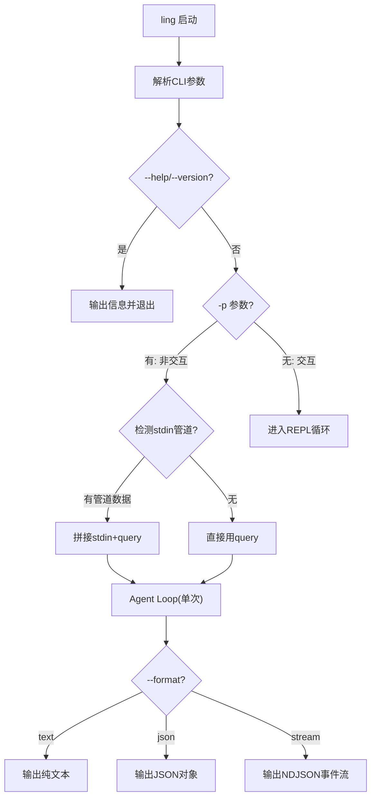

# 从 CLI 到生产——非交互模式与 CI/CD

Agent 不只是给人用的，也是给机器用的。

前九章我们一直在做一件事：坐在终端前，打字，等回复，再打字。这是人机交互的典型场景。但真实世界里，你的 Agent 还需要被脚本调用、被 CI 管道集成、被其他程序编排。

想象这些场景：

- GitHub 来了一个 PR，CI 自动调 Agent 做 Code Review
- 定时任务每天凌晨跑一次，让 Agent 分析错误日志
- 另一个程序调用你的 Agent，拿到结构化的 JSON 结果，继续处理

这些场景有个共同特点：**没有人坐在终端前**。Agent 必须能被"无人驾驶"地调用——传入参数，执行任务，输出结果，退出。

这章搞定这件事。



---

## 10.1 Print 模式——非交互执行

交互模式是 REPL：读输入、执行、打印、循环。非交互模式更简单：接收一次输入，执行，输出结果，退出。

用 `-p`（print）参数触发：

```bash
# 直接传 query
ling -p "分析这个项目的技术栈"

# 管道输入 + query
cat error.log | ling -p "分析这些错误，找出根因"

# 指定模型
ling -p "总结这段代码" --model claude-sonnet-4-20250514
```

实现思路很直接：检测到 `-p` 参数就走非交互分支，跑完 agent loop 直接 `process.exit(0)`。

### CLI 参数解析

Node.js 18+ 内置了 `parseArgs`，不需要装 commander 或 yargs：

```typescript
// src/cli/parser.ts

import { parseArgs } from "node:util";

export interface CliOptions {
  print?: string;           // -p "query"
  format: "text" | "json" | "stream";
  schema?: string;          // JSON Schema 文件路径
  provider: string;
  model: string;
  maxTurns: number;
  continue: boolean;
  resume?: string;
  name?: string;
  help: boolean;
  version: boolean;
}

export function parseCli(argv: string[]): CliOptions {
  const { values } = parseArgs({
    args: argv.slice(2),  // 跳过 node 和脚本路径
    options: {
      print:    { type: "string",  short: "p" },
      format:   { type: "string",  short: "f", default: "text" },
      schema:   { type: "string" },
      provider: { type: "string",  default: "openai" },
      model:    { type: "string",  short: "m", default: "gpt-4o" },
      "max-turns": { type: "string", default: "10" },
      continue: { type: "boolean", short: "c", default: false },
      resume:   { type: "string",  short: "r" },
      name:     { type: "string",  short: "n" },
      help:     { type: "boolean", short: "h", default: false },
      version:  { type: "boolean", short: "v", default: false },
    },
    strict: true,
  });

  return {
    print:    values.print as string | undefined,
    format:   (values.format as "text" | "json" | "stream") ?? "text",
    schema:   values.schema as string | undefined,
    provider: (values.provider as string) ?? "openai",
    model:    (values.model as string) ?? "gpt-4o",
    maxTurns: parseInt(values["max-turns"] as string, 10) || 10,
    continue: values.continue as boolean,
    resume:   values.resume as string | undefined,
    name:     values.name as string | undefined,
    help:     values.help as boolean,
    version:  values.version as boolean,
  };
}
```

`parseArgs` 的 `strict: true` 会在遇到未知参数时直接报错——这是你想要的行为，比静默忽略好得多。

### 读取 stdin 管道输入

`cat error.log | ling -p "分析"` 这种用法意味着 Agent 需要能读 stdin。判断逻辑很简单：如果 `process.stdin.isTTY` 为 false，说明有管道输入。

```typescript
// src/cli/parser.ts（续）

export async function readStdin(): Promise<string | null> {
  if (process.stdin.isTTY) return null;

  const chunks: Buffer[] = [];
  for await (const chunk of process.stdin) {
    chunks.push(chunk);
  }
  const text = Buffer.concat(chunks).toString("utf-8").trim();
  return text || null;
}
```

### 非交互模式主函数

`print-mode.ts` 把上面的东西串起来：

```typescript
// src/cli/print-mode.ts

import OpenAI from "openai";
import type { CliOptions } from "./parser.js";
import { writeOutput, writeStreamEvent } from "./output.js";
import { loadSchema, extractJson, validateAgainstSchema } from "./schema-validator.js";

export async function runPrintMode(
  query: string,
  options: CliOptions
): Promise<void> {
  const client = new OpenAI();

  let systemPrompt = "You are Ling, a coding assistant.";

  // 如果指定了 schema，注入约束
  let schemaConstraint: ReturnType<typeof loadSchema> | null = null;
  if (options.schema) {
    schemaConstraint = loadSchema(options.schema);
    systemPrompt += "\n\n" + schemaConstraint.promptInstructions;
  }

  const messages: OpenAI.ChatCompletionMessageParam[] = [
    { role: "system", content: systemPrompt },
    { role: "user", content: query },
  ];

  if (options.format === "stream") {
    writeStreamEvent({ type: "start", model: options.model });
  }

  let turns = 0;
  let finalContent = "";

  while (turns < options.maxTurns) {
    turns++;

    const response = await client.chat.completions.create({
      model: options.model,
      messages,
    });

    const message = response.choices[0].message;
    finalContent = message.content ?? "";

    if (options.format === "stream" && finalContent) {
      writeStreamEvent({ type: "text_delta", content: finalContent });
    }

    if (!message.tool_calls || message.tool_calls.length === 0) {
      break;
    }

    messages.push(message as OpenAI.ChatCompletionMessageParam);

    for (const toolCall of message.tool_calls) {
      if (options.format === "stream") {
        writeStreamEvent({
          type: "tool_use",
          tool: toolCall.function.name,
          args: JSON.parse(toolCall.function.arguments),
        });
      }

      const result = `Tool ${toolCall.function.name} executed`;

      messages.push({
        role: "tool",
        tool_call_id: toolCall.id,
        content: result,
      });
    }
  }

  // schema 约束验证
  let structuredOutput: unknown = undefined;
  if (schemaConstraint) {
    try {
      const parsed = extractJson(finalContent);
      const { valid, errors } = validateAgainstSchema(
        parsed, schemaConstraint.schema
      );
      if (!valid) {
        process.stderr.write(
          `Schema validation failed: ${errors.join(", ")}\n`
        );
        process.exit(1);
      }
      structuredOutput = parsed;
      finalContent = JSON.stringify(parsed, null, 2);
    } catch (err) {
      process.stderr.write(
        `Failed to parse structured output: ${(err as Error).message}\n`
      );
      process.exit(1);
    }
  }

  writeOutput(options.format, {
    content: finalContent,
    model: options.model,
    turns,
    structured_output: structuredOutput,
  });
}
```

核心就是同一个 agent loop，只不过入口不同、出口不同。交互模式的入口是 readline，出口是 console.log；非交互模式的入口是命令行参数，出口是结构化的输出。

---

## 10.2 结构化输出

非交互模式下，调用方通常是脚本或其他程序。它们不想看"人类可读"的文本，它们想要**机器可解析**的格式。

Ling 支持三种输出格式：

| 格式 | 参数 | 输出样例 | 用途 |
|------|------|---------|------|
| text | `--format text` | 纯文本 | 人类阅读、简单脚本 |
| json | `--format json` | 单个 JSON 对象 | 程序解析 |
| stream | `--format stream` | 每行一个 JSON（NDJSON） | 实时处理 |

```typescript
// src/cli/output.ts

export type OutputFormat = "text" | "json" | "stream";

export function writeStreamEvent(event: StreamEvent): void {
  process.stdout.write(JSON.stringify(event) + "\n");
}

export interface StreamEvent {
  type: "start" | "text_delta" | "tool_use" | "tool_result" | "end" | "error";
  content?: string;
  tool?: string;
  args?: Record<string, unknown>;
  result?: string;
  model?: string;
  turns?: number;
}

export function writeOutput(
  format: OutputFormat,
  result: {
    content: string;
    model: string;
    turns: number;
    structured_output?: unknown;
  }
): void {
  switch (format) {
    case "text":
      process.stdout.write(result.content + "\n");
      break;
    case "json":
      process.stdout.write(JSON.stringify(result, null, 2) + "\n");
      break;
    case "stream":
      writeStreamEvent({
        type: "end",
        content: result.content,
        model: result.model,
        turns: result.turns,
      });
      break;
  }
}
```

三种格式的实际输出长这样：

```bash
# text——默认，就是纯文本
$ ling -p "1+1等于几"
2

# json——整个结果包成 JSON
$ ling -p "1+1等于几" --format json
{
  "content": "2",
  "model": "gpt-4o",
  "turns": 1
}

# stream——每行一个事件，NDJSON 格式
$ ling -p "分析这个文件" --format stream
{"type":"start","model":"gpt-4o"}
{"type":"tool_use","tool":"read_file","args":{"path":"src/index.ts"}}
{"type":"tool_result","tool":"read_file","result":"..."}
{"type":"text_delta","content":"这个文件是..."}
{"type":"end","content":"这个文件是项目的入口...","model":"gpt-4o","turns":2}
```

stream 格式的关键是 **NDJSON**（Newline Delimited JSON）——每行一个独立的 JSON 对象。调用方可以逐行解析，不需要等全部完成。这对长时间运行的任务特别有用。

---

## 10.3 JSON Schema 约束输出

有时候你不只是想要 JSON，你想要**特定结构**的 JSON。比如做 PR Review，你想让 Agent 输出：

```json
{
  "summary": "这个 PR 修复了登录页面的 XSS 漏洞",
  "issues": [
    { "file": "src/auth.ts", "line": 42, "severity": "high", "message": "未转义用户输入" }
  ],
  "approved": false
}
```

而不是一段自由格式的文本。

实现方法：定义一个 JSON Schema 文件，通过 `--schema` 参数传入。Ling 把 schema 注入到 system prompt 里，告诉 LLM "你必须按这个格式输出"，然后从输出中提取 JSON 并校验。

```bash
ling -p "Review this PR" --schema review-schema.json --format json
```

review-schema.json 长这样：

```json
{
  "type": "object",
  "properties": {
    "summary": { "type": "string", "description": "一句话总结" },
    "issues": {
      "type": "array",
      "items": {
        "type": "object",
        "properties": {
          "file": { "type": "string" },
          "line": { "type": "number" },
          "severity": { "type": "string", "enum": ["low", "medium", "high"] },
          "message": { "type": "string" }
        },
        "required": ["file", "severity", "message"]
      }
    },
    "approved": { "type": "boolean" }
  },
  "required": ["summary", "issues", "approved"]
}
```

### Schema 注入与验证

```typescript
// src/cli/schema-validator.ts

import { readFileSync } from "node:fs";

export interface SchemaConstraint {
  schema: Record<string, unknown>;
  promptInstructions: string;
}

export function loadSchema(schemaPath: string): SchemaConstraint {
  const raw = readFileSync(schemaPath, "utf-8");
  const schema = JSON.parse(raw);

  const promptInstructions = [
    "IMPORTANT: Your final response MUST be a valid JSON object conforming to this schema:",
    "```json",
    JSON.stringify(schema, null, 2),
    "```",
    "Do NOT include any text before or after the JSON.",
    "Do NOT wrap the JSON in markdown code fences.",
    "Output ONLY the raw JSON object.",
  ].join("\n");

  return { schema, promptInstructions };
}
```

关键在 `promptInstructions`——直接告诉 LLM "你的输出必须是这个格式的 JSON，不要加任何其他文字"。大多数 LLM 对这种指令的遵从度很高。

但 LLM 不是数据库，你不能 100% 信任它的输出格式。所以还需要提取和验证：

```typescript
// src/cli/schema-validator.ts（续）

/** 从 LLM 输出中提取 JSON */
export function extractJson(text: string): unknown {
  // 尝试直接解析
  try {
    return JSON.parse(text);
  } catch {
    // 可能被包在 ```json ... ``` 里
  }

  // 正则提取 code fence
  const fenceMatch = text.match(/```(?:json)?\s*\n?([\s\S]*?)\n?```/);
  if (fenceMatch) {
    try {
      return JSON.parse(fenceMatch[1]);
    } catch { /* 继续 */ }
  }

  // 找第一个 { 到最后一个 }
  const start = text.indexOf("{");
  const end = text.lastIndexOf("}");
  if (start !== -1 && end > start) {
    try {
      return JSON.parse(text.slice(start, end + 1));
    } catch { /* 放弃 */ }
  }

  throw new Error("Failed to extract JSON from LLM output");
}

/** 简易 Schema 验证 */
export function validateAgainstSchema(
  data: unknown,
  schema: Record<string, unknown>
): { valid: boolean; errors: string[] } {
  const errors: string[] = [];

  if (schema.type === "object") {
    if (typeof data !== "object" || data === null || Array.isArray(data)) {
      errors.push(`Expected object, got ${typeof data}`);
      return { valid: false, errors };
    }
    const required = (schema.required as string[]) ?? [];
    for (const key of required) {
      if (!(key in (data as Record<string, unknown>))) {
        errors.push(`Missing required field: "${key}"`);
      }
    }
  }

  if (schema.type === "array" && !Array.isArray(data)) {
    errors.push(`Expected array, got ${typeof data}`);
  }

  return { valid: errors.length === 0, errors };
}
```

`extractJson` 做了三级容错：先直接 `JSON.parse`，不行就找 code fence，再不行就暴力找花括号。这不是过度防御——LLM 真的会在你明确告诉它"不要加 code fence"的情况下加上 code fence。

验证部分故意做得简单——只查 required 字段和顶层类型。生产环境你可以用 Ajv 这样的库做完整验证，但这里点到为止。

---

## 10.4 完整版主入口

现在把交互和非交互两条路径合到一个入口文件里：

```typescript
// src/ling.ts

import * as readline from "readline";
import { parseCli, readStdin, runPrintMode } from "./cli/index.js";

const VERSION = "0.10.0";

const HELP = `
Ling - AI Coding Agent

Usage:
  ling [options]                  Start interactive REPL
  ling -p "query"                 Non-interactive mode
  cat file | ling -p "analyze"    Pipe input + query

Options:
  -p, --print <query>    Non-interactive mode, print result and exit
  -f, --format <fmt>     Output format: text (default), json, stream
      --schema <file>    Constrain output with JSON Schema
      --provider <name>  LLM provider (default: openai)
  -m, --model <name>     Model name (default: gpt-4o)
      --max-turns <n>    Max agent loop turns (default: 10)
  -c, --continue         Resume last session
  -r, --resume <id>      Resume specific session
  -n, --name <name>      Name the session
  -h, --help             Show this help
  -v, --version          Show version
`;

async function main() {
  const options = parseCli(process.argv);

  if (options.help) {
    console.log(HELP);
    process.exit(0);
  }

  if (options.version) {
    console.log(`ling v${VERSION}`);
    process.exit(0);
  }

  // ---- 非交互模式 ----
  if (options.print) {
    const stdinContent = await readStdin();
    let query = options.print;

    if (stdinContent) {
      query = `${stdinContent}\n\n---\n\n${query}`;
    }

    await runPrintMode(query, options);
    process.exit(0);
  }

  // ---- 交互模式 ----
  console.log(`Ling Agent v${VERSION}\n`);

  const rl = readline.createInterface({
    input: process.stdin,
    output: process.stdout,
  });

  const prompt = () => {
    rl.question("You: ", async (input) => {
      if (!input.trim()) return prompt();
      if (input.trim() === "/exit") {
        rl.close();
        return;
      }
      console.log(`\nLing: [response]\n`);
      prompt();
    });
  };
  prompt();
}

main().catch((err) => {
  console.error(err);
  process.exit(1);
});
```

逻辑非常线性：解析参数 -> 处理 help/version -> 检测 `-p` 走非交互 -> 否则走 REPL。stdin 管道输入通过 `readStdin()` 读取后拼接到 query 前面，这样 LLM 就能同时看到文件内容和用户的指令。

---

## 10.5 GitHub Actions 集成

Agent 能被脚本调用了，接进 CI/CD 就是水到渠成的事。

### PR 自动 Review

最常见的场景：有人提了 PR，CI 自动调 Agent 做 Review，结果发到 PR 评论里。

```yaml
# .github/workflows/pr-review.yml

name: PR Review with Ling

on:
  pull_request:
    types: [opened, synchronize]

permissions:
  contents: read
  pull-requests: write

jobs:
  review:
    runs-on: ubuntu-latest
    steps:
      - uses: actions/checkout@v4
        with:
          fetch-depth: 0

      - uses: actions/setup-node@v4
        with:
          node-version: "20"

      - name: Install Ling
        run: npm install -g ling-agent

      - name: Get PR diff
        run: |
          git diff origin/${{ github.base_ref }}...HEAD > /tmp/pr-diff.txt

      - name: Run Ling Review
        env:
          OPENAI_API_KEY: ${{ secrets.OPENAI_API_KEY }}
        run: |
          cat /tmp/pr-diff.txt | ling -p "Review this PR diff. Focus on bugs, security issues, and code style problems. Be concise." \
            --format json \
            --schema review-schema.json \
            --max-turns 1 \
            > /tmp/review.json

      - name: Post Review Comment
        env:
          GH_TOKEN: ${{ secrets.GITHUB_TOKEN }}
        run: |
          BODY=$(cat /tmp/review.json | jq -r '.content')
          gh pr comment ${{ github.event.pull_request.number }} --body "$BODY"
```

几个关键点：

1. **`fetch-depth: 0`**——需要完整 Git 历史才能生成 diff
2. **`--max-turns 1`**——CI 里不需要多轮工具调用，一轮出结果就够
3. **`--schema review-schema.json`**——约束输出格式，方便后续处理
4. **API Key 走 secrets**——不要硬编码

### Issue 自动分类

另一个实用场景：新 Issue 进来，Agent 读取内容，自动打标签。

```yaml
# .github/workflows/issue-triage.yml

name: Issue Triage

on:
  issues:
    types: [opened]

permissions:
  issues: write

jobs:
  triage:
    runs-on: ubuntu-latest
    steps:
      - uses: actions/checkout@v4

      - name: Classify Issue
        env:
          OPENAI_API_KEY: ${{ secrets.OPENAI_API_KEY }}
        run: |
          BODY='${{ github.event.issue.body }}'
          TITLE='${{ github.event.issue.title }}'

          echo "$TITLE\n\n$BODY" | ling -p "Classify this issue. Return a JSON with a 'labels' array containing applicable labels from: bug, feature, docs, question, good-first-issue" \
            --format json \
            --max-turns 1 \
            > /tmp/triage.json

      - name: Apply Labels
        env:
          GH_TOKEN: ${{ secrets.GITHUB_TOKEN }}
        run: |
          LABELS=$(cat /tmp/triage.json | jq -r '.structured_output.labels | join(",")')
          gh issue edit ${{ github.event.issue.number }} --add-label "$LABELS"
```

这两个 workflow 加起来不超过 50 行 YAML。Agent 的非交互模式 + 结构化输出 + 管道输入，这三个能力组合起来就是 CI/CD 集成的全部基础。

---

## 10.6 npm 发布

你的 Agent 目前只能 `tsx src/ling.ts` 跑。要让别人 `npm install -g` 就能用，需要做几件事。

### package.json 的 bin 字段

```json
{
  "name": "ling-agent",
  "version": "0.10.0",
  "type": "module",
  "bin": {
    "ling": "./bin/ling"
  },
  "files": [
    "bin/",
    "dist/"
  ],
  "scripts": {
    "build": "tsc",
    "prepublishOnly": "npm run build"
  },
  "dependencies": {
    "openai": "^4.78.0"
  },
  "devDependencies": {
    "tsx": "^4.19.0",
    "typescript": "^5.7.0",
    "@types/node": "^22.0.0"
  }
}
```

关键字段：

- **`bin`**：告诉 npm "安装后把 `./bin/ling` 链接到用户的 PATH 里，命令名叫 `ling`"
- **`files`**：发布到 npm 时只包含 `bin/` 和 `dist/`，源码不发
- **`prepublishOnly`**：发布前自动编译 TypeScript

### 可执行入口文件

```javascript
#!/usr/bin/env node

// bin/ling
import("../dist/ling.js");
```

第一行 `#!/usr/bin/env node` 是 **shebang**——告诉操作系统用 node 来执行这个文件。没有这行，Linux/macOS 不知道该怎么运行它。

`bin/ling` 本身只有一行代码：动态 import 编译后的入口文件。为什么不直接指向 `dist/ling.js`？因为 shebang 必须在文件的第一行，而 `tsc` 编译出来的 `.js` 文件第一行不是 shebang。

### 发布流程

```bash
# 1. 编译
npm run build

# 2. 本地测试
npm link
ling --help
ling -p "hello" --format json

# 3. 发布
npm login
npm publish

# 用户安装
npm install -g ling-agent
ling -p "分析这个项目"
```

`npm link` 是本地测试利器——它在全局 `node_modules` 里创建一个符号链接指向你的项目目录，这样你可以直接当全局命令用，改了代码立即生效（不需要重新 link）。

---

## 10.7 对照 Claude Code

这些轮子，Claude Code 早就造好了。看看它是怎么做的。

### 非交互模式

```bash
# Claude Code 的 -p 模式，和我们的一样
claude -p "分析这个项目的技术栈"

# 管道输入
cat error.log | claude -p "分析这些错误"
```

### 输出格式

```bash
# 纯文本（默认）
claude -p "query" --output-format text

# JSON，包含完整的结果对象
claude -p "query" --output-format json

# 流式 JSON，每行一个事件
claude -p "query" --output-format stream-json
```

Claude Code 的 JSON 输出里有个 `result` 字段，包含 `content`（文本输出）和 `structured_output`（结构化输出）。我们的设计直接借鉴了这个结构。

### 结构化输出

Claude Code 通过 `--output-format json` 返回的 `SDKResultMessage` 里包含 `structured_output` 字段——如果 system prompt 里有 schema 约束，这个字段会包含解析后的 JSON 对象，而不只是原始文本。

### GitHub 集成

Claude Code 有两种 GitHub 集成方式：

**1. @claude 评论触发**：在 PR 里评论 `@claude review this PR`，GitHub App 收到 webhook，调用 Claude Code 处理，结果回复到 PR 评论。

**2. GitHub Actions**：

```yaml
- uses: anthropics/claude-code-action@v1
  with:
    anthropic_api_key: ${{ secrets.ANTHROPIC_API_KEY }}
```

这个 Action 封装了 `claude -p` 的调用，自动处理 PR 上下文、diff 获取、结果回复。本质上和我们的 workflow 做的事一样，只是包装得更完善。

### 其他集成

Claude Code 还支持 Slack 集成——在 channel 里 @ 触发，对话内容作为上下文传给 Agent。这展示了非交互模式的通用性：只要能发送文本、接收文本，就能对接。

我们的 Ling 和 Claude Code 的架构对比：

| 能力 | Ling | Claude Code |
|------|------|------------|
| 非交互模式 | `-p "query"` | `-p "query"` |
| stdin 管道 | 支持 | 支持 |
| 输出格式 | text / json / stream | text / json / stream-json |
| Schema 约束 | `--schema file.json` | system prompt 约束 |
| CI 集成 | 自己写 workflow | claude-code-action |
| 分发方式 | npm publish | npm install -g @anthropic-ai/claude-code |

核心思路完全一样。区别在于 Claude Code 是一个成熟产品，在错误处理、权限控制、上下文管理上做了大量工程工作。但底层模式是一致的：非交互执行 + 结构化输出 + 管道输入 = 可编程的 Agent。

---

## 小结

这章做了三件事：

1. **非交互模式**：`-p` 参数让 Agent 能被脚本调用，stdin 管道让它能接收文件内容
2. **结构化输出**：text/json/stream 三种格式，加上 JSON Schema 约束，让 Agent 的输出能被程序解析
3. **CI/CD 集成**：GitHub Actions 里调 Agent 做 PR Review 和 Issue 分类，不到 50 行 YAML

这些能力让 Agent 从"一个人的终端工具"变成"系统中的一个组件"。它可以被其他程序调用，可以被编排进更大的流程里，可以 7x24 无人值守地运行。

从第 1 章到第 10 章，我们从一个 30 行的聊天循环，一路走到了可以发布到 npm、接进 CI/CD 的完整 Agent。回头看，核心就那几件事：调 LLM、给工具、管上下文、做安全、出结果。剩下的都是工程。

下一章是终章——画一张完整架构图，和主流框架做对比，然后指出 Ling 没实现的东西和值得关注的前沿方向。
