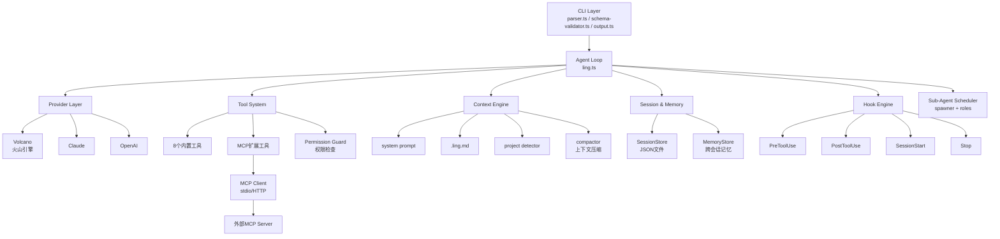

# 终章 · 从 Ling 到真实世界

到这里，Ling 的代码全部写完了。

回头看一眼：从第 1 章的 50 行单文件，到现在的完整 Agent，我们一路加了多模型支持、8 个内置工具、权限系统、流式输出、会话管理、Hook 扩展、MCP 协议、多 Agent 调度、生产级 CLI——总共约 2000 行 TypeScript。

这一章做三件事：画一张完整架构图，和主流框架做个对比，指出 Ling 没实现的东西和值得关注的前沿方向。

---

## 11.1 Ling 全架构图



每个模块对应一章的内容：

| 模块 | 章节 | 核心文件 |
|------|------|----------|
| Agent Loop | 第 1 章 | `ling.ts` |
| Provider Layer | 第 2 章 | `providers/*.ts` |
| Tool System | 第 3 章 | `tools/*.ts` |
| Context Engine | 第 4 章 | `context/*.ts` |
| Permission Guard | 第 5 章 | `permissions/*.ts` |
| Streaming | 第 6 章 | `streaming/*.ts` |
| Session & Memory | 第 7 章 | `session/*.ts` |
| Hook + MCP | 第 8 章 | `hooks/*.ts` + `mcp/*.ts` |
| Sub-Agent | 第 9 章 | `agents/*.ts` |
| CLI Layer | 第 10 章 | `cli/*.ts` |

关键设计决策：**Agent Loop 是中心枢纽，所有模块都被它调用，模块之间不直接依赖。** Provider 不知道 Tool 的存在，Permission Guard 不知道 Session 的存在。这让每个模块可以独立理解、独立测试。

---

## 11.2 与主流框架对比

你可能会问：已经有 LangChain、CrewAI、AutoGen 了，为什么还要自己写？

因为目的不同。下面这张表说清楚了。

| 维度 | LangChain | CrewAI | AutoGen | Claude Code | Ling |
|------|-----------|--------|---------|-------------|------|
| 定位 | LLM 应用框架 | 多 Agent 角色框架 | 多 Agent 对话框架 | 工业级 AI 编程工具 | 教学实现 |
| 语言 | Python | Python | Python | TypeScript | TypeScript |
| 代码量 | 30 万行+ | 2 万行+ | 5 万行+ | 10 万行+ | ~2000 行 |
| 抽象层级 | 高（Chain/Agent/Memory/Tool 四层） | 中（Agent/Task/Crew） | 中（Agent/GroupChat） | 低（直接操作消息和工具） | 低 |
| 学习曲线 | 陡——概念多，版本迭代快 | 中——角色定义直观 | 中——对话模式清晰 | 不公开源码细节 | 平——代码即教材 |
| 工具数量 | 100+ 集成 | 内置 + 自定义 | 内置 + 自定义 | 29 个精调工具 | 8 个内置 + MCP |
| 安全模型 | 无内置 | 无内置 | 无内置 | 3 层权限 + 路径沙盒 | 基于规则的权限 |
| 适合场景 | 复杂 pipeline、RAG | 商业流程自动化 | 研究、多角色对话 | 专业软件开发 | 理解 Agent 原理 |

几点说明：

**LangChain** 是最早的 LLM 应用框架，生态最大。但抽象太多——Chain、Agent、Memory、Retriever、OutputParser——每层都有自己的接口，版本从 0.1 到 0.3 改了三轮 API。适合需要大量第三方集成的生产项目，不适合学原理。

**CrewAI**（https://github.com/crewAIInc/crewAI）走的是"角色扮演"路线：你定义一组 Agent，每个有角色（研究员、写手、审核员），分配任务，它们协作完成。适合商业流程自动化，但角色抽象也意味着你离底层更远。

**AutoGen**（https://github.com/microsoft/autogen）是微软的多 Agent 对话框架。核心是 GroupChat——多个 Agent 在一个聊天室里讨论、分工、投票。学术味更重，适合研究多 Agent 交互模式。

**Claude Code** 是我们整本书的参考对象。它不是框架，是一个完整的产品。29 个内置工具经过大量实战调优，权限系统从 managed 到 default 有 6 层优先级，还有 Skill 系统、LSP 集成、worktree 管理等我们没实现的能力。

**Ling** 的价值不在于功能多，在于你能完整理解每一行代码。读完这本书，你再去看 Claude Code 的源码或者 LangChain 的实现，会发现底层原理都一样——区别只在工程打磨的深度。

---

## 11.3 Claude Code 还有什么我们没实现的？

Ling 覆盖了 Agent 的核心骨架，但距离工业级产品还有不少差距。这里列出最值得了解的五个方向。

### Skill 系统

Claude Code 的 Skill 是 Markdown 文件驱动的可复用工作流。你写一个 `.md` 文件描述一个任务的步骤，Agent 就能按照它执行。本质上是把 prompt 工程做成了模块化——每个 Skill 是一个独立的 system prompt 片段，可以带参数、带示例、带约束条件。

这个设计的精妙之处在于：用户不需要写代码就能扩展 Agent 的能力。一个运维工程师写个"部署检查清单" Skill，整个团队都能用。

### 配置分层治理

我们在第 5 章实现了简单的权限配置。Claude Code 的配置系统有 6 层优先级：

```
managed > enterprise > CLI flags > .claude/settings.local.json
> .claude/settings.json > ~/.claude/settings.json > defaults
```

越上层越优先。企业管理员可以锁定某些配置不让用户覆盖（managed），项目级配置可以进 git 共享给团队（settings.json），个人偏好放本地（settings.local.json）。这种分层在多人协作时非常有用。

### LSP 集成

Language Server Protocol 让 Agent 能直接调 TypeScript、Python 等语言的类型检查器。不用跑完整编译，就能知道"这个变量的类型是什么""这次修改有没有类型错误"。比起我们用 `bash` 工具跑 `tsc --noEmit`，LSP 更快、信息更精确。

### Worktree 管理

我们在第 9 章的 Sub-Agent 里提到了 git worktree 的概念，但没有真正实现。Claude Code 会为每个子任务创建独立的 worktree，子 Agent 在自己的工作目录里改代码，改完合并回主分支。这样多个子 Agent 可以并行工作而不互相冲突。完整实现需要处理 worktree 的创建、清理、冲突解决——工程量不小。

### Auto Permission Mode

我们的权限系统是基于规则的：匹配路径、匹配命令。Claude Code 还有一个"auto"模式，用分类器自动判断操作是否符合用户意图——如果用户说"帮我重构 src 目录"，那在 src 下的文件写入就自动放行，不弹确认框。这需要额外训练一个判断模型，不是简单的规则匹配能做到的。

---

## 11.4 三个前沿方向

Agent 领域变化很快。以下三个方向值得持续关注。

### Computer Use：操控浏览器和桌面

Agent 不再局限于代码和命令行，开始操控 GUI。

- **Anthropic Computer Use**（https://docs.anthropic.com/en/docs/agents-and-tools/computer-use）：Claude 直接操控桌面，看截图、移鼠标、敲键盘。
- **Playwright MCP Server**（https://github.com/microsoft/playwright-mcp）：通过 MCP 协议让 Agent 控制浏览器，执行自动化测试。
- **OpenAI Operator**（https://openai.com/operator）：GPT-4o 驱动的浏览器操控代理，面向终端用户。

这个方向的核心难题是视觉理解的准确率——截图里一个按钮识别错了，整个操作链就跑偏了。

### Multi-Agent Swarm：大规模协作

从两三个 Agent 协作，到几十个 Agent 同时工作。

- **OpenAI Swarm**（https://github.com/openai/swarm）：轻量多 Agent 编排框架，Agent 之间通过 handoff 传递控制权。
- **Claude Code Sub-Agent**：我们在第 9 章实现的就是这个模式的简化版——主 Agent 拆任务，子 Agent 并行执行。
- **MetaGPT**（https://github.com/geekan/MetaGPT）：给 Agent 分配软件工程角色（产品经理、架构师、程序员、测试），模拟完整的软件开发流程。

关键挑战是协调成本。Agent 数量一多，光是"谁该做什么""做完了通知谁"的通信开销就会爆炸。

### Self-improving Agent：从经验中学习

Agent 不再是无状态的——它能记住过去的成功和失败，下次做得更好。

- **Voyager**（https://github.com/MineDojo/Voyager）：在 Minecraft 里自我探索的 Agent，会把学到的技能存成代码库，下次直接复用。论文：*Voyager: An Open-Ended Embodied Agent with Large Language Models*（2023）。
- **Reflexion**（https://github.com/noahshinn/reflexion）：Agent 执行失败后，把错误经历写进 memory，再重试时会避免同样的错误。论文：*Reflexion: Language Agents with Verbal Reinforcement Learning*（2023）。
- **ADAS**（Automated Design of Agentic Systems）：让 Agent 自己设计 Agent 的架构——用代码定义 Agent 的流程，然后不断迭代优化。论文：*Automated Design of Agentic Systems*（2024）。

这个方向最让人兴奋，也最不成熟。目前的"学习"主要靠把经验写进 prompt 或外部存储，还没有真正改变模型本身的能力。

---

## 11.5 从这里去哪

读完这本书，你有几条路可以走：

**路线 1：给 Ling 加功能。** 把附录里列的"没实现的"挑几个做了。Skill 系统是最容易上手的——本质就是读 Markdown 文件、解析成 prompt 片段、注入 system prompt。LSP 集成稍难一些，但 `vscode-languageclient` 这个 npm 包把协议层都封装好了。

**路线 2：读 Claude Code 源码。** 附录 D 有一份源码导航。建议从 `cli/main.ts` 入口开始，跟着消息流走一遍：CLI 解析 → Provider 调用 → Tool 执行 → 权限检查。你会发现骨架和 Ling 几乎一样，差异在于每个环节的打磨深度。

**路线 3：做一个垂直场景的 Agent。** 通用编程助手已经很卷了，但垂直场景到处是机会。用 Ling 的架构，换一套专用工具和 system prompt，你可以做：数据库运维 Agent、Kubernetes 排障 Agent、代码审查 Agent、技术文档 Agent。MCP 让你不用改核心代码就能接入新能力。

**路线 4：关注 MCP 生态。** MCP 协议还在快速演进，社区每周都有新的 Server 出现。附录 C 列了目前最常用的 10 个。盯着 https://github.com/modelcontextprotocol 这个组织，有新东西第一时间跟进。

选哪条都行。重要的是动手。

理论读一百遍不如自己写一遍——这也是这本书存在的理由。
