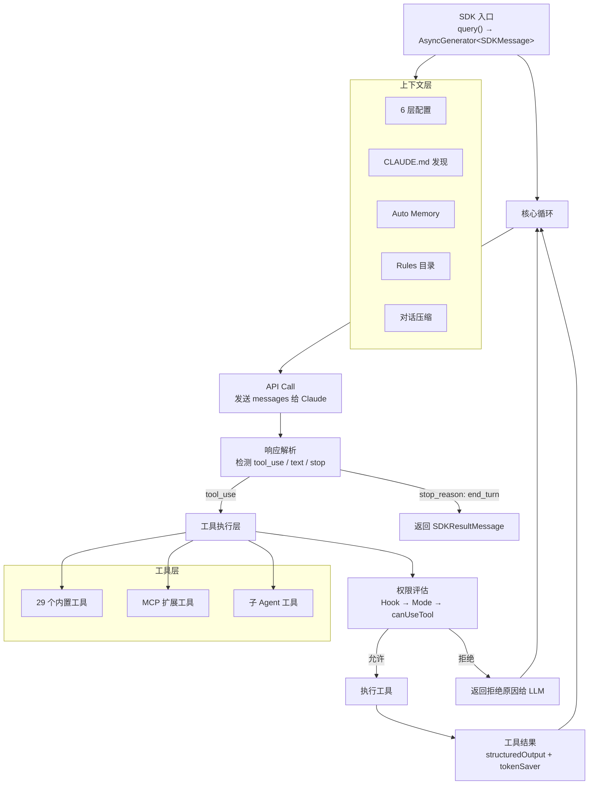
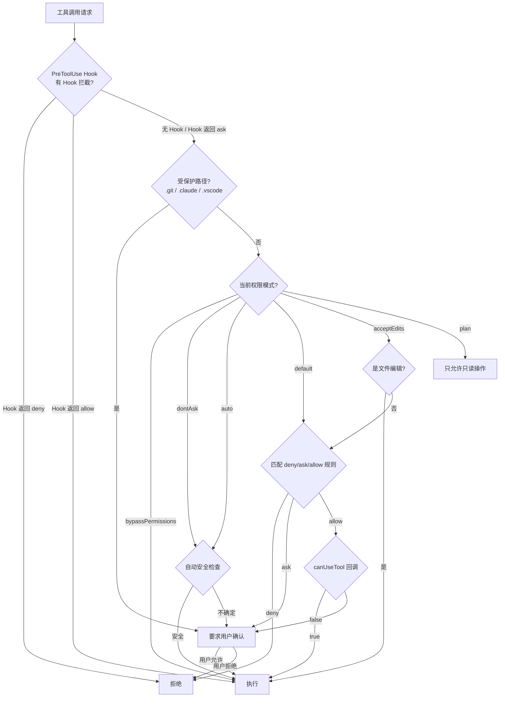
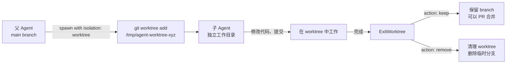

# 第 12 章 · 深入 Claude Code 源码

你已经造了一个 Agent。2000 行 TypeScript，8 个工具，权限系统，Hook，MCP，多 Agent 调度——Ling 是你从零搭起来的。

现在去看"正规军"怎么做的。

Claude Code 不是实验项目，不是 demo。它是 Anthropic 的官方编程 Agent，日活百万级，每天处理海量的代码编辑、命令执行、文件搜索请求。它的每个设计决策背后都有大规模生产环境的验证。

这一章的目标很明确：系统性地拆解 Claude Code 的架构和关键设计，对照 Ling 找差距，搞清楚从"能跑"到"能用"之间到底差什么。

**读源码的方法论。** 不要从头到尾读——Claude Code 打包后的 `cli.js` 有 16 万行，这么读会疯。正确的方式是按模块切入：先读类型定义理解数据结构，再读工具实现理解能力边界，最后读扩展机制理解设计哲学。这一章就按这个顺序走。

---

## 12.1 架构全景

先看全局。

Claude Code 的核心架构可以用一张图说清楚：



入口是 `query()` 函数，返回一个 `AsyncGenerator<SDKMessage>`。这个设计意味着调用方可以逐条接收消息——文本片段、工具调用进度、最终结果——而不是等整个对话结束才拿到响应。

核心循环的逻辑和 Ling 本质上一样：

1. 把 messages 发给 Claude API
2. 解析响应，检测是否有 `tool_use`
3. 有 → 走权限评估 → 执行工具 → 把结果塞回 messages → 回到步骤 1
4. 没有 → 对话结束，返回最终结果

**和 Ling 的对比：** 核心循环几乎一模一样——这不是巧合，这就是 Agent 的标准架构。区别在循环之外的所有东西：工具的数量和精细度、权限系统的层级、上下文管理的深度、消息类型的丰富程度。

---

## 12.2 工具系统的工程化设计

Ling 有 8 个工具。Claude Code 有 29 个。但数量不是重点，重点是工程化程度的差距。

### 完整工具清单

按功能分类：

| 类别 | 工具名 | 说明 |
|------|--------|------|
| **文件操作** | FileRead | 读文件，支持文本/图片/PDF/Notebook |
| | FileEdit | 精确字符串替换 |
| | FileWrite | 写入完整文件 |
| | Glob | 文件名模式匹配 |
| | Grep | 内容搜索（基于 ripgrep） |
| | NotebookEdit | Jupyter Notebook 单元格编辑 |
| **命令执行** | Bash | Shell 命令，带超时和沙盒 |
| | TaskOutput | 读取后台任务输出 |
| | TaskStop | 停止后台任务 |
| **Web 访问** | WebFetch | 抓取网页内容 |
| | WebSearch | 搜索引擎查询 |
| **Agent 管理** | Agent | 启动子 Agent |
| | EnterWorktree | 进入 Git Worktree |
| | ExitWorktree | 退出 Git Worktree |
| **用户交互** | AskUserQuestion | 结构化提问（带选项） |
| | TodoWrite | 管理任务清单 |
| | ExitPlanMode | 退出规划模式 |
| **配置** | Config | 读写设置 |
| **MCP** | Mcp | 调用 MCP 工具 |
| | ListMcpResources | 列出 MCP 资源 |
| | ReadMcpResource | 读取 MCP 资源 |
| | SubscribeMcpResource | 订阅 MCP 资源变更 |
| | UnsubscribeMcpResource | 取消订阅 |
| | SubscribePolling | 轮询订阅 |
| | UnsubscribePolling | 取消轮询 |

看看里面几个有意思的设计决策。

### FileEdit 的 old_string 唯一性约束

Ling 的 `edit-file` 工具和 Claude Code 的 `FileEdit` 做的是同一件事：精确字符串替换。但 Claude Code 加了一个关键约束——**old_string 必须在文件中唯一**。

```typescript
export interface FileEditInput {
  file_path: string;
  old_string: string;   // 必须在文件中唯一匹配
  new_string: string;   // 必须和 old_string 不同
  replace_all?: boolean; // 显式声明替换所有
}
```

为什么唯一性很重要？因为 LLM 经常偷懒，给一个过于简短的 `old_string`，比如只给 `return null;`。如果文件里有三处 `return null;`，不加唯一性约束就会改错地方。强制唯一意味着 LLM 必须提供足够多的上下文（比如包含周围几行代码），才能精确定位到目标位置。

如果确实要替换所有匹配项呢？用 `replace_all: true` 显式声明。这比"默认替换所有"安全得多——LLM 必须明确表达"我就是要改所有"这个意图。

这个设计背后的思路是：**让正确的操作容易做，让危险的操作需要额外声明。**

### Bash 工具的 description 字段

这是 Ling 没有的：

```typescript
export interface BashInput {
  command: string;
  timeout?: number;
  description?: string;  // 让用户一眼看懂命令目的
  run_in_background?: boolean;
  dangerouslyDisableSandbox?: boolean;
}
```

`description` 不是给 LLM 看的——是给**用户**看的。当 Claude Code 弹出权限确认时，用户看到的不只是 `find . -name "*.tmp" -exec rm {} \;` 这样的天书，还有一句 "Find and delete all .tmp files recursively"。

这个字段的 system prompt 里甚至给了具体的写作规范：简单命令 5-10 个词（`git status → "Show working tree status"`），复杂命令要加足够上下文让用户理解。

这是一个纯粹的 UX 决策。技术上不需要它，但它让非专业用户也能理解 Agent 在做什么，从而做出正确的授权决定。

### 工具输出的结构化设计

Ling 的工具统一返回 `string`。我们在第 3 章说过"LLM 本身就是吃文本的，搞复杂的返回类型没意义"。这话在教学场景下没问题，但 Claude Code 给出了不同的答案。

看 `FileEditOutput`：

```typescript
export interface FileEditOutput {
  filePath: string;
  oldString: string;
  newString: string;
  originalFile: string;
  structuredPatch: {
    oldFileName: string;
    newFileName: string;
    hunks: {
      oldStart: number;
      oldLines: number;
      newStart: number;
      newLines: number;
      lines: string[];
    }[];
  };
}
```

它不只是返回"编辑成功"这样的文本，而是返回完整的结构化 diff——包括原始文件内容、patch 的 hunk 信息、行号。这些信息有两个用途：

1. **给 LLM 看**：结构化的 diff 比一句"编辑成功"信息量大得多，LLM 可以验证编辑是否符合预期
2. **给 UI 看**：终端或 IDE 可以直接渲染一个漂亮的 diff 视图，不需要再去 parse 文本

再看 `FileReadOutput`——它是一个联合类型，根据文件类型返回不同的结构：

```typescript
export type FileReadOutput =
  | { type: "text"; file: { filePath: string; content: string; numLines: number; startLine: number; totalLines: number } }
  | { type: "image"; file: { base64: string; type: "image/jpeg" | "image/png" | "image/gif" | "image/webp"; originalSize: number; dimensions?: { ... } } }
  | { type: "notebook"; file: { filePath: string; cells: unknown[] } }
  | { type: "pdf"; file: { filePath: string; base64: string; originalSize: number } }
  | { type: "parts"; file: { filePath: string; originalSize: number; count: number; outputDir: string } };
```

一个 `FileRead` 工具就能处理文本、图片、PDF、Jupyter Notebook，每种返回不同的结构化数据。Ling 的 `read_file` 只能读文本文件——差距不是一点半点。

### BashOutput 的大输出处理

```typescript
export interface BashOutput {
  stdout: string;
  stderr: string;
  rawOutputPath?: string;  // 大输出保存到磁盘
  interrupted: boolean;
  isImage?: boolean;
}
```

`rawOutputPath` 这个字段解决了一个实际问题：命令输出太大。比如 `cat` 一个几万行的日志文件，全塞进 messages 会炸掉 token 上限。Claude Code 的处理方式是：大输出先存到磁盘文件，只把路径和摘要返回给 LLM。LLM 如果需要更多细节，可以用 `FileRead` 工具去读那个文件的特定部分。

这就是教学项目和生产项目的差距——你在做 demo 时不会碰到这种 edge case，但真实用户每天都会碰到。

---

## 12.3 权限系统的六种模式

Ling 在第 5 章实现了三层过滤（Deny → Ask → Allow）。Claude Code 的权限系统复杂得多，但核心思路是一样的——只是多了几层"外壳"。

完整的权限评估流程：



六种模式对应不同的使用场景：

| 模式 | 场景 | 行为 |
|------|------|------|
| `default` | 日常使用 | 走完整的 deny/ask/allow 规则匹配 |
| `acceptEdits` | 信任文件编辑但谨慎执行命令 | 文件编辑自动放行，Bash 等走规则 |
| `plan` | 只允许规划，不允许执行 | 只有只读操作通过，写操作需要显式退出 plan 模式 |
| `auto` | 自动化场景（CI/CD） | 用分类器自动判断操作是否安全 |
| `dontAsk` | 无人值守 | 类似 auto，但更宽松 |
| `bypassPermissions` | 完全信任 | 跳过所有权限检查 |

Ling 的三层模型相当于 Claude Code `default` 模式的子集。Claude Code 多出来的是两个维度：

**Hook 层。** PreToolUse Hook 在所有规则之前执行。企业管理员可以通过 Hook 实现自定义的安全策略——比如"禁止访问 /production 目录下的任何文件"——这些策略优先级高于用户的任何设置。

**Mode 层。** 不同模式对应不同的信任级别。`plan` 模式特别有意思——它让 Agent 只能做规划（读文件、搜索代码），不能做任何修改，直到用户审核完计划后通过 `ExitPlanMode` 工具切换到执行模式。这解决了一个真实痛点：你想让 Agent 先给方案再动手，而不是上来就改代码。

`ExitPlanMode` 工具的类型定义揭示了更多细节：

```typescript
export interface ExitPlanModeInput {
  allowedPrompts?: {
    tool: "Bash";
    prompt: string;  // 语义描述，如 "run tests"、"install dependencies"
  }[];
}
```

Agent 退出 plan 模式时，可以声明它接下来需要哪些类型的 Bash 操作。用户看到的是"Agent 计划运行测试和安装依赖"，而不是一堆具体命令。这比逐条审批命令高效得多。

### 受保护路径

`.git`、`.claude`、`.vscode` 这几个目录为什么要特殊保护？

- `.git` ：修改 Git 内部数据可以破坏整个仓库历史
- `.claude`：包含权限配置和 Hook 定义——如果 Agent 能修改自己的权限规则，就等于没有权限系统
- `.vscode`：编辑器配置，修改可能影响整个开发环境

这是一个"元安全"问题：权限系统本身的配置不能被权限系统保护的对象修改。Ling 没有处理这个问题——值得在后续迭代中补上。

---

## 12.4 上下文管理的精细化

### 6 层配置优先级

```
managed > enterprise > CLI flags > .claude/settings.local.json
> .claude/settings.json > ~/.claude/settings.json > defaults
```

从上到下，优先级递减。这个分层解决的是多人协作中的配置冲突：

- **managed / enterprise**：组织管理员设置，锁定后用户不能覆盖。比如禁用 `bypassPermissions` 模式
- **CLI flags**：命令行参数，当次会话生效
- **settings.local.json**：个人偏好，不进 git（在 .gitignore 里）
- **settings.json**：项目级配置，进 git，团队共享
- **~/.claude/settings.json**：全局个人配置
- **defaults**：内置默认值

看一个实际的企业级配置（来自 Claude Code 的示例）：

```json
{
  "permissions": {
    "disableBypassPermissionsMode": "disable",
    "ask": ["Bash"],
    "deny": ["WebSearch", "WebFetch"]
  },
  "allowManagedPermissionRulesOnly": true,
  "allowManagedHooksOnly": true,
  "strictKnownMarketplaces": []
}
```

这是一个严格配置：禁用权限绕过、Bash 命令必须确认、禁止 Web 访问、不允许用户自定义权限规则和 Hook。适合安全要求高的金融或医疗团队。

Ling 只有一层配置（项目根目录的 `.ling.json`）。这在单人使用时够了，但多人协作时会打架——你想宽松，同事想严格，谁说了算？Claude Code 的分层设计给出了答案：组织 > 项目 > 个人。

### CLAUDE.md 的发现算法

Claude Code 从当前工作目录开始，向上遍历到文件系统根目录，收集每一层的 `CLAUDE.md`（或 `.claude/CLAUDE.md`）。所有找到的文件内容拼接成 system prompt 的一部分。

这意味着：

- 仓库根目录的 `CLAUDE.md` 定义项目级约定（编码规范、架构决策）
- 子目录的 `CLAUDE.md` 定义模块级约定（这个目录的特殊规则）
- 用户主目录的 `CLAUDE.md` 定义个人偏好

Ling 的 `.ling.md` 也是类似思路，但只读项目根目录一个文件。向上遍历的设计在 monorepo 场景下特别有用——不同子项目可以有不同的规则。

### Auto Memory

Claude Code 会自动把你的纠正和偏好写入 `~/.claude/memory/` 下的文件。记忆分几种类型：

- **纠正类**：你纠正了 Agent 的错误，它记住以后不犯。比如"发布到飞书 Wiki 时去掉正文第一个 # 标题"
- **偏好类**：你的工作习惯。比如"公众号封面不用渐变生成图，找合适的真实图片"
- **项目知识类**：项目的特殊信息。比如"lark-cli --markdown 参数必须用 `$(cat file)` 传入"
- **工作流类**：你常用的操作流程
- **环境类**：你的开发环境信息

这些记忆跨会话持久化——下次启动 Claude Code，它还记得之前学到的东西。Ling 在第 7 章实现了 `MemoryStore`，支持跨会话记忆，但没有自动写入机制——需要用户手动 `/save`。自动化这一步对用户体验影响很大。

### Rules 目录

`.claude/rules/` 目录下可以放多个规则文件，每个文件可以通过 glob 模式匹配特定路径。比如：

- `.claude/rules/tests.md` 匹配 `**/test/**` 路径，包含测试代码的编写规范
- `.claude/rules/api.md` 匹配 `src/api/**`，包含 API 层的设计约束

这比 Ling 的单一 `.ling.md` 灵活得多。大项目不同模块有不同规范，全堆在一个文件里既混乱又浪费 token（不相关的规则也会塞进 prompt）。按路径匹配，只有在编辑相关文件时才加载对应规则。

### 对话压缩

Claude Code 的 `/compact` 命令触发对话压缩。触发条件是上下文长度超过阈值（接近模型的 context window 上限）。压缩策略是：让 LLM 生成当前对话的摘要，用摘要替换之前的所有 messages。

Ling 在第 4 章实现了类似的 `compactor`，但 Claude Code 还有一个细节：压缩时可以传自定义 prompt，指定保留哪些关键信息。比如 `/compact focus on the database migration changes` 会让压缩结果重点保留数据库迁移相关的上下文。

---

## 12.5 流式架构与消息类型

Ling 在第 6 章实现了基础的流式输出——逐 token 打印。Claude Code 的流式架构远不止于此。

`query()` 函数返回 `AsyncGenerator<SDKMessage>`，`SDKMessage` 是一个庞大的联合类型，涵盖了对话过程中所有可能的事件。关键的消息类型：

| 消息类型 | 含义 | 对应的 UI 状态 |
|---------|------|---------------|
| `SDKAssistantMessage` | Agent 的文本回复 | 显示回复内容 |
| `SDKResultMessage` | 对话结束的最终消息 | 显示统计信息（cost / tokens / duration） |
| `SDKToolProgressMessage` | 工具执行进度 | 显示进度条或滚动日志 |
| `SDKToolUseBegin` | 工具开始调用 | 显示"正在执行 XXX..." |
| `SDKToolUseResult` | 工具执行完成 | 显示结果或 diff |
| `SDKPermissionRequest` | 需要用户授权 | 弹出确认对话框 |
| `SDKPermissionResponse` | 用户授权结果 | 继续或中止 |
| `SDKCompactRequest` | 触发对话压缩 | 显示"正在压缩上下文..." |

`SDKResultMessage` 特别值得看：

```typescript
interface SDKResultMessage {
  type: "result";
  subtype: "success" | "error" | "error_max_turns";
  cost_usd: number;
  duration_ms: number;
  duration_api_ms: number;
  num_turns: number;
  is_error: boolean;
  session_id: string;
  total_cost_usd: number;
  usage: {
    input_tokens: number;
    output_tokens: number;
    cache_creation_input_tokens: number | null;
    cache_read_input_tokens: number | null;
  };
}
```

它包含了完整的性能指标：花了多少钱、用了多少 token、多少是缓存命中、跑了几轮、总耗时多少。这些信息对生产环境的成本监控至关重要。

**为什么需要这么多消息类型？** 因为 Claude Code 不只是在终端里跑。它的 SDK 输出被各种消费者使用——终端 UI、VS Code 扩展、Web 界面、CI/CD 管道。每种消费者关心不同的事件：终端要显示打字效果，IDE 要渲染 diff 预览，CI 只要最终结果和成本。统一的消息类型让所有消费者从同一个流里读数据，各取所需。

Ling 的流式输出只有文本 token——连工具调用的开始和结束都没有单独的事件。这在终端 REPL 里够用，但如果要接入 IDE 或 Web 界面，信息量完全不够。

---

## 12.6 Hook 系统的 AOP 设计

Ling 在第 8 章实现了 4 种 Hook 事件。Claude Code 的 Hook 系统是一个完整的 AOP（面向切面编程）框架。

### Hook 事件

Claude Code 支持的 Hook 事件点覆盖了 Agent 生命周期的每个关键节点：

| 阶段 | 事件 | 说明 |
|------|------|------|
| 工具调用 | PreToolUse | 工具执行前，可拦截/修改 |
| | PostToolUse | 工具执行后，可做校验/通知 |
| 会话 | SessionStart | 会话开始 |
| | SessionStop | 会话结束 |
| 对话 | Notification | Agent 发送通知时 |
| | Stop | Agent 停止响应时 |
| 子 Agent | SubAgentSpawn | 子 Agent 启动时 |
| | SubAgentComplete | 子 Agent 完成时 |

每个事件可以挂载多个 Handler，按顺序执行。

### 四种 Handler 类型

```json
{
  "hooks": {
    "PreToolUse": [
      {
        "matcher": "Bash",
        "hooks": [
          { "type": "command", "command": "python3 /path/to/validator.py" },
          { "type": "http", "url": "https://security.company.com/audit" },
          { "type": "prompt", "prompt": "Check if this command is safe..." },
          { "type": "agent", "agent": "security-reviewer" }
        ]
      }
    ]
  }
}
```

- **command**：执行本地命令，通过 stdin 传入上下文 JSON，通过 exit code 返回决策
- **http**：POST 到远程 URL，适合接入企业审计系统
- **prompt**：让另一个 LLM 调用做判断——用 AI 审查 AI
- **agent**：启动一个专门的 Agent 来评估——比如一个专注安全审查的 Agent

`command` 类型的 exit code 约定很巧妙：

| Exit Code | 含义 | 行为 |
|-----------|------|------|
| 0 | 通过 | 继续执行 |
| 1 | 错误 | stderr 显示给用户，不显示给 Agent |
| 2 | 拒绝 | stderr 显示给 Agent 作为拒绝原因 |

看 Claude Code 仓库里的实际例子——一个 Bash 命令验证器：

```python
# 摘自 examples/hooks/bash_command_validator_example.py
_VALIDATION_RULES = [
    (r"^grep\b(?!.*\|)",
     "Use 'rg' (ripgrep) instead of 'grep'"),
    (r"^find\s+\S+\s+-name\b",
     "Use 'rg --files -g pattern' instead of 'find -name'"),
]

def main():
    input_data = json.load(sys.stdin)
    command = input_data.get("tool_input", {}).get("command", "")
    issues = _validate_command(command)
    if issues:
        for msg in issues:
            print(f"• {msg}", file=sys.stderr)
        sys.exit(2)  # exit 2 = 拦截，原因告诉 Agent
```

这个 Hook 会拦截所有 `grep` 命令，建议 Agent 改用 `rg`。exit code 2 把原因返回给 Agent，Agent 会自动重试用 `rg` 代替。这比在 system prompt 里写"不要用 grep"更可靠——prompt 是建议，Hook 是强制。

### Hook 的配置分层

Hook 的配置同样遵循分层优先级。企业级配置 `allowManagedHooksOnly: true` 可以禁止用户自定义 Hook——只有管理员部署的 Hook 生效。这在安全敏感的环境中必不可少：你不想让开发者自己写个 Hook 来绕过安全检查。

**和 Ling 的对比：** Ling 有 4 种事件（PreToolUse / PostToolUse / SessionStart / Stop），2 种 Handler（command / http）。覆盖了最常见的场景，但缺少 `prompt` 和 `agent` 两种 Handler——这两种正好是 AI 原生的扩展方式，让 Hook 系统本身也能利用 LLM 的判断力。

---

## 12.7 子 Agent 的沙盒模型

Ling 在第 10 章实现了基础的子 Agent 调度。Claude Code 的子 Agent 系统在隔离性上做得更彻底。

### AgentInput 类型全解

```typescript
export interface AgentInput {
  description: string;           // 3-5 词的短描述
  prompt: string;                // 完整的任务指令
  subagent_type?: string;        // 预设 Agent 类型
  model?: "sonnet" | "opus" | "haiku";  // 模型选择
  run_in_background?: boolean;   // 后台运行
  name?: string;                 // 可寻址的名称
  team_name?: string;            // 团队名
  mode?: "acceptEdits" | "bypassPermissions" | "default" | "dontAsk" | "plan";
  isolation?: "worktree";        // 隔离模式
}
```

逐字段拆解：

**`description`** 和 **`prompt`** 的分离，和 Bash 工具的 `description` 同理——`description` 用于 UI 显示和日志，`prompt` 是实际的任务内容。

**`model`** 允许为子 Agent 选择不同的模型。这是成本优化的关键：主 Agent 用 Opus 做复杂推理，子 Agent 用 Sonnet 或 Haiku 做简单任务（搜索代码、读文件）。同一个对话里混合使用不同规格的模型，把钱花在刀刃上。

**`mode`** 控制子 Agent 的权限。关键原则：**子 Agent 不能突破父级权限。** 父 Agent 是 `default` 模式，子 Agent 可以是 `plan`（更严格），但不能是 `bypassPermissions`（更宽松）。这是安全的基本要求。

**`run_in_background`** 和 **`name`** 组合实现异步 Agent。后台 Agent 启动后立即返回，父 Agent 继续工作。通过 `name` 可以后续查询状态或发送消息。这是 Ling 完全没有的能力。

### Worktree 隔离

`isolation: "worktree"` 是最有趣的设计。来看它的工作流程：



对应的类型：

```typescript
export interface EnterWorktreeInput {
  name?: string;  // 不提供则自动生成
}

export interface ExitWorktreeInput {
  action: "keep" | "remove";
  discard_changes?: boolean;  // remove 时如果有未提交的更改，需要显式确认
}
```

为什么需要 Worktree？两个原因：

1. **并行不冲突。** 多个子 Agent 可以同时改代码，各自在自己的 worktree 里工作。主 Agent 在 main 上，子 Agent A 在 worktree-a 上，子 Agent B 在 worktree-b 上——互不干扰。
2. **安全回滚。** 子 Agent 搞砸了？`action: "remove"` 一键清理，主分支毫发无损。不需要 `git reset --hard` 这种危险操作。

### AgentOutput 的两种状态

```typescript
export type AgentOutput =
  | {
      status: "completed";
      agentId: string;
      content: { type: "text"; text: string }[];
      totalToolUseCount: number;
      totalDurationMs: number;
      totalTokens: number;
      usage: { input_tokens: number; output_tokens: number; ... };
      prompt: string;
    }
  | {
      status: "async_launched";
      agentId: string;
      description: string;
      prompt: string;
      outputFile: string;       // 进度输出文件路径
      canReadOutputFile?: boolean;
    };
```

同步子 Agent 返回 `completed`，包含完整的执行统计。异步子 Agent 返回 `async_launched`，给你一个 `outputFile` 路径。父 Agent 可以用 `FileRead` 工具去读这个文件查看进度。

这是一个典型的"不要轮询，用文件做通信"的设计。比 WebSocket 或消息队列简单得多，而且完全利用了 Agent 已有的文件读写能力——不需要引入新的通信原语。

---

## 12.8 推荐的源码阅读路线

Claude Code 的源码在 npm 包的 `cli.js` 中（打包后的单文件）和 GitHub 仓库的示例中。虽然 `cli.js` 是 minified 的，但类型定义文件 `sdk-tools.d.ts` 是完整的，配合 SDK 的公开接口已经足够理解核心设计。

### 第一轮（2 小时）：类型定义 → 理解数据流

从 `sdk-tools.d.ts` 开始。这个文件 2000+ 行，定义了所有工具的输入输出类型。

**必读类型：**

- `ToolInputSchemas` — 所有工具输入的联合类型，从这里看到完整的工具清单
- `ToolOutputSchemas` — 所有工具输出的联合类型
- `BashInput` / `BashOutput` — 最常用的工具，理解 description、timeout、background 等字段
- `FileEditInput` / `FileEditOutput` — 理解 old_string 唯一性和 structuredPatch
- `AgentInput` / `AgentOutput` — 理解子 Agent 的完整参数

**文件位置：**

```
/usr/lib/node_modules/@anthropic-ai/claude-code/sdk-tools.d.ts
```

或者装完 `@anthropic-ai/claude-code` 后在 `node_modules` 里找。

### 第二轮（4 小时）：工具实现 → 理解能力边界

GitHub 仓库 `examples/` 目录：

- `examples/hooks/bash_command_validator_example.py` — 理解 Hook 的输入输出协议
- `examples/settings/settings-strict.json` — 理解企业级安全配置
- `examples/settings/settings-lax.json` — 理解宽松配置

Claude Code 的插件（plugins）目录也值得看——它展示了如何基于 Agent 能力构建上层应用。

### 第三轮（持续）：扩展机制

- **Hook**：写一个自己的 PreToolUse Hook，拦截特定命令
- **MCP**：用 Claude Code 连接一个自定义 MCP Server，观察 `McpInput` 和 `McpOutput` 的交互
- **CLAUDE.md**：在不同目录放不同的 CLAUDE.md，观察 Agent 行为的变化

这一轮没有固定时长。每次你在使用 Claude Code 时碰到"它怎么做到的"，就去查对应的类型定义和配置。日积月累，你会对整个系统了如指掌。

---

## 12.9 小结：从 Ling 到 Claude Code 的差距清单

| 功能 | Ling | Claude Code | 差距原因 |
|------|------|-------------|---------|
| **核心循环** | 有 | 有 | 无差距——架构一样 |
| **工具数量** | 8 个 | 29 个 | Claude Code 覆盖了文件/Web/Agent/MCP/交互等全场景 |
| **工具输出** | 纯文本 | 结构化类型 | 生产环境需要给多种 UI 消费者提供结构化数据 |
| **大输出处理** | 无 | rawOutputPath 磁盘持久化 | 教学项目不会碰到 token 溢出的 edge case |
| **权限模式** | 1 种（default） | 6 种 | 不同使用场景需要不同信任级别 |
| **权限 Hook 层** | 无 | PreToolUse Hook 优先于规则 | 企业环境需要不可覆盖的安全策略 |
| **元安全** | 无 | .git/.claude 受保护 | 防止 Agent 修改自身的配置 |
| **配置层级** | 1 层 | 6 层 | 多人协作需要组织 > 项目 > 个人的覆盖机制 |
| **CLAUDE.md 发现** | 只读根目录 | 向上遍历到根 | monorepo 和子目录规则需求 |
| **Auto Memory** | 手动保存 | 5 种类型自动写入 | 自动化是 UX 的关键差距 |
| **Rules 目录** | 无 | glob 匹配特定路径 | 大项目不同模块需要不同规则 |
| **流式消息** | 纯文本 token | 24+ 种消息类型 | 多消费者（终端/IDE/Web/CI）需要不同粒度的事件 |
| **Hook 事件** | 4 种 | 8+ 种 | 更细粒度的生命周期覆盖 |
| **Hook Handler** | 2 种（command/http） | 4 种（+prompt/agent） | AI 原生的审查能力 |
| **Hook 配置锁定** | 无 | allowManagedHooksOnly | 企业安全需求 |
| **子 Agent 模型选择** | 无 | sonnet/opus/haiku | 成本优化：不同任务用不同模型 |
| **Worktree 隔离** | 无 | git worktree 全生命周期 | 多 Agent 并行工作的安全隔离 |
| **异步 Agent** | 无 | run_in_background + outputFile | 长任务不阻塞主 Agent |
| **Plan 模式** | 无 | plan → ExitPlanMode → 执行 | 先规划后执行的工作流 |
| **对话压缩** | 有（基础） | 有（支持自定义 focus） | Claude Code 的压缩更可控 |
| **Bash 沙盒** | 路径限制 | 完整沙盒（网络/文件/进程） | 生产环境需要进程级隔离 |
| **AskUser** | 纯文本问答 | 结构化多选题 | 减少用户输入成本，提高交互效率 |

数一下：Ling 2000 行代码覆盖了上表约 70% 的功能模块（有基础实现），剩下 30% 是生产环境打磨出来的工程细节。

这 30% 的差距不是架构问题——核心循环、工具系统、Hook 机制，你都已经理解了。差距在于：

1. **边界情况的处理。** 大输出怎么办？唯一性冲突怎么办？这些是百万用户踩出来的坑。
2. **多角色协作。** 管理员、项目、个人三级配置覆盖，不是一个人用的时候需要考虑的。
3. **AI 原生的设计。** prompt Hook、Agent Handler、Auto Memory——这些是把 LLM 的能力用在 Agent 自身的管理上，思路上比传统软件工程更进一步。

回头看 Ling 的 2000 行，它做到的事情是：**把 Agent 的核心骨架完完整整走了一遍，每一行代码你都理解为什么这么写。** 这是读懂 Claude Code 的基础。没有这个基础，你看到 29 个工具、6 层配置、24 种消息类型，只会觉得"好复杂"；有了这个基础，你看到的是"原来这里是这么处理的"。

从 Ling 到 Claude Code，不是推倒重来，是在同一个骨架上长出血肉。